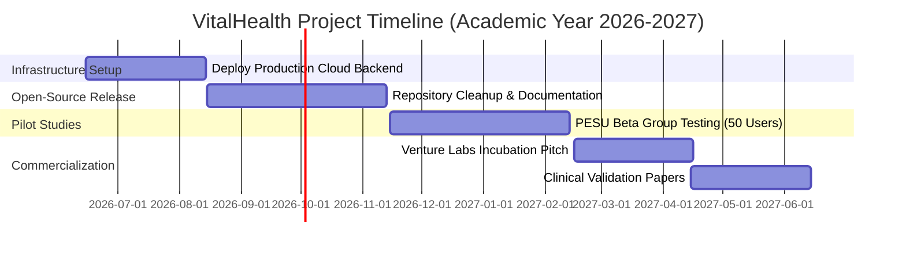

# PROJECT PROPOSAL & TECHNICAL DOSSIER: VITALHEALTH DIGITAL TWIN PLATFORM
**Proposal for Annual Cloud Resource Allocation (Academic Year 2026-2027)**

---

## 1. ADMINISTRATIVE ROUTING BLOCK

* **Project Title:** VitalHealth — AI-Powered Physiological Digital Twin
* **Academic Center:** Center for Internet of Things (C-IoT) & Center for Information Security, Forensics and Cyber Recovery (C-ISFCR)
* **Research Group:** CAVE Labs, PES University
* **Principal Investigator:** Dr. Adithya Balasubramanyam, Professor & Head, CAVE Labs
* **Target Sponsor:** Office of the Vice Chancellor, PES University
* **Resource Request:** Annual Cloud Credits of ₹60,000/- (E2E Networks Cloud Hosting)
* **Date of Submission:** June 15, 2026

---

## 2. COVER LETTER

**To,**  
**The Vice Chancellor,**  
PES University,  
Outer Ring Road Campus, Bengaluru.  

**Through:**  
**Prof. Prasad B Honnavalli**, Director,  
Center for Internet of Things (C-IoT) &  
Center for Information Security, Forensics and Cyber Recovery (C-ISFCR),  
PES University.  

**Subject:** Approval for Annual Cloud Credit Subscription (₹60,000/-) for the VitalHealth Digital Twin Platform.

**Respected Sir,**

Following the successful design and development of the **VitalHealth App**, our research team at CAVE Labs, C-IoT, is committed to establishing its ongoing stability, performance, and real-world deployment. As a key milestone within the "Moonshot" initiatives at our center, specifically focusing on Digital Twins, our team has built a working prototype of VitalHealth. This patient-facing mobile application serves as an advanced Data Acquisition tool and a personalized Digital Twin of human physiology.

The application, currently developed for Android users, captures real-time data regarding patients' activities of daily living (such as exercise, meals, hydration, and medication). This data is then processed through a multi-tier cloud-backed workflow:
1. **Physiology Engine (BioGears):** The acquired data is simulated on a peer-reviewed, C++ physiology engine hosted on the cloud, generating real-time predictions of vital parameters (e.g., blood glucose, arterial pressure, respiratory rate).
2. **Conversational AI (RAG Pipeline):** The simulated physiology is integrated into a secure, context-aware conversational AI assistant utilizing a Retrieval-Augmented Generation (RAG) pipeline running a local LLM to help users understand their health metrics.

As the project transitions from prototyping to active pilot testing, it requires continuous, high-performance cloud hosting to run the C++ simulations and local LLM inferences. Therefore, I request your kind approval for a full-year cloud credit subscription amounting to **₹60,000/-**. This will ensure the seamless hosting, testing, and refinement of the application towards a public roll-out.

Detailed technical progress, architectural overview, UI snapshots, and the strategic roadmaps (for open-source collaboration and startup incubation) are attached in the accompanying technical report.

Thanking you,

**Dr. Adithya Balasubramanyam**  
Professor & Head, CAVE Labs, C-IoT  
Department of CSE, PES University  

---
\pagebreak

## 3. EXECUTIVE SUMMARY & RESEARCH VISION

### 3.1 Background & Context
The tracking of human health has traditionally relied on empirical, retrospective, and superficial metrics such as calorie tracking and step counts. While useful, these data points lack the physiological context of what is happening *inside* the human body. The **VitalHealth Digital Twin Platform** represents a paradigm shift. Developed as a flagship research project under the C-IoT "Moonshot" initiatives at PES University, it models personalized, clinical-grade internal human physiology.

### 3.2 Key Scientific Contributions
VitalHealth implements a living computational model (a "digital twin") of each user by coupling mobile-based daily activity logging with a cloud-hosted peer-reviewed C++ engine (**BioGears**). Rather than using static database lookups or statistical correlations, the system solves complex **Ordinary Differential Equations (ODEs)** of organ-system interactions second-by-second. The platform simulates:
*   How a specific nutritional intake affects the glucose-insulin feedback loops.
*   How active exercise alters cardiovascular pressure based on the baroreceptor reflex and the autonomic nervous system.
*   How pharmaceutical drugs interact metabolically and affect respiration rates via pharmacokinetic-pharmacodynamic (PK-PD) models.

---

## 4. TECHNICAL SYSTEM ARCHITECTURE

The VitalHealth platform is divided into a client-side mobile application and two cloud-hosted backend services connected via secure, encrypted REST APIs:

```mermaid
graph TD
    subgraph Client-Side Mobile App [React Native Client (Expo SDK 54)]
        A1[User Onboarding & Profiling]
        A2[Daily Routine Logger]
        A3[rPPG Camera Scanner]
        A4[Cognitive Brain Lab Suite]
        A5[On-Device OCR & Document Parser]
        A6[Local Vector Store - AsyncStorage]
    end

    subgraph Cloud Backend VM [E2E Cloud Ubuntu 22.04 LTS]
        B1[BioGears API Server - FastAPI]
        B2[BioGears C++ CLI Engine]
        B3[Clinical Database - SQLite & Firebase Sync]
        B4[Dr. Aria AI Server - FastAPI]
        B5[Local LLM Engine - Qwen2.5-14B GGUF]
    end

    A1 -->|POST /register| B1
    A2 -->|POST /sync/batch| B1
    A4 -->|Sync Cognitive Metrics| B3
    A5 -->|Chunk & Embed Context| A6
    A6 -->|Local Vector Query| B4
    B4 -->|Retrieve Local LLM Answers| B5
    B1 -->|Invokes Subprocess| B2
    B1 -->|Generate Matplotlib Reports| B3
```

### 4.1 System Components and Tech Stack
1.  **Mobile Interface (Expo React Native):** Cross-platform frontend featuring navigation managed by Expo Router, local offline storage via SQLite, and native integrations (Notifee for foreground service alarms, Vision Camera for heart scanning, and device sensors for activity monitoring).
2.  **Simulation Backend (FastAPI + Python 3.11):** An API wrapper that manages incoming patient profile requests, generates stabilization scenarios, translates activities into XML BioGears configuration schemas, and streams real-time simulation output.
3.  **Physiology Engine (BioGears Core v7.x):** A validated C++ physics-based simulation engine representing 26 organ systems (61,000+ lines of ODEs). It operates directly on the cloud VM as a compiled subprocess.
4.  **AI Chatbot Server (FastAPI + llama.cpp/Ollama):** Manages local execution of the `Qwen2.5-14B` Large Language Model. It ingests patient-specific context and retrieved medical records to generate secure clinical conversations.

---

## 5. SYSTEM MODULES & WORK COMPLETED TO DATE

The research team at CAVE Labs has completed the implementation of the core application modules, which are currently undergoing integration testing:

### 5.1 Clinical Profile Calibration & Stabilization
The system initializes the physiological twin using a multi-step demographic onboarding wizard:
*   **Demographic Mapping:** Captures Age, Weight, Height, Sex, and Body Fat.
*   **Chronic Disease Injection:** Integrates medical conditions (Type 1 or Type 2 Diabetes, Chronic Obstructive Pulmonary Disease, and Chronic Anemia) directly into the BioGears patient configuration.
*   **Resting Baseline Tuning:** Validates resting Heart Rate and Systolic/Diastolic Blood Pressure. The backend initiates a 30-second initialization run to allow the C++ model to reach thermodynamic and cardiovascular equilibrium before generating a permanent `.xml` baseline state.

### 5.2 Dynamic Scenario Builder & Catch-Up Engine
*   **Event Serialization:** Converts nutritional items (macronutrient grams), activity levels (exercise intensity), sleep hours, liquid volumes, stress metrics, and medications into standardized XML BioGears actions.
*   **Data-Gap Recovery:** When a user opens the app after an offline period, the "Catch-Up Engine" detects the duration of the data gap, divides the timeline into manageable 8-hour segments, and runs baseline simulation loops sequentially to prevent physiological divergence.

### 5.3 Real-Time Vital Signs & Organ Health Analytics
*   **Live Vitals Display:** Displays simulation-derived cardiovascular, metabolic, and respiratory metrics (HR, BP, Glucose, Oxygen Saturation, Respiration Rate, Mean Arterial Pressure, Core Temperature).
*   **Organ Health Grading System:** Analyzes timeseries outputs in the CSV history files to calculate real-time, threshold-based health scores (0-100%) and letter grades (A–F) for major organ systems:
    *   *Heart Health:* Measured via heart rate deviation and Mean Arterial Pressure (MAP) perfusion.
    *   *Lung Health:* Measured via $SpO_2$ levels and respiration rate.
    *   *Gut Health:* Measured via glucose fluctuation patterns.
    *   *Brain Health:* Evaluated through cerebral perfusion (MAP) and stress indicators.

### 5.4 Privacy-Preserving On-Device RAG AI Chat (Dr. Aria)
To maintain strict compliance with medical data privacy regulations, the platform runs a hybrid RAG system:
*   **On-Device Extraction:** Text from uploaded medical PDFs or camera snapshots of prescriptions is extracted and chunked locally on the mobile device.
*   **On-Device Vector Database:** Text chunks are converted into mathematical embeddings and stored locally using the mobile device's SQLite layer.
*   **Semantic Matching:** User queries trigger a local vector search. Only the top matching chunks are transmitted to the cloud LLM server as prompt context, ensuring that raw medical documents never leave the user's phone.

### 5.5 Scientific Cognitive Testing Suite (Brain Lab)
A 4-phase cognitive evaluation module has been developed and integrated:
1.  *Pattern Test:* Evaluates visuospatial working memory through grid-recall tasks.
2.  *Reaction Test:* Measures neural processing speed and motor response latency (in milliseconds).
3.  *Memory Test:* Measures working memory span using progressive digit sequence recall.
4.  *Stroop Test:* Evaluates executive cognitive function and interference control.
*   *Scoring & Insights:* Scores are normalized, and a composite cognitive rating is calculated by `brainEngine.ts`.

### 5.6 Heart Rate Scanning & Medication Safety
*   **rPPG Scanner:** Employs camera-based remote photoplethysmography to analyze micro-color fluctuations in facial skin capillaries, extracting pulse rates locally.
*   **Medication Safety Checker:** Incorporates a substance database containing 79 active ingredients. Before a medication event is submitted, the validator checks the list of active substances for potential pharmacokinetic conflicts (e.g., compounding respiratory depressants).

---

## 6. USER INTERFACE DESIGNS & CLINICAL WORKFLOWS

To ensure professional compliance, the user interfaces have been structured using clean, accessible layouts. The following table details the design layout and data bindings for the key screens:

### 6.1 UI Screen Specifications and Clinical Bindings

| Screen Name | Visual Layout & Design Elements | Core Data Bindings | Clinical Function |
|---|---|---|---|
| **1. Digital Twin Dashboard** | - Top: Circular organ health meters (Heart, Lungs, Gut, Brain) with color-coded grades (A-F).<br>- Center: 3D human physiology silhouette visualization.<br>- Bottom: 8-card grid showing active vitals (HR, BP, Glucose, $SpO_2$, Core Temp, MAP). | - `BiogearsTwinContext` state values.<br>- `/profiles/{user_id}` API metadata.<br>- Latest CSV timeseries output. | Serves as the primary real-time visualization hub for simulated vitals and system health grades. |
| **2. Daily Routine Logger** | - Horizontal top tab bar (Nutrition, Hydration, Activity, Substances, Sleep, Stress, Fasting).<br>- Input forms with custom slider controls and text inputs for meal macronutrients, exercise intensity, and medication dosages. | - Event payload schemas.<br>- `substance_registry.py` API definitions.<br>- Local SQLite event queue. | Captures patient activity data and packages it into structured JSON objects to send to the simulation engine. |
| **3. AI Health Chat (Dr. Aria)** | - Clean chat bubbles with message history.<br>- "Attach Document" button with thumbnail preview.<br>- Server latency indicator.<br>- Interactive settings panel to modify the API URL and API key. | - On-device vector store (`AsyncStorage`).<br>- `/ai/chat` endpoint payload.<br>- Retransmitted text context chunks. | Implements privacy-preserving patient consultations grounded in medical documents. |
| **4. Brain Lab & Report** | - Minimalist testing interfaces (grid targets, tap alerts, sequence buttons).<br>- Report summary featuring a composite score (0-100), overall grade, and radar chart showing cognitive strengths/weaknesses. | - `brainEngine.ts` scoring metrics.<br>- Cognitive test response latency.<br>- Firebase user stats sync. | Orchestrates the 4-phase cognitive evaluation and stores historical progress. |

---

## 7. STRATEGIC JUSTIFICATION FOR CLOUD CREDIT REQUEST

Securing a stable, year-round cloud credit allocation is a fundamental requirement to transition this project from a local development prototype to a public platform. The specific justifications are outlined below:

### 7.1 Physics-Based Simulation Compute Demands
The BioGears engine is a highly detailed computational model. It calculates gas fractions in the alveoli, blood pressure in the chambers of the heart, and fluid volume changes in the kidneys by solving systems of ordinary differential equations (ODEs). A single simulation run of a daily routine requires substantial CPU computation. Hosting this engine in the cloud allows us to run multiple simulations concurrently for active users without overloading their mobile devices or draining their batteries.

### 7.2 Local Deep Learning Model Execution
To safeguard user privacy, the conversational AI (Dr. Aria) uses a locally hosted instance of the **Qwen2.5-14B** language model rather than relying on external public APIs. Running a 14-billion parameter neural network requires a high-performance virtual machine with at least 16 GB of system RAM, multi-core virtual CPUs, and fast solid-state storage. E2E Cloud hosts this model using virtualized resources, providing responsive chat interactions (inference times under 2 seconds) for users.

### 7.3 Open-Source Collaboration and Researcher Access
The research team is preparing to release the VitalHealth codebase under an open-source MIT license on GitHub to encourage collaborative development.
*   **Compilation Hurdles:** Setting up the BioGears C++ engine locally requires compiling a 2 GB C++ repository, which is highly complex and not supported on ARM architecture (e.g., Apple Silicon M1/M2/M3 MacBooks).
*   **Shared Sandbox API:** The cloud credits will support a permanent, public API server that allows student developers, academic researchers, and external contributors to test and integrate their custom client designs without needing to configure or compile BioGears locally.

### 7.4 Startup Incubation & Venture Readiness
The VitalHealth Digital Twin platform has significant potential to be incubated as a digital health startup. 
*   **Beta Testing:** A stable cloud server is essential to conduct pilot tests with a group of 50–100 beta users at PES University, collecting performance metrics and physiological tracking accuracy data.
*   **Investor Demos:** Having the app connected to a stable, scalable production cloud backend allows us to showcase real-time simulation updates and AI insights during pitch sessions to incubators (e.g., PESU Venture Labs) and external venture capitalists.

---

## 8. DETAILED RESOURCE PLAN & BUDGET ALLOCATION

The requested cloud credit allocation of **₹60,000/-** is designed to cover the operational hosting expenses on E2E Networks (E2E Cloud) or equivalent cloud service providers for 12 months:

| Budget Item | Technical Specification | Unit Cost / Month (INR) | Annual Cost (INR) | Cloud Resource Justification |
|---|---|---|---|---|
| **Dedicated Compute Instance** | 8 vCPUs, 16 GB RAM, 100 GB SSD, Ubuntu 22.04 LTS | ₹4,500 | ₹54,000 | Required to host the C++ BioGears CLI, run the FastAPI endpoint queues, and perform Qwen2.5-14B LLM inferences. |
| **Cloud Object Storage** | 50 GB backup storage, weekly snapshots | ₹300 | ₹3,600 | Used to back up patient state XML configurations and store historical simulation CSV data. |
| **Data Outbound Transfer** | Unlimited incoming, 50 GB outgoing network bandwidth | ₹200 | ₹2,400 | Supports real-time Server-Sent Events (SSE) streaming and REST API communications. |
| **Total Requested Credits** | | **₹5,000** | **₹60,000** | |

---

## 9. PROJECT MILESTONES & IMPLEMENTATION TIMELINE



*   **Quarter 1 (Jun - Aug 2026):** Setup production cloud environment, establish API key protections, and configure automated SQLite-to-Cloud sync.
*   **Quarter 2 (Sep - Nov 2026):** Release codebase on GitHub under open-source licenses, launch the public sandbox API for external researchers, and publish the Expo development client.
*   **Quarter 3 (Dec - Feb 2027):** Conduct a 50-user beta pilot study at PES University, collecting performance metrics and physiological tracking accuracy data.
*   **Quarter 4 (Mar - May 2027):** Prepare venture pitches for PESU Venture Labs, present the system architecture at IEEE/ACM digital health conferences, and submit clinical validation papers.
