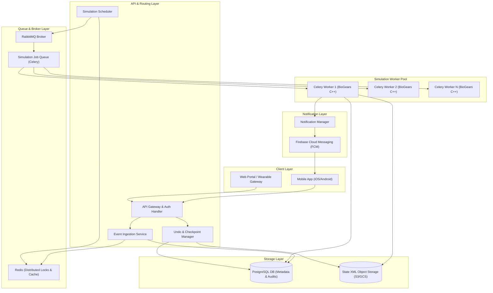
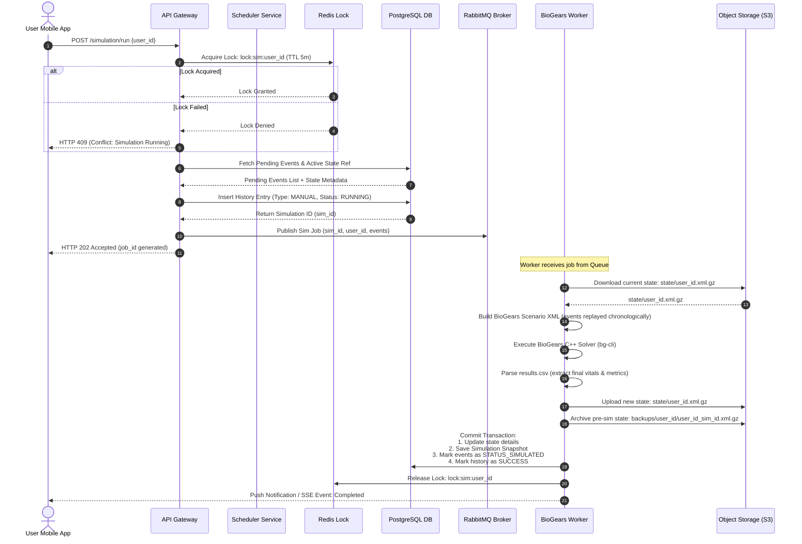
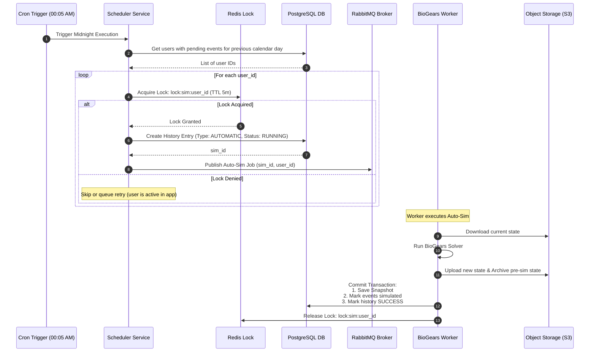
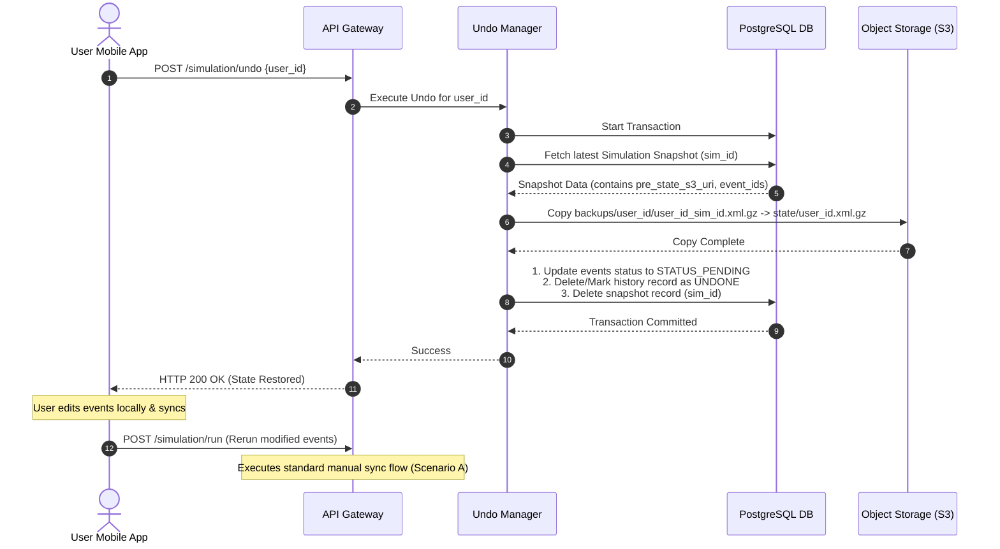
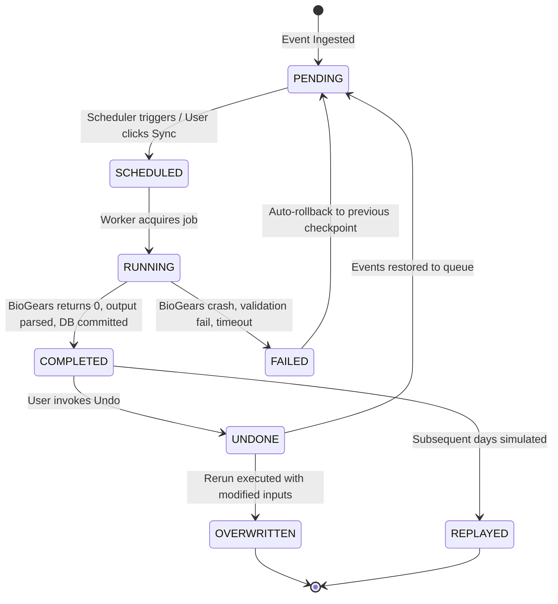
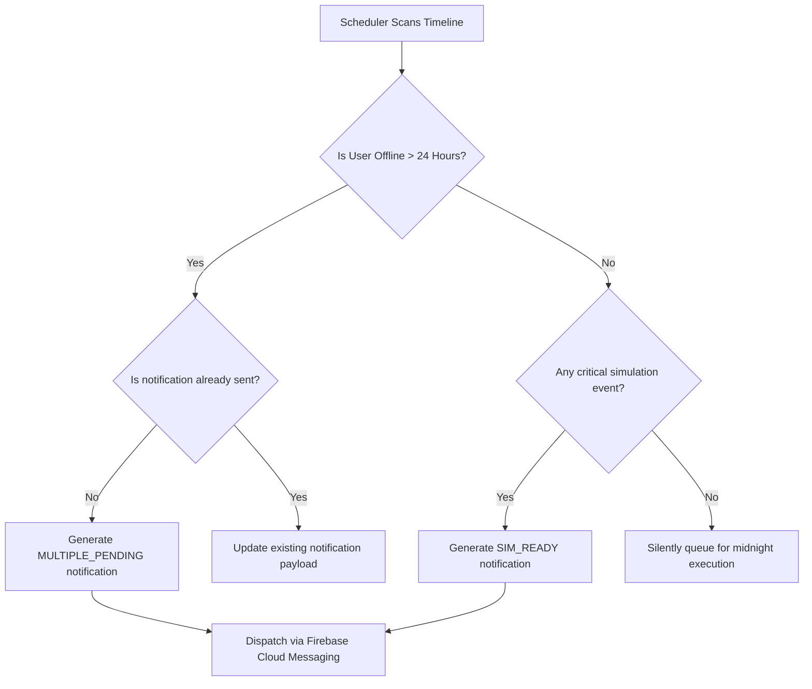
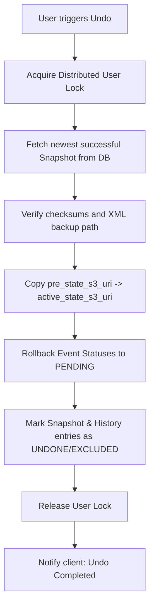
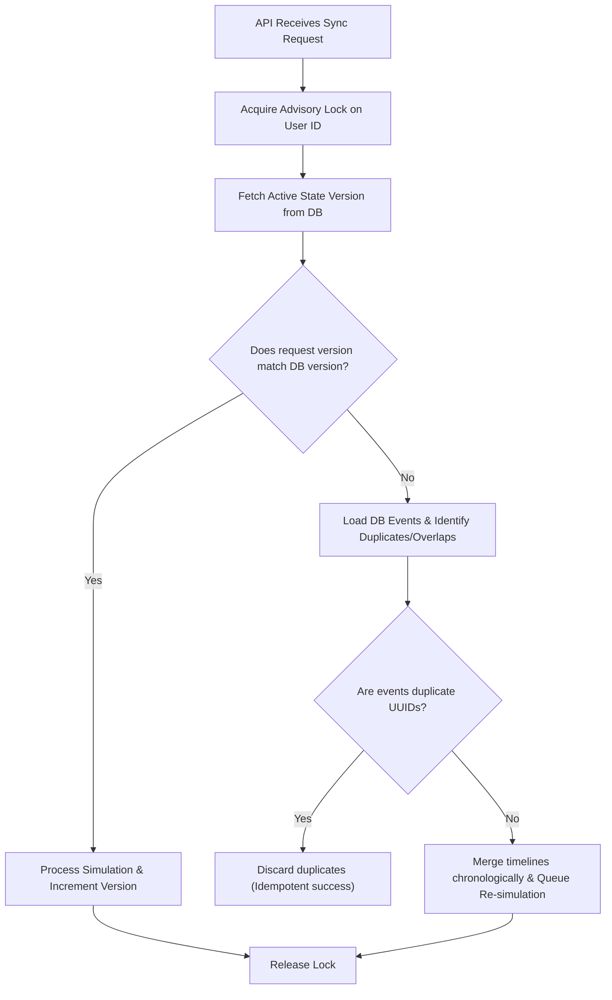

# VitalHealth Digital Twin: Deferred Physiology Synchronization System
## Architectural Design & Engineering Specification

> **Confidential Document**  
> **Role:** Principal System Architect, VitalHealth Platform  
> **Status:** Approved for Implementation  
> **Target Version:** v3.2.0-Alpha  

---

## 1. System Architecture

The Deferred Physiology Synchronization System (DPSS) manages the scheduling, queueing, execution, and rollback of continuous physiological simulations running on the C++ BioGears engine. Due to the high CPU overhead of the C++ solver, simulations are executed asynchronously and decoupled from API ingestion using a worker-pool pattern.

### 1.1 Architecture Block Diagram



### 1.2 Modular Separation of Concerns

1. **Event Ingestion Service**: Receives user activities (meals, meds, exercise, sleep, vitals) and commits them to the durable database as `pending` events. Enforces rate limits and input validation via a rules engine.
2. **Simulation Scheduler**: Periodically sweeps the database to evaluate if a user's pending events are ready for simulation. Coordinates both manual notifications and automatic midnight execution.
3. **BioGears Worker Pool (Engine Runner)**: A pool of stateless Celery workers. Each worker pulls a job, retrieves the user's active BioGears State XML (`.xml.gz`), constructs the simulation scenario XML, invokes the C++ engine binary, parses the output CSV, and uploads the new state.
4. **Checkpoint & Undo Manager**: Orchestrates state rollbacks. It swaps physical XML state files in Object Storage, flags previously simulated events as pending, and updates the state ledger transactionally.
5. **Notification Service**: Manages notification states and pushes alerts (FCM/APNs) to client devices regarding scheduler state, simulation completions, conflicts, and errors.
6. **Audit Logger & Security Manager**: A HIPAA-compliant, tamper-evident logger capturing all actions involving Protected Health Information (PHI) and simulation modifications.

---

## 2. System Workflow

The lifecycle of physiological data progresses through seven distinct operational phases to guarantee data integrity and fault-tolerant state changes.

```
[Ingestion] -> [Queuing] -> [Evaluation] -> [Notification] -> [Execution] -> [Commitment] -> [Backup]
```

### 2.1 Complete Operational Phases

| Phase | System Component | Description |
| :--- | :--- | :--- |
| **1. Ingestion & Validation** | Ingestion Service | The client submits an activity log. The system validates fields (e.g., dosage limits, caloric range) and logs the entry as `STATUS_PENDING` in the timeline database. |
| **2. Queue Accumulation** | PostgreSQL DB | Events accumulate over time without executing immediate simulations, minimizing battery drain and server CPU stress. |
| **3. Scheduler Evaluation** | Simulation Scheduler | A cron-like manager checks user profiles. If the time since the last simulation exceeds 4 hours, or if critical events (such as exercise or insulin administration) are detected, the scheduler marks the user's timeline as "Ready to Synchronize." |
| **4. Notification Dispatch** | Notification Manager | The system dispatches a push notification: *"Your physiology is ready to synchronize."* If ignored, it remains active. At `00:05 AM`, the automatic midnight routine takes over. |
| **5. Simulation Execution** | Celery Worker | The worker downloads the user's prior BioGears XML state. It constructs a chronological BioGears Scenario XML, replaying all logged events. The BioGears engine runs the simulation, calculating state parameters second-by-second, and outputs a CSV file. |
| **6. State Commitment** | PostgreSQL / Object Store | The system parses the final row of the CSV to extract new vitals. The updated BioGears XML state is compressed (`.xml.gz`) and saved to Object Storage. The events are marked as `STATUS_SIMULATED`. |
| **7. Snapshot & Backup** | Checkpoint Manager | The pre-simulation XML, input event payload, and post-simulation vitals are frozen into an immutable `Simulation Snapshot` linked to a unique transaction ID. |

---

## 3. Sequence Diagrams

### 3.1 Scenario A: Manual User-Initiated Simulation
This flow describes the path when a user acts on a notification or initiates sync manually.



### 3.2 Scenario B: Automatic Midnight Synchronization
This flow runs automatically shortly after midnight to prevent the model from falling behind real-world time.



### 3.3 Scenario C: Undo and Rerun Flow
This flow handles the restoration of a checkpoint and subsequent replay after user modifications.



---

## 4. Scheduler Design

The scheduler operates on a daemon process utilizing Celery Beat for periodic orchestration and Redis for distributed locks.

### 4.1 Evaluation Frequency & Rules

The scheduler runs a sweep every **10 minutes**. It determines if a user's timeline is "Ready to Simulate" using a heuristic score:

$$\text{Ready} = (T_{\text{current}} - T_{\text{last\_sim}} \ge 4\text{ hours}) \lor (\text{CriticalEventLogged} = \text{True}) \lor (\text{EventCount} \ge 5)$$

* **Critical Events**: Submissions of type `MEDICATION` (e.g., insulin, heart medication), `EXERCISE` (intensity > 0.7), or `MEAL` (carbohydrates > 100g).

### 4.2 Duplicate Prevention & Backpressure

* **Distributed Locking**: Before any simulation runs, the process must acquire a Redis lock `lock:sim:{user_id}` with a 5-minute Time-To-Live (TTL).
* **Backpressure Management**: If the Celery queue depth exceeds 1,000 tasks, the scheduler delays non-critical automatic simulations and scales up worker pods.
* **Advisory Lock Check**: The API checks active Celery workers before scheduling. If a job is already queued for a specific user, subsequent requests are merged or rejected with HTTP 409 (Conflict).

### 4.3 Wearable & Multi-Device Sync logic

* **Vector Clocks**: Event payloads include client-side generated UUIDs and vector clocks (Device ID + Monotonically increasing counter) to prevent duplication during network retries.
* **Timestamp Alignment**: Wearable data synced offline is retroactively placed on the timeline using the wearable's local UTC record timestamp, not the server receipt time.

---

## 5. State Machine

The simulation lifecycle is managed using a strict, database-enforced state machine to ensure traceability.



### State Transitions & Validations

1. `PENDING`: Events are written to the database but not simulated yet.
2. `SCHEDULED`: Events are selected and queued.
3. `RUNNING`: The BioGears runner locks the patient record and runs the binary.
4. `COMPLETED`: Data is updated. The state becomes the new active reference.
5. `FAILED`: The worker logs an execution failure. The system releases the lock and reverts the active pointer.
6. `UNDONE`: Active pointer is reverted to the archived backup.
7. `OVERWRITTEN`: The state is deleted or marked inactive when a user reruns modified inputs over an undone state.

---

## 6. Database Schema (DDL)

This schema is compatible with PostgreSQL (incorporating `JSONB` for event details and snapshots) and contains fallback paths for SQLite.

```sql
-- Core user state reference table
CREATE TABLE digital_twin_states (
    user_id VARCHAR(255) PRIMARY KEY,
    active_state_s3_uri VARCHAR(512) NOT NULL,
    state_sha256 CHAR(64) NOT NULL,
    engine_version VARCHAR(50) NOT NULL,
    last_simulated_at TIMESTAMPTZ NOT NULL,
    version INT DEFAULT 1 NOT NULL, -- Optimistic Concurrency Control
    created_at TIMESTAMPTZ DEFAULT CURRENT_TIMESTAMP,
    updated_at TIMESTAMPTZ DEFAULT CURRENT_TIMESTAMP
);

-- Index on last simulated timestamp
CREATE INDEX idx_dt_states_last_sim ON digital_twin_states(last_simulated_at);

-- Ingested events database (pending and completed)
CREATE TYPE event_status AS ENUM ('PENDING', 'SIMULATED', 'EXCLUDED');
CREATE TABLE pending_events (
    event_id UUID PRIMARY KEY DEFAULT gen_random_uuid(),
    user_id VARCHAR(255) NOT NULL REFERENCES digital_twin_states(user_id) ON DELETE CASCADE,
    event_type VARCHAR(50) NOT NULL, -- MEAL, EXERCISE, SLEEP, MEDICATION, etc.
    event_timestamp TIMESTAMPTZ NOT NULL, -- Exact time event occurred in real world
    payload JSONB NOT NULL, -- Detail containing specific validation ranges, quantities
    status event_status DEFAULT 'PENDING' NOT NULL,
    device_id VARCHAR(100) NOT NULL,
    sequence_num BIGINT NOT NULL,
    created_at TIMESTAMPTZ DEFAULT CURRENT_TIMESTAMP,
    CONSTRAINT unique_user_device_seq UNIQUE(user_id, device_id, sequence_num)
);

CREATE INDEX idx_pending_events_user_status ON pending_events(user_id, status);
CREATE INDEX idx_pending_events_timestamp ON pending_events(event_timestamp);

-- Immutable simulation history log (HIPAA Auditable)
CREATE TYPE execution_type AS ENUM ('MANUAL', 'AUTOMATIC', 'REPLAY', 'RESTORE', 'UNDO');
CREATE TYPE execution_status AS ENUM ('PENDING', 'RUNNING', 'SUCCESS', 'FAILED');
CREATE TABLE simulation_history (
    sim_id UUID PRIMARY KEY DEFAULT gen_random_uuid(),
    user_id VARCHAR(255) NOT NULL REFERENCES digital_twin_states(user_id) ON DELETE CASCADE,
    sim_type execution_type NOT NULL,
    status execution_status NOT NULL,
    initiated_by VARCHAR(255) NOT NULL, -- User, System, or Admin ID
    started_at TIMESTAMPTZ DEFAULT CURRENT_TIMESTAMP,
    completed_at TIMESTAMPTZ,
    duration_ms INT,
    engine_version VARCHAR(50) NOT NULL,
    engine_engine_version VARCHAR(50) NOT NULL,
    failure_reason TEXT
);

CREATE INDEX idx_sim_history_user_status ON simulation_history(user_id, status);

-- Immutable simulation snapshots (Checkpoints for Rollbacks)
CREATE TABLE simulation_snapshots (
    snapshot_id UUID PRIMARY KEY DEFAULT gen_random_uuid(),
    sim_id UUID NOT NULL REFERENCES simulation_history(sim_id) ON DELETE CASCADE,
    user_id VARCHAR(255) NOT NULL REFERENCES digital_twin_states(user_id) ON DELETE CASCADE,
    pre_state_s3_uri VARCHAR(512) NOT NULL, -- Location of state XML BEFORE this run
    post_state_s3_uri VARCHAR(512) NOT NULL, -- Location of state XML AFTER this run
    input_event_ids UUID[] NOT NULL, -- Array of events processed in this run
    vitals_snapshot JSONB NOT NULL, -- HeartRate, SystolicBP, Glucose, etc.
    biomarkers_snapshot JSONB NOT NULL, -- Organ metrics, metabolic markers, drug levels
    created_at TIMESTAMPTZ DEFAULT CURRENT_TIMESTAMP
);

CREATE UNIQUE INDEX idx_snapshots_sim_id ON simulation_snapshots(sim_id);
CREATE INDEX idx_snapshots_user ON simulation_snapshots(user_id);

-- Scheduler State Tracker
CREATE TABLE scheduler_state (
    user_id VARCHAR(255) PRIMARY KEY REFERENCES digital_twin_states(user_id) ON DELETE CASCADE,
    last_checked_at TIMESTAMPTZ NOT NULL,
    next_scheduled_at TIMESTAMPTZ NOT NULL,
    is_locked BOOLEAN DEFAULT FALSE NOT NULL,
    lock_acquired_at TIMESTAMPTZ
);

-- Notification Log Table
CREATE TYPE notification_type AS ENUM (
    'SIM_READY', 'AUTO_SCHEDULED', 'AUTO_COMPLETED', 'SIM_FAILED',
    'REVIEW_REQUIRED', 'UNDONE', 'RERUN_COMPLETED', 'MULTIPLE_PENDING', 'CONFLICT_DETECTED'
);
CREATE TABLE notifications_log (
    notification_id UUID PRIMARY KEY DEFAULT gen_random_uuid(),
    user_id VARCHAR(255) NOT NULL REFERENCES digital_twin_states(user_id) ON DELETE CASCADE,
    profile_name VARCHAR(100) NOT NULL,
    sim_date DATE NOT NULL,
    type notification_type NOT NULL,
    status VARCHAR(50) DEFAULT 'UNREAD' NOT NULL, -- UNREAD, READ, DISMISSED, ACTIONED
    payload JSONB NOT NULL,
    created_at TIMESTAMPTZ DEFAULT CURRENT_TIMESTAMP,
    updated_at TIMESTAMPTZ DEFAULT CURRENT_TIMESTAMP
);

CREATE INDEX idx_notifications_user_status ON notifications_log(user_id, status);

-- Audit log (Security Audit Trail)
CREATE TABLE audit_logs (
    id BIGSERIAL PRIMARY KEY,
    timestamp TIMESTAMPTZ DEFAULT CURRENT_TIMESTAMP,
    user_id VARCHAR(255) NOT NULL,
    action VARCHAR(100) NOT NULL,
    performed_by VARCHAR(255) NOT NULL,
    details TEXT,
    ip_address VARCHAR(45) NOT NULL,
    signature CHAR(64) NOT NULL -- SHA256 HMAC of row contents for tamper detection
);

CREATE INDEX idx_audit_logs_user_timestamp ON audit_logs(user_id, timestamp);
```

---

## 7. API Design

### 7.1 OpenAPI 3.0 Specification Snippet

```yaml
openapi: 3.0.3
info:
  title: VitalHealth Deferred Physiology Synchronization API
  version: 1.0.0
paths:
  /simulation/create:
    post:
      summary: Stage a new health event
      security:
        - ApiKeyAuth: []
      requestBody:
        required: true
        content:
          application/json:
            schema:
              $ref: '#/components/schemas/HealthEvent'
      responses:
        '201':
          description: Event successfully staged.
          content:
            application/json:
              schema:
                type: object
                properties:
                  event_id:
                    type: string
                    format: uuid
                  status:
                    type: string
                    example: PENDING
        '422':
          description: Validation Error.
  
  /simulation/run:
    post:
      summary: Manually trigger simulation run
      security:
        - ApiKeyAuth: []
      requestBody:
        required: true
        content:
          application/json:
            schema:
              type: object
              required:
                - user_id
              properties:
                user_id:
                  type: string
      responses:
        '202':
          description: Simulation job accepted and queued.
          content:
            application/json:
              schema:
                type: object
                properties:
                  job_id:
                    type: string
                    format: uuid
                  status:
                    type: string
                    example: PENDING
        '409':
          description: Conflict (simulation already running).

  /simulation/undo:
    post:
      summary: Rollback last simulation
      security:
        - ApiKeyAuth: []
      requestBody:
        required: true
        content:
          application/json:
            schema:
              type: object
              required:
                - user_id
              properties:
                user_id:
                  type: string
      responses:
        '200':
          description: Rollback successful.
          content:
            application/json:
              schema:
                type: object
                properties:
                  status:
                    type: string
                    example: success
                  restored_to_snapshot_id:
                    type: string
                    format: uuid

components:
  securitySchemes:
    ApiKeyAuth:
      type: apiKey
      in: header
      name: X-API-Key
  schemas:
    HealthEvent:
      type: object
      required:
        - user_id
        - event_type
        - event_timestamp
        - payload
        - device_id
        - sequence_num
      properties:
        user_id:
          type: string
        event_type:
          type: string
          enum: [MEAL, EXERCISE, SLEEP, MEDICATION, HYDRATION, STRESS]
        event_timestamp:
          type: string
          format: date-time
        payload:
          type: object
          properties:
            value:
              type: number
            unit:
              type: string
            substance_name:
              type: string
        device_id:
          type: string
        sequence_num:
          type: integer
```

---

## 8. Notification Workflow

Notifications balance informational accuracy with cognitive load. Multi-day periods of inactivity are grouped to prevent notification fatigue.



### 8.1 Payload Structure
```json
{
  "to": "/topics/user_alice",
  "priority": "high",
  "data": {
    "notification_id": "4b6c310c-99d9-408c-9a4f-c7bf7c541ad2",
    "type": "MULTIPLE_PENDING",
    "profile_name": "Alice Cooper",
    "simulation_date": "2026-07-06",
    "title": "Unsynchronized Days Detected",
    "body": "You have 3 days of pending physiology updates. Tap to synchronize your Digital Twin.",
    "pending_days_count": 3
  }
}
```

---

## 9. Undo Workflow

The Undo system acts as a physical database and file-system restore mechanism. It reverts the system state to a previous snapshot rather than executing inverse calculations.



### 9.1 Medication Kinetics Rollback
Wearable trackers and manual logs register drugs (e.g., pain medication, insulin) which BioGears simulates using multi-compartment pharmacokinetic/pharmacodynamic (PK/PD) equations.
1. When a simulation is rolled back, the C++ solver state file is restored.
2. The restored XML contains the exact plasma concentrations, substance clearance rates, and active receptor bindings from the moment before simulation execution.
3. This process guarantees that no numeric drift occurs; the drug kinetic decay resumes exactly from the previous checkpoint.

---

## 10. Automatic Midnight Synchronization Logic

At `00:05 AM` local time, the system sweeps for unsynchronized events. If a user did not manually execute a simulation during the day, the engine forces synchronization.

### 10.1 Multi-Day Processing Logic

When a user opens the app after 3 days of offline behavior, the backend resolves the gap sequentially. This maintains a continuous chain of physiological history.

```
[Day 1 State: XML v1] -> Replay Day 1 Events -> [Output: XML v2]
[Day 2 State: XML v2] -> Replay Day 2 Events -> [Output: XML v3]
[Day 3 State: XML v3] -> Replay Day 3 Events -> [Output: XML v4 (Active)]
```

* **Timeline Reconstruction Rules**:
  1. The system organizes events in strict chronological order by the actual occurrence timestamp (`event_timestamp`).
  2. No synthetic activities are generated. If a user logged no meals, the engine simulates fasting (which triggers progressive glycogen depletion, lipolysis, and autonomic adaptations).
  3. A snapshot checkpoint is committed at the boundary of each calendar day (`23:59:59` simulation time) before initiating the next day's timeline.

---

## 11. Edge Cases

| Scenario | Operational Impact | Mitigation Strategy |
| :--- | :--- | :--- |
| **1. Midnight App Launch** | User opens the application exactly when the automatic midnight cron starts. | The API Gateway checks the Redis lock `lock:sim:user_id`. The user is greeted with a loading screen stating: *"Updating your Digital Twin..."* subsequent manual clicks are rejected. |
| **2. Server Crash Mid-Run** | The simulation engine worker is terminated by an OOM killer or host failure. | A periodic queue monitor checks for running jobs without heartbeats. The job is marked as `FAILED`, active XML state is restored from the `pre_state_s3_uri` backup, and the task is rescheduled. |
| **3. Mobile Device Offline** | The user logs events for days without internet connectivity. | Events are cached locally in SQLite. Upon reconnection, the client bulk uploads events. The backend uses optimistic concurrency checks to process the sequence chronologically. |
| **4. Engine Version Upgrade** | The core BioGears C++ engine version updates, making old state XMLs incompatible. | The system flags the state XML as deprecated. It retrieves the user's initial calibration parameters (from the profile registration database) and runs a fast-forward simulation from day one using all historical event logs. |
| **5. Battery Optimization** | Android/iOS OS delays background timeline uploads. | The client queues event payloads with monotonic sequence numbers. The server processes out-of-order events using a buffering window before triggering the final daily sync. |

---

## 12. Conflict Resolution

When multiple clients (e.g., iPad, Phone, Web Portal) upload conflicting events, the system resolves state discrepancies using database transaction isolation and version locking.

### 12.1 Merging Timeline Conflicts



* **Optimistic Concurrency Control (OCC)**:
  `UPDATE digital_twin_states SET version = version + 1, active_state_s3_uri = :new_uri WHERE user_id = :user_id AND version = :current_version;`
  If the update returns 0 affected rows, a concurrent update has occurred, triggering a rollback and retry of the transaction.

---

## 13. Failure Recovery

1. **Transactional Database Commit**: DB state transitions use Postgres isolation level `READ COMMITTED`. The database update changes the pointer to the new state file and marks events as simulated in a single transaction.
2. **Dead-Letter Queue (DLQ)**: If a simulation fails due to validation errors (e.g., an invalid XML parameter), the payload is sent to a Celery DLQ for administrative audit. The user's active state remains unchanged.
3. **Engine Panic Safe Fallbacks**: If the C++ solver throws a memory access error or NaN value:
   * The wrapper catches the OS signal.
   * It deletes the corrupt output CSV.
   * It rolls back the state pointer in Postgres to the prior day's verified backup.

---

## 14. Scalability Recommendations

1. **Database Sharding**: Partition the `pending_events` and `simulation_snapshots` tables using hash-based sharding on `user_id`.
2. **Multi-Worker Scaling**: Because BioGears simulations are CPU-bound, Celery workers are hosted in auto-scaling Kubernetes pods. Standard node pools handle light API requests, while high-performance compute nodes execute simulation tasks.
3. **Snapshot Archival**: Move old historical snapshots (`pre_state_s3_uri`) older than 90 days to low-cost archival storage (e.g., Amazon S3 Glacier). The active state pointer and last 7 snapshots are kept in standard object storage.

---

## 15. Future Enhancements

1. **Machine Learning Activity Imputation**: Train LSTM models on historical wearable data. If a user logs no sleep or meals on a day, the model suggests imputed events to the user rather than defaulting to empty inputs.
2. **Differential Privacy for Research**: Implement Laplace noise injection on exports to allow clinical researchers to analyze simulated cohort data without revealing private patient histories.
3. **HL7 FHIR Mapping**: Construct interfaces mapping local BioGears inputs and outputs to standard HL7 FHIR resources, enabling integration with EHR (Electronic Health Record) systems.

```json
{
  "resourceType": "Observation",
  "status": "final",
  "category": [{
    "coding": [{
      "system": "http://terminology.hl7.org/CodeSystem/observation-category",
      "code": "vital-signs"
    }]
  }],
  "code": {
    "coding": [{
      "system": "http://loinc.org",
      "code": "8867-4",
      "display": "Heart rate"
    }]
  },
  "subject": {
    "reference": "Patient/user_alice"
  },
  "effectiveDateTime": "2026-07-06T12:00:00Z",
  "valueQuantity": {
    "value": 72.5,
    "unit": "beats/minute",
    "system": "http://unitsofmeasure.org",
    "code": "/min"
  }
}
```
