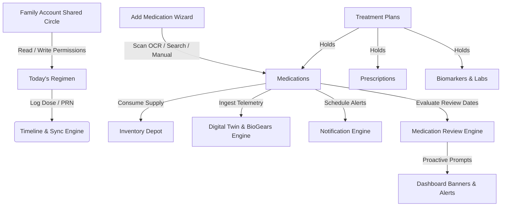
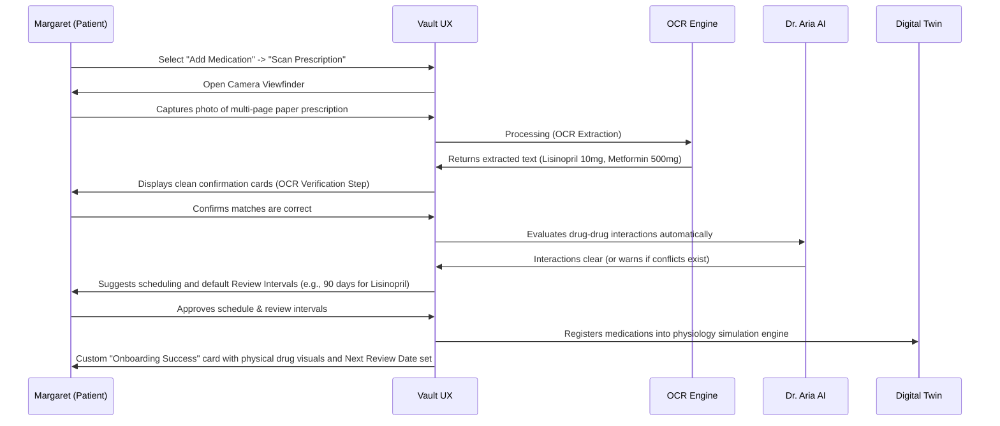
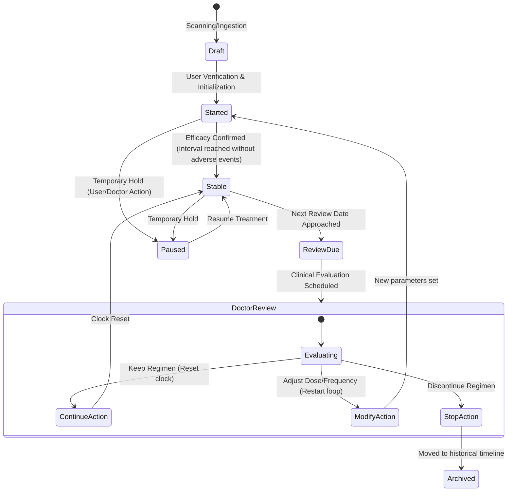
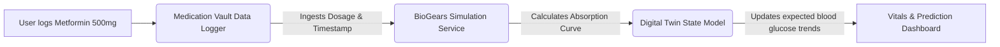

# VitalHealth – MV-001: Medication Vault Product & UX Specification
## Personal Health Operating System (PHOS) Module Specification
**Document Reference:** MV-001-SPEC-REV1  
**Status:** Approved for Engineering & UX Prototyping  
**Authors:** Senior Healthcare Product Manager, Senior UX Architect, Clinical Workflow Designer, Healthcare Systems Architect  

---

> [!IMPORTANT]
> This document is the official product and user experience specification for the Medication Vault module of VitalHealth. It is intended to guide frontend and backend developers in creating a production-grade system. **Do not modify this file with React/TypeScript code or database schemas. Maintain its status as a pure design, product, and architectural specification.**

---



---

## 1. Vision

The Medication Vault is not a standalone utility for tracking pill reminders; it is a core system component within the VitalHealth Personal Health Operating System (PHOS). Its vision is to transition the user's relationship with medication from a series of disjointed alerts to a unified, context-aware clinical journey. 

Medication is rarely taken in isolation. It is prescribed to treat specific conditions, it impacts physiological biomarkers in real time, its absorption is modified by nutrition, and its effectiveness must be periodically evaluated by clinical teams. The Medication Vault bridges the gap between clinical intent (the doctor’s prescription) and daily biological reality (the user's physiological twin).

Crucially, **real patients do not take medicines forever.** To prevent indefinite, unreviewed drug consumption, the Medication Vault contains a clinical-grade **Medication Review Engine**. This engine monitors drug durations, predicts efficacy windows, calculates Next Review Dates, and proactively transitions medications through a safety-focused review cycle.

By integrating medication tracking directly with the **Digital Twin**, **Dr. Aria AI**, **Health Timeline**, and **Care Circles**, VitalHealth turns passive tracking into active, closed-loop clinical insights. The visual design is calm, encouraging, and clean, moving away from stressful, clinical grids to a human-centric health companion.

---

## 2. Product Philosophy

To ensure all team members design and build with the correct mindset, we define the Medication Vault through strict conceptual boundaries:

| What Medication Vault is NOT | What Medication Vault IS |
| :--- | :--- |
| **A simple drug encyclopedia.** We do not expect users to read dry chemical monographs. | **An AI-Supported Medication Workspace.** Dr. Aria translates pharmacy sheets into plain English. |
| **A rigid alarm/reminder app.** Standard alarms cause alert fatigue and ignore physical context. | **A Contextual Companion.** Adapts to meals, travel, physiological metrics, and sleep wake cycles. |
| **A static PDF folder.** Storing prescription scans as unread flat files is a dead end. | **A Structured Prescription Ledger.** Every scan is OCR-extracted, validated, and interactive. |
| **A manual inventory logging utility.** Counting pills manually is tedious and prone to abandonment. | **An Anticipatory Refill Assistant.** Tracks remaining doses and automatically bridges to pharmacy systems. |
| **A clinical data island.** Isolating intake from physiological vitals prevents true health understanding. | **A Digital Twin Ingestion Source.** Feeds pharmacokinetics directly into BioGears engines. |
| **A passive database of infinite drugs.** Letting prescription schedules run indefinitely is clinically unsafe. | **A Proactive Medication Review Engine.** Manages drug lifecycles via scheduled clinical review steps. |

---

## 3. Information Architecture (IA)

The Medication Vault data structure is treatment-centric. Medications do not exist at the root level; they are children of clinical treatments, which represent the user’s active health challenges.

```
VitalHealth PHOS
 └── Medication Vault Module
      ├── Active Treatments (Clinical Containers)
      │    ├── Treatment Plan (e.g., "Type 2 Diabetes Control")
      │    │    ├── Associated Medications (e.g., Metformin, Jardiance)
      │    │    ├── Prescriptions (OCR Verified PDFs & Metadata)
      │    │    ├── Biomarkers & Lab Targets (e.g., HbA1c, Fasting Glucose)
      │    │    ├── Care Team Contacts (e.g., Dr. Sarah Jenkins - Endocrinologist)
      │    │    └── AI Assistant Workspace (Dr. Aria Chat History on Diabetes)
      │    └── Treatment Plan (e.g., "Post-Op Knee Recovery") - Short Term
      │         ├── Associated Medications (e.g., Ibuprofen, Acetaminophen PRN)
      │         └── End Date & Physical Therapy Targets
      ├── Chronological Regimen (Today's Timeline View)
      │    ├── Scheduled Slots (Morning, Afternoon, Evening, Night)
      │    └── As-Needed (PRN) Tray
      ├── Prescription Repository (System Ledger)
      │    └── Scanned Documents, Verified Status, OCR Confidence Indexes
      ├── Inventory Depot
      │    └── Drug Supply Profiles (Doses Remaining, Reorder Thresholds)
      └── Medication Review Engine Ledger
           └── Active Review Timers (Next Review Dates, Review Intervals, Audit Logs)
```

### Relational Schema Concepts (Product Logic)
- **Treatment Plan (1 : N) Medications**: A Treatment Plan can contain multiple medications. A medication must be associated with at least one Treatment Plan (if undefined, it is automatically assigned to a system-generated "General Wellness" container).
- **Medication (1 : 1) Inventory**: Every scheduled medication links to exactly one inventory tracker.
- **Medication (N : 1) Prescription**: Multiple medications can be linked to a single scanned prescription document.
- **Dose Log (N : 1) Medication**: Every time a pill is taken, skipped, or snoozed, it creates a Dose Log entry linked to that medication, timestamped, and associated with a spatial location and timezone.
- **Medication (1 : 1) Review Timer**: Every active medication possesses a review record specifying the `Review Interval` (e.g., 7 days, 30 days, 90 days, 6 months, 1 year), the calculated `Next Review Date`, and the current stage in the clinical review lifecycle.

---

## 4. Navigation Structure

To minimize cognitive load, the Medication Vault uses a flat, 3-tab layout, paired with contextual transition pages that isolate specific tasks.

```
[Main Navigation Bar]
   ├── Tab 1: Today's Regimen (Chronological view of daily doses & Proactive Banners)
   ├── Tab 2: Treatment Plans (Clinical folder view of conditions & Review Statuses)
   └── Tab 3: Cabinet & Ledger (Inventory, Prescriptions, Care Circle)
```

### Navigation Actions & Transitions
- **The Global Add Medication Button (FAB)**: Accessible on Tabs 1 and 2. Tapping it opens a modal sheet that fills the screen with a clean transition (scale and slide-up). This sheet presents the 4 ingestion methods with large, high-contrast, easily tappable cards.
- **Contextual Swiping**: On Tab 1 (Today's Regimen), swiping a medication card to the right logs it as "Taken". Swiping left reveals a drawer with secondary actions: "Skip" and "Snooze".
- **Medication Review Transition Pages**: Tapping a "Review Due" banner transitions the user to a dedicated Clinical Review preparation sheet. This screen highlights the patient's adherence logs, lists changes in related vitals, and provides a direct path to export records for their physician.
- **Deep Linking Matrix**:
  - `vitalhealth://vault/today` -> Opens Tab 1.
  - `vitalhealth://vault/treatments/{treatment_id}` -> Opens Tab 2 and expands the specific plan.
  - `vitalhealth://vault/medication/{medication_id}/review` -> Opens the specific Clinical Review workspace for that medication.
  - `vitalhealth://vault/medication/{medication_id}/refill` -> Opens Tab 3 directly focused on the reorder screen.
  - `vitalhealth://aria/chat?context=medication&id={medication_id}` -> Opens Dr. Aria AI with a preloaded prompt focusing on the specified medication.

---

## 5. User Personas

To guide UX decision-making, we define three primary user personas representing distinct demographics and clinical complexities.

### Persona A: Margaret Jenkins (72, Multimorbid Patient)
* **Clinical Context**: Diagnosed with Type 2 Diabetes, Stage II Hypertension, and Osteoarthritis. Takes 7 daily medications across 4 distinct dosing windows.
* **Technical Comfort**: Low. Uses an older Android device. Struggles with small text and multi-step dialogs.
* **Vault Goal**: Needs an interface that tells her exactly what to take *right now* with large text, visual drug indicators (color/shape), and automatic confirmation loops.
* **Review Cycle Need**: Needs simple, long-interval review alerts (e.g., 6 months for blood pressure, 1 year for thyroid medication) so she doesn't run out of refills before realizing she needs a doctor's checkup.
* **Caregiver Integration**: Her daughter, Elena, must be notified automatically if Margaret misses a dose of Metformin by more than 90 minutes, or if a medication review is due within 14 days.

### Persona B: David Chen (34, Acute Care Patient)
* **Clinical Context**: Prescribed a 10-day intensive antibiotic course (Amoxicillin-Clavulanate) and a steroid inhaler following a severe respiratory infection.
* **Technical Comfort**: High. Tech worker, uses an iPhone, expects rapid interactions and calendar sync.
* **Vault Goal**: Wants to quickly scan the pharmacy box, automatically build the schedule, set alerts that respect his meetings, and verify that the antibiotic course is 100% complete so he doesn't relapse.
* **Review Cycle Need**: Needs a short, high-priority review trigger (e.g., 7 days post-treatment) to confirm symptoms have resolved before stopping or archiving the antibiotic course.
* **Caregiver Integration**: None. Private account.

### Persona C: Elena Jenkins (45, Primary Caregiver & Mother)
* **Clinical Context**: Coordinates care for her elderly mother (Margaret) and her 8-year-old son (Leo, who takes daily asthma maintenance inhalers and acute allergy medicine).
* **Technical Comfort**: Moderate. Uses her phone for banking and social media.
* **Vault Goal**: Needs a unified dashboard where she can switch profiles, monitor her mother's insulin adherence, log her son's inhaler doses, and receive immediate alerts for skipped medications.
* **Review Cycle Need**: Needs a central dashboard view of upcoming review dates for both her mother and her son, enabling her to coordinate clinical appointments efficiently.

---

## 6. User Journeys

### Journey 1: Onboarding a Chronic Condition (Margaret Jenkins)


### Journey 2: Missed Dose Escalation Logic (Margaret & Elena)
- **8:00 AM (Target Time)**: Metformin dose is scheduled.
- **8:15 AM (First Nudge)**: A calm, persistent notification sounds. "Metformin time. Best taken with your breakfast."
- **8:45 AM (Second Nudge)**: Notification states: "It's been 45 minutes since your scheduled Metformin dose. Remember, taking it with food prevents stomach upset."
- **9:30 AM (Dose Auto-Snoozed/Late Flag)**: The system flags the dose as "Late".
- **9:31 AM (Caregiver Escalate)**: A silent notification is sent to Elena's phone: *"Margaret hasn't logged her morning Metformin yet. She is 90 minutes past due."* Elena calls her mother to check in.
- **9:40 AM (Dose Logged)**: Margaret logs the dose. The alert on Elena’s phone clears automatically.

### Journey 3: Timezone Traversal (David Chen - NYC to London)
- **Baseline**: David takes a medication at 9:00 PM EST daily.
- **Travel Phase**: David boards a flight. The app detects a timezone change via the OS.
- **Decision Engine**:
  - Is the drug an interval-critical drug (e.g., birth control, blood thinners, certain antibiotics requiring strict 12-hour intervals)?
  - Or is it window-flexible (e.g., statins, vitamins)?
- **UX Action**:
  - *Interval-critical*: The app keeps a strict countdown timer. It alerts David that his next dose is due at 2:00 AM local time (London) to maintain the exact 12-hour window.
  - *Window-flexible*: The app gently shifts the dose timing. It prompts: *"Welcome to London. We've shifted your Lipitor dose to 9:00 PM GMT to align with your evening routine here. This is safe to do."*

---

## 7. Medication Lifecycle & Review Engine

To prevent invalid states and ensure clinical oversight, every medication in the system exists within a regulated lifecycle managed by the **Medication Review Engine**. Medications do not remain active indefinitely; they progress through sequential review check-gates:



### Lifecycle Stage Details & Logic
* **Draft**: Created via OCR, database search, or package scan. Requires review and verification. Not active in notifications, inventory count down, or Digital Twin calculations.
* **Started**: The medication regimen has been initiated. This phase focuses on monitoring initial tolerance. The system runs high-frequency symptom tracking. The default interval is **7 days** or **30 days** depending on the drug profile.
* **Stable**: The patient has adjusted to the medication. Adherence is consistent, and primary biomarkers are stable. The review clock operates on a medium-to-long interval (e.g., **90 days**, **6 months**, or **1 year**).
* **Review Due**: The system calculates that the `Next Review Date` is within the alert threshold (typically **14 days** prior). Dashboard banners and notifications change from passive monitoring to proactive planning mode.
* **Doctor Review**: The active window during which the patient has an appointment or conducts an AI-guided self-evaluation. 
  - **Continue**: The physician determines the medication is functioning correctly. The review clock is reset for another interval (e.g., +180 days).
  - **Modify**: The dosage, strength, or frequency is adjusted. The medication transitions back to the "Started" phase under the new parameters, resetting the monitoring loop.
  - **Stop**: The medication is discontinued. The schedule is deleted, and the history is written to the Timeline.
* **Paused**: Temporarily stops alerts (e.g., patient is in the hospital and medications are managed by staff). Adherence metrics are suspended.
* **Archived**: Historical record of completed or stopped regimens.

---

## 8. Treatment Lifecycle

Treatments represent the clinical context (e.g., "Cardiovascular Health"). Medications are mapped into these treatments.

- **Proposed**: Generated by Dr. Aria AI after analyzing a uploaded clinical note. Prompt: *"Dr. Aria detected a new treatment recommendation for Hypertension. Review and activate?"*
- **Active**: The treatment has active medications and tracked biomarkers.
- **On Hold**: The treatment is suspended (e.g., during surgery recovery, some long-term treatments are paused).
- **Completed**: The underlying condition is resolved (e.g., "Post-Op Recovery" completed after 6 weeks).
- **Archived**: Hidden from daily views but fully searchable in the historical timeline.

---

## 9. Workspace Architecture

The Medication Vault Workspace features a clean, premium visual design. It uses a calming, high-contrast, modern interface with a deep slate and charcoal background (dark mode) or soft off-white and cool grey background (light mode). Focus colors are soft blue (`hsl(210, 100%, 50%)`) and comforting emerald (`hsl(150, 80%, 40%)`) for adherence. Warning indicators use warm amber (`hsl(35, 100%, 50%)`) to avoid triggering panic.

```
+-------------------------------------------------------------+
| [Profile Switcher: Self v]                      [Aria AI]   |
|                                                             |
|  TODAY'S REGIMEN      TREATMENT PLANS      CABINET          |
|  (Selected)                                                 |
|                                                             |
|  +-------------------------------------------------------+  |
|  | [!] PROACTIVE CLINICAL REVIEW DUE                     |  |
|  |     Lisinopril is due for review in 5 days.           |  |
|  |     [PREPARE CLINICAL SUMMARY]    [SCHEDULE DOC]      |  |
|  +-------------------------------------------------------+  |
|                                                             |
|  +-------------------------------------------------------+  |
|  | MORNING WINDOW (8:00 AM - 11:00 AM)                   |  |
|  |  +-------------------------------------------------+  |  |
|  |  | [Icon] Metformin 500mg                          |  |  |
|  |  |        Take 1 pill with breakfast               |  |  |
|  |  |        [LOG AS TAKEN]         [SNOOZE / SKIP]   |  |  |
|  |  +-------------------------------------------------+  |  |
|  |  +-------------------------------------------------+  |  |
|  |  | [Icon] Lisinopril 10mg                          |  |  |
|  |  |        Take 1 pill                              |  |  |
|  |  |        [LOG AS TAKEN]         [SNOOZE / SKIP]   |  |  |
|  |  +-------------------------------------------------+  |  |
|  +-------------------------------------------------------+  |
|                                                             |
|               [ + ADD NEW MEDICATION ]                      |
+-------------------------------------------------------------+
```

### Layout Rules
- **Typography**: Custom fonts (e.g., *Inter* or *Outfit*). Titles use bold, large styles (`24px` to `32px` on mobile), with regular weights (`14px` to `16px`) for instructions.
- **Dynamic Interaction**: Swiping cards uses physical spring-based animations. Collapsing headers slide away smoothly when scrolling down to maximize screen space for the regimen cards.
- **Accessibility Integration**: Every element matches WCAG 2.1 AA contrast requirements. Target tap areas are a minimum of `48dp x 48dp` with generous padding. Screen readers receive descriptive voice annotations (e.g., *"Metformin 500 milligram card. Double-tap to log as taken, swipe left for snooze options"*).

---

## 10. Dashboard Experience

### Purpose & User Target
The landing page of the Medication Vault. It is used by patients to check their daily progress and coordinate care at a glance.

### UI Components
- **Top Bar**: Profile switcher dropdown (Self, Father, Son), search icon, and Dr. Aria mini-button.
- **Proactive Review Banner**: Surfaces automatically when a medication's review state transitions to `Review Due`.
  - Color: Soft amber background, charcoal text.
  - Text: *"Your blood pressure medication is due for review in 5 days. Schedule an appointment?"*
  - Secondary text: *"Adherence: 96% | Avg Blood Pressure: 122/80"*
  - Primary button: *"Prepare Review"* (triggers a clinical report export and opens appointment scheduler links).
- **Progress Ring**: A smooth, glowing circular indicator showing today's completion progress (e.g., "3 of 5 Doses Taken"). The ring glows green when 100% adherence is met.
- **Toggle Header**: "Today's Regimen" vs. "Treatment Plans".
- **Primary Action**: Sticky, semi-transparent "+ Add Medication" button floating at the bottom center.

### Interaction States
- **Empty State**: Displays when no medications are added. Presents a warm vector graphic and a clear message: *"Your vault is empty. Let's add your first medication or scan a prescription."*
- **Loading State**: A shimmering skeleton screen that replicates the shape of the regimen cards to reduce perceived latency.
- **Success State**: When the last dose of the day is logged, the progress ring scales up slightly, triggers a subtle haptic pop, and displays a comforting card: *"All done for today! Your Digital Twin is balanced."*

---

## 11. Today's Medication Experience

### Purpose & Clinical Goal
Focuses the patient on the immediate task: taking the right medication, at the right time, with the right instructions, without cluttering the interface with historical or future data.

### Screen Layout & Components
- **Dosing Windows**: Chronologically grouped segments (Morning, Afternoon, Evening, Night).
  - Cards inside past windows collapse automatically if all doses are logged.
  - Active windows are expanded by default.
  - Future windows are visible but slightly dimmed to reduce visual noise.
- **Card Anatomy**:
  - Left: Visual pill avatar (user-selected or system-generated based on description: e.g., pink oval, white round, blue capsule).
  - Center: Medication Name, Strength, and custom timing instruction (e.g., *"Take with food"*).
  - Right: Quick Log action button.
- **As-Needed (PRN) Section**: Located below the scheduled windows. It contains medications with no strict time slots (e.g., pain relievers). Each card features a counter showing how many doses have been taken today and when the medication was last logged to prevent accidental overdosing.

### Production Behavior & Logic
- **Automated Grace Periods**: Doses logged within 2 hours of the scheduled time are marked as "On Time". Doses logged after 2 hours are marked as "Late".
- **Log Confirmation Action Sheet**: Tapping a card opens a modal action sheet from the bottom:
  - *"Log Metformin 500mg as taken at 8:14 AM?"*
  - Provides a quick slider to adjust the intake time back by up to 2 hours in case the user took the pill earlier but forgot to log it.
- **Skip Action Flow**: If "Skip" is selected, the system prompts for a reason (*"Side effects"*, *"Forgot"*, *"Doctor instructed"*). This data is passed to the Digital Twin and logged in the analytics engine.

---

## 12. Treatment Plans

### Purpose
To organize the vault by clinical diagnoses instead of an unstructured list of drugs. This matches how doctors think and how medical records are structured.

```
+-------------------------------------------------------------+
| < Back                                           [Search]   |
|                                                             |
|  TREATMENT PLANS                                            |
|                                                             |
|  [Card] TYPE 2 DIABETES CONTROL                             |
|         Adherence: 94% | 2 Active Medications               |
|         +-------------------------------------------------+ |
|         | Medications: Metformin, Jardiance               | |
|         | Last Lab: HbA1c 6.8% (12 days ago)              | |
|         | Prescribing Dr: Dr. Sarah Jenkins               | |
|         +-------------------------------------------------+ |
|                                                             |
|  [Card] POST-OP KNEE RECOVERY (Short-term: Ends Aug 15)     |
|         Adherence: 100% | 1 Active Medication             |
|         +-------------------------------------------------+ |
|         | Medications: Ibuprofen 600mg                    | |
|         | Lab/Goal: Knee Flexion > 90°                    | |
|         +-------------------------------------------------+ |
+-------------------------------------------------------------+
```

### UX Components & Visual Hierarchy
- **Treatment Cards**: Large containers that group:
  - The name of the condition (e.g., "Hypertension Management").
  - An adherence index metric (e.g., Proportion of Days Covered over 30 days).
  - The list of active medications within this treatment.
  - Quick link to the prescribing clinician.
  - Linked health records or lab results (e.g., blood pressure charts for Hypertension).
  - **Clinical Review Status indicator**: Shows the Next Review Date and current stage (e.g., *"Next Review: Sept 14 (Stable)"*).
  - A summary card containing AI-generated advice from Dr. Aria (e.g., *"Your blood pressure has trended down since starting Lisinopril. Dr. Aria recommends bringing this chart to your follow-up on Aug 12."*).

---

## 13. Add Medication Experience

The entry flow is completely redesigned to support four distinct, clinical-grade acquisition methods. It must never feel like a manual form-fill unless all automated pathways fail.

```
+-------------------------------------------------------------+
| Cancel                  ADD MEDICATION                      |
|                                                             |
|  Choose how you want to add your medication:                |
|                                                             |
|  +-------------------------------------------------------+  |
|  | [Icon] SCAN PRESCRIPTION                              |  |
|  |        Snap a photo of your doctor's order sheet.     |  |
|  |        Extracts all schedules automatically.          |  |
|  +-------------------------------------------------------+  |
|  +-------------------------------------------------------+  |
|  | [Icon] SEARCH MEDICINE DATABASE                       |  |
|  |        Type name, select strength and form.           |  |
|  +-------------------------------------------------------+  |
|  +-------------------------------------------------------+  |
|  | [Icon] SCAN BOX OR BOTTLE                             |  |
|  |        Scan barcode or OCR the pharmacy label.        |  |
|  +-------------------------------------------------------+  |
|  +-------------------------------------------------------+  |
|  | [Icon] ENTER MANUALLY                                 |  |
|  |        Type details step-by-step.                     |  |
|  +-------------------------------------------------------+  |
+-------------------------------------------------------------+
```

### Method 1: Scan Prescription
1. **Camera Ingestion**: The user takes a photo of their prescription document or uploads a PDF.
2. **OCR Parsing Engine**: The backend runs OCR on the document. It parses:
   - Medication name and strength (e.g., *"Metformin 500mg"*).
   - Frequency (e.g., *"twice daily with meals"*).
   - Quantity and refills (e.g., *"Qty: 60, Refills: 3"*).
   - Prescribing doctor and date.
3. **Verification Screen**: Displays the scanned document side-by-side with the extracted values highlighted. The user reviews and clicks *"Approve & Schedule"*.
4. **Review Cycle Initialization**: The OCR engine suggests a default `Review Interval` based on the drug class (e.g., 90 days for new statins, 10 days for antibiotics). The user confirms this schedule.
5. **Document Linking**: The PDF is automatically saved to the Documents module and linked to this medication record.

### Method 2: Search Medicine
1. **Autocomplete Field**: An interactive search input connected to the system drug database.
2. **Selection Flow**:
   - As the user types, matches appear instantly.
   - Once selected, the screen presents large cards for available strengths (e.g., *"50mg"*, *"100mg"*, *"200mg"*).
   - The user selects the dosage form (tablet, capsule, liquid, injection, inhaler) via high-contrast illustrations.
   - **Review Engine Step**: System displays: *"Clinical standard recommends reviewing this drug in 90 days. Set this review date?"* Options: 7d, 30d, 90d, 6m, 1y.

### Method 3: Scan Medicine Package
1. **Multi-Modal Camera View**: The camera scans the medication packaging.
2. **Primary - Barcode Scan**: Tries to match the UPC/barcode against the database to instantly retrieve the drug name, manufacturer, strength, and packaging size.
3. **Secondary - On-Device OCR Fallback**: If the barcode is unrecognized or damaged, the app automatically switches to OCR mode. It scans the textual layout of the bottle, looks for the drug name and strength using clinical NLP, and populates the details. The transition between barcode detection and OCR occurs in the background without user intervention.

### Method 4: Manual Entry
- A step-by-step wizard. Each screen asks exactly one question to avoid cognitive overload:
  1. *What is the name of the medicine?* (Text field with autocomplete suggestions).
  2. *What shape or form is it?* (Visual pill selector).
  3. *What is the strength?* (Numeric entry with unit selector: mg, mcg, ml, units).
  4. *How often do you take it?* (Visual scheduler: Daily, Specific Days, As-Needed).
  5. *When should this medication be clinically reviewed?* (Toggles: 7 days, 30 days, 90 days, 6 months, 1 year, Custom date).

---

## 14. Prescription Management

### Purpose
To serve as a verifiable ledger of active clinical instructions, verifying that the vault matches the instructions of the healthcare team.

### Components & Screen Elements
- **Prescription Cards**: Shows the active prescriber's clinic name, phone number, date of issue, and a thumbnail of the original document.
- **Verification Badging**: 
  - **Verified**: Confirmed by OCR or synced directly from an EHR integration (Epic MyChart/FHIR).
  - **Self-Reported**: Added manually by the user, flagged with a light warning indicating it hasn't been checked against clinical sources.
- **Refill Tracker**: Shows the remaining refills (e.g., *"2 refills left before expiration"*). Includes a one-tap action to call the clinic or generate a shareable prescription pass for the pharmacist.

---

## 15. Inventory Management

The Inventory Management workspace keeps patients from running out of critical medications by tracking supply counts automatically.

```
+-------------------------------------------------------------+
| < Back                  INVENTORY DEPOT                     |
|                                                             |
|  ACTIVE SUPPLIES                                            |
|                                                             |
|  +-------------------------------------------------------+  |
|  | [Icon] Metformin 500mg                                |  |
|  |        14 Days Remaining (14 pills left)              |  |
|  |        [Reorder Threshold: 7 Days]                     |  |
|  |        [ REQUEST REFILL ]     [ ADJUST STOCK ]        |  |
|  +-------------------------------------------------------+  |
|                                                             |
|  +-------------------------------------------------------+  |
|  | [Icon] Lisinopril 10mg                                |  |
|  |        6 Days Remaining (6 pills left)  [LOW STOCK]   |  |
|  |        [ REQUEST REFILL ]     [ ADJUST STOCK ]        |  |
|  +-------------------------------------------------------+  |
+-------------------------------------------------------------+
```

### Production Rules & Automation
- **Automatic Consumption**: Every time a user logs a dose, the inventory decrements by the dosage amount.
- **Days-Remaining Forecast**: The UI displays inventory as *"Days Remaining"* rather than pill counts. For example, *"14 Days Remaining"* is more meaningful to a patient than *"28 tablets remaining (take 2 daily)"*.
- **Low-Stock Triggers**: When the inventory crosses the threshold (default: 7 days of supply remaining), the status color shifts to amber and generates a system alert.
- **Adjust Stock Utility**: A simple modal to adjust counts (e.g., if a user drops a pill or receives a split shipment).

---

## 16. Medication Details

A comprehensive profile page for each medication that serves as the single source of truth for the patient.

### Content Elements
- **Header**: Visual pill render (color/shape), name, strength, and purpose (e.g., *"Metformin 500mg - Prescribed for Diabetes"*).
- **Active Schedule Card**: Visual representation of the dosing schedule (e.g., *"8:00 AM with Breakfast"*).
- **Medication Review Section**: 
  - Displays current Review Status: `Started`, `Stable`, or `Review Due`.
  - Next Review Date (e.g., *"October 24, 2026"*).
  - Selected Interval: `90 days`.
  - Action button: *"Request Clinical Review"* (allows the patient to force a manual review cycle or log a clinical adjustment immediately).
- **Warning & Food Panel**: Clear, visual icons showing critical warnings (e.g., *"Take with food"*, *"Avoid Grapefruit"*, *"May cause drowsiness"*).
- **Dr. Aria Insight Panel**: A collapsed card that expands to show common side effects in plain English.
- **Refill & Inventory Status**: Current pill counts and days remaining.
- **Clinical Metadata**: Prescribing physician, date started, total duration, and a link to the original verified prescription document.

---

## 17. AI Integration (Dr. Aria AI)

Dr. Aria AI is integrated directly into the workspace to help users understand their medications.

```
+-------------------------------------------------------------+
| [Aria Logo] Ask Dr. Aria about Metformin                    |
|                                                             |
|  Common questions:                                          |
|  +-------------------------------------------------------+  |
|  | "Why was I prescribed this medicine?"                 |  |
|  +-------------------------------------------------------+  |
|  | "What should I do if I miss a dose?"                  |  |
|  +-------------------------------------------------------+  |
|  | "Are there any food interactions?"                    |  |
|  +-------------------------------------------------------+  |
|                                                             |
|  [ Chat Input Field...                                 ]    |
+-------------------------------------------------------------+
```

### Design Guidelines
- **Contextual Access**: A Dr. Aria quick-help card is embedded inside the detail screen of every medication.
- **Clinical Review Support**: When a drug reaches the `Review Due` phase, Dr. Aria prepares a diagnostic survey for the patient:
  - *"I see your Lisinopril is due for review. Let's check: have you experienced any dry coughing or lightheadedness lately?"*
  - The responses are compiled directly into the clinical review export document.
- **Plain-Language Translations**: When parsing FDA drug monographs, Dr. Aria translates clinical terms into simple language. For example, instead of *"May cause transient dyspepsia,"* Dr. Aria shows *"May cause temporary stomach upset. Taking it with food helps."*
- **Interaction Checker**: Run automatically in the background when a new drug is added. If a conflict is detected, a warning appears at the top of the Add Medication flow: *"Dr. Aria detected a moderate interaction between your new medication and your active Lisinopril. We recommend confirming this with your pharmacist."*

---

## 18. Family & Caregiver Experience

The Family & Caregiver sub-workspace manages permissions, notifications, and profile sharing.

```
+-------------------------------------------------------------+
| < Back               FAMILY CARE CIRCLE                     |
|                                                             |
|  PEOPLE I CARE FOR                                          |
|  +-------------------------------------------------------+  |
|  | [Avatar] Margaret Jenkins (Mother)                      |  |
|  |          Today's Adherence: 3 of 4 Doses Logged        |  |
|  |          Upcoming Reviews: Lisinopril (4 days left)    |  |
|  |          [VIEW DETAILS]        [ALERT SETTINGS]        |  |
|  +-------------------------------------------------------+  |
|                                                             |
|  PEOPLE WHO CARE FOR ME                                     |
|  +-------------------------------------------------------+  |
|  | [Avatar] Elena Jenkins (Daughter)                       |  |
|  |          Access Level: Full (Can edit schedules)       |  |
|  |          [MANAGE PERMISSIONS]                          |  |
|  +-------------------------------------------------------+  |
+-------------------------------------------------------------+
```

### Sharing Protocol & Permissions
- **Granular Permissions**:
  - *View Only*: Caregiver can see today's adherence, inventory levels, and upcoming clinical review notifications, but cannot log doses or edit schedules.
  - *Full Access*: Caregiver can log doses (e.g., for children or elderly dependents), modify schedules, and manage the Medication Review outcomes.
- **Privacy Mode**: Adult patients can toggle off sharing for specific sensitive medications (e.g., mental health or reproductive drugs) while keeping standard cardiovascular medications visible to their caregiver.
- **Caregiver Alert Rules**: Configure notification delays before escalating skipped doses to family members (e.g., immediate, 1 hour, or 3 hours).

---

## 19. Digital Twin Integration

Medication Vault data feeds directly into the Digital Twin. There is no manual sync button; the integration is automatic and runs in the background.



### Closed-Loop Physiological Feedback & Review Triggers
- **Metformin Absorption**: When Metformin is logged, the Digital Twin's physiology engine registers the intake. The predicted glucose curve for the next 4 hours adjusts downward, and the dashboard displays a dotted trend line representing the expected path.
- **Lisinopril Effect**: Logging Lisinopril simulates a gradual decline in systemic vascular resistance over 2 hours. If a user’s blood pressure smartwatch measures a stable reading matching the model, the Digital Twin calibrates its simulation parameters.
- **Review Cycle Validation**: The Digital Twin provides data points for the Medication Review Engine. If blood pressure readings are consistently high despite logged Lisinopril compliance over a 30-day period, the Review Engine will automatically pull the `Next Review Date` forward, triggering a dashboard alert: *"Your Digital Twin shows elevated blood pressure trends despite 95% compliance. Let's schedule a clinical review early."*

---

## 20. Notification Experience

VitalHealth replaces generic, jarring push alarms with contextual notifications designed to reduce alert fatigue.

### Notification Types & Logic
- **Contextual Regimen Alerts**: Notifications adjust their timing based on physiological and calendar context:
  - *Meal-related*: If Metformin is set for "Morning with breakfast", and the user logs breakfast in the Nutrition module, the notification sounds immediately. If no meal is logged by 9:00 AM, the app prompts: *"Ready for breakfast? Don't forget your Metformin."*
  - *Activity-related*: If the user is running (detected via CoreMotion/Fitbit), the notification is delayed until 5 minutes after their heart rate returns to resting levels.
- **Proactive Medication Review Alerts**:
  - Sent 14 days before a chronic medication reaches its review date: *"Lisinopril review due in 14 days. Click here to check your adherence summary."*
  - Sent 5 days before: *"Review due in 5 days. Would you like to export your clinical report for Dr. Jenkins?"*
- **Inventory Triggers**: Silent notifications sent at 10:00 AM when a medication drops below 7 days of supply.
- **Refill Escalation**: An alert when a prescription has 0 refills remaining and must be renewed by the physician.
- **Caregiver Alerts**: Critical push notifications sent to caregivers when a dependent misses a high-risk medication.

---

## 21. Timeline Experience

Every action within the Medication Vault generates an event on the master VitalHealth Health Timeline, creating a historical record of the patient's care.

```
[Health Timeline]
  ├── 08:00 AM: Metformin 500mg logged as TAKEN (Self)
  ├── 08:30 AM: Breakfast logged (350 kcal, 45g Carbs)
  ├── 10:15 AM: Heart Rate Spike (142 bpm - Morning Walk)
  ├── 02:00 PM: Lisinopril Review Completed -> Status: CONTINUE (Dr. Jenkins)
  ├── 02:05 PM: Lisinopril Review clock reset for 6 months (Next Review: Jan 21, 2027)
  └── 09:00 PM: Metformin 500mg logged as SKIPPED (Reason: Nausea)
```

- **Logged Doses**: Displays when and how a dose was logged (e.g., self-logged, caregiver-logged, or auto-logged via a connected smart pillbox).
- **Schedule Alterations**: Tracks changes to dosage schedules (e.g., *"Metformin dose changed from 500mg to 1000mg by Dr. Jenkins"*).
- **Review Cycle Events**: Logs review transitions (e.g., *Started -> Stable*, *Review Completed (Continue/Modify/Stop)*).

---

## 22. Analytics Experience

Analytics move away from simple adherence percentages (which can be misleading) to clinical standards.

```
+-------------------------------------------------------------+
| < Back                  ADHERENCE TRENDS                    |
|                                                             |
|  PROPORTION OF DAYS COVERED (PDC)                           |
|  Overall Score: 94% (Target: >80% for clinical efficacy)    |
|                                                             |
|  [Adherence Trend Graph: 30-day view showing daily status]  |
|                                                             |
|  CLINICAL CORRELATIONS                                      |
|  +-------------------------------------------------------+  |
|  | [Icon] Adherence & Blood Glucose                       |  |
|  |        Your average glucose drops by 18 mg/dL on days  |  |
|  |        where Metformin is taken before 9:00 AM.        |  |
|  +-------------------------------------------------------+  |
+-------------------------------------------------------------+
```

### Key Metrics & Visualizations
- **Proportion of Days Covered (PDC)**: The clinical standard for calculating adherence. It measures the percentage of days the patient has access to their medication based on fill history and daily logging, ignoring days when a medication was paused or completed.
- **Review Engine Analytics**: Displays the timeline of reviews, including historical adjustments. Calculates the correlation between review actions and symptom improvements.
- **Reason-for-Skip Charts**: A simple breakdown of why doses were missed (e.g., 60% side effects, 40% forgot), helping clinical teams adjust treatments during Doctor Reviews.

---

## 23. Search Experience

A central search interface accessible from the top of the Medication Vault.

- **Dual-Scope Search**:
  - **Local Vault Search**: Finds items in the user's active medications, past prescriptions, and treatment plans (e.g., searching *"Dr. Jenkins"* displays the Metformin prescription and the Endocrinology care team contact).
  - **Global Drug Database Search**: If no local match is found, the system queries the drug database. The search results show drug information profiles with an action button to *"Add to Vault"*.
- **Recent Searches**: Displays recently viewed medications or scanned prescriptions for quick access.

---

## 24. Sharing & Doctor Experience

Makes it easy for patients to share accurate, clinical-grade medication histories with their healthcare providers.

```
+-------------------------------------------------------------+
| < Back                SHARE WITH CLINIC                     |
|                                                             |
|  Select what to include in your clinical report:             |
|  [x] Active Medication List                                 |
|  [x] 30-Day Adherence Log (PDC)                             |
|  [x] Clinical Review Survey Responses (Dr. Aria)            |
|  [x] Prescribing Doctors & Refills                          |
|  [x] Related Vitals & Biomarkers (Digital Twin logs)        |
|                                                             |
|  [ GENERATE SECURE PDF ]     [ SEND DIRECT VIA FHIR ]       |
+-------------------------------------------------------------+
```

### Export Formats & Standards
- **Clinical Review Passport**: A dedicated report generated for upcoming reviews. It includes the active drug list, 30-day compliance logs, related Digital Twin telemetry (e.g., blood pressure/glucose patterns), and patient symptom entries collected by Dr. Aria.
- **FHIR Interoperability**: For clinics that support secure integrations, the vault package can be sent directly to the clinic's Electronic Health Record (EHR) system (such as Epic or Cerner) using the HL7 FHIR standard, updating the provider's records automatically.
- **Temporary Web Link**: Generates a secure, read-only link that displays the medication list for 24 hours, secured by a verification code sent to the patient's phone.

---

## 25. Settings

The settings panel manages configurations for notifications, timezones, data sharing, and integrations.

- **Notification Preferences**: Configure custom notification sounds (soft chimes rather than harsh alarms) and set a "Quiet Hours" window where non-critical alerts are silenced.
- **Timezone Management**: Toggle between Automatic Shift (which adjusts dose timing to your current location) and Strict Lock (which keeps doses tied to a specific timezone to preserve strict intervals).
- **Default Review Intervals**: Set preferred safety thresholds for different drug classes (e.g., chronic management defaults to 180 days; high-risk medications default to 30 days).
- **Smart Hardware Integrations**: Connect Bluetooth pillboxes or smart cap organizers.

---

## 26. Accessibility

The Medication Vault is designed to be accessible to users with visual, cognitive, or motor impairments.

- **Contrast & Font Scaling**: All text complies with WCAG 2.1 AA/AAA contrast guidelines. The UI supports dynamic text scaling without breaking layout cards or overlapping text elements.
- **Screen Reader Support**: Every image and interactive button contains descriptive alternative text. Important elements are labeled with roles (e.g., button, slider, checkbox) to guide navigation.
- **Color Blindness Modes**: Status indicators do not rely on color alone. Low stock is marked with an amber color and a "LOW STOCK" badge. Logged doses use a checkmark icon, while skipped doses use an "X" icon, making the interface clear for colorblind users.
- **Voice Control Actions**: Integrated with Siri and Google Assistant shortcuts (e.g., *"Siri, log my morning Metformin"*).

---

## 27. Offline Behaviour

The Medication Vault is designed to be offline-first, ensuring that users can access their schedules and log doses without an active internet connection.

- **Local Database Caching**: All medication details, schedules, review states, and historical logs are stored locally on the device's secure storage.
- **Deferred Sync Queue**: Dose log events and review status transitions created offline are written to a local sync queue. Once the network is restored, the queue syncs in the background, updating the Digital Twin and caregiver dashboards.
- **Conflict Resolution**: If a dose is logged or a review completed on two different devices while offline, the sync engine resolves conflicts using vector clocks, prioritizing the patient's local log.

---

## 28. Error Handling

- **OCR Failures**: If the prescription OCR engine fails to extract text with high confidence, the system highlights the document and prompts the user: *"We couldn't read parts of this prescription. Please review the highlighted areas and verify the details manually."*
- **Database Search Errors**: If a search query returns no results from the local database or the network fails, the app prompts: *"We couldn't find this medicine online. Let's enter it manually to ensure your schedule is set."*
- **Review Timer Discrepancies**: If a review date passes without user action, the status reverts to "Review Due" but logs a silent telemetry alarm to the caregiver, preventing system lockups while ensuring patient safety.

---

## 29. Empty States

Empty states are designed to be warm, encouraging, and actionable, guiding users on how to populate their vault.

```
+-------------------------------------------------------------+
|                                                             |
|                      [ Warm Graphic ]                       |
|                                                             |
|                    Welcome to your Vault                    |
|                                                             |
|        Your Medication Vault is empty. Let's get started    |
|        by adding a treatment plan or scanning a medicine.   |
|                                                             |
|                     [ ADD MEDICATION ]                      |
|                                                             |
+-------------------------------------------------------------+
```

- **Today's Regimen (No Meds)**: Displays a graphic showing a clean cabinet, with a button to *"Add Medication"*.
- **Treatment Plans (No Plans)**: Displays an explanation card: *"Treatment plans help you organize your medications, doctors, and tests around specific health conditions. Create your first plan here."*
- **Care Circle (Empty)**: Displays an explanation card: *"Add family members or caregivers to share schedules, track adherence, and receive alerts if doses are missed."*

---

## 30. Edge Cases

- **Pediatric Liquid Doses**: The wizard supports volume measurements (ml) instead of pill counts. The inventory tracker estimates remaining doses using the bottle volume and the single dose amount.
- **Discontinuations & Tapering Schedules**: When a physician sets a gradual tapering schedule, the Review Engine locks the transition intervals to step-down intervals (e.g., reviewing every 7 days during dose reductions to track symptoms).
- **Double Doses**: If a user tries to log a dose that was already taken within the last 2 hours, the app displays a warning screen: *"This dose was already logged at 8:14 AM. Are you sure you want to log another dose?"* This helps prevent accidental double-dosing.
- **Hospital Admission Override**: A single toggle in Settings pauses all daily alerts and notifications while the user is admitted, allowing hospital staff to manage medications.

---

## 31. Future Scalability

The architecture of the Medication Vault is designed to support future expansions:

- **Smart Hardware Integrations**: A unified API schema designed to integrate with Bluetooth-enabled smart pillboxes and cap organizers, allowing doses to be logged automatically upon opening.
- **Genomic Match Warnings**: Future integrations will automatically cross-reference the medication list with the user's genomic data (e.g., warning if a patient's genetic profile indicates they are a physical hyper-metabolizer of a prescribed drug, suggesting a dosage adjustment).
- **Clinical Trials Integration**: A secure matchmaking engine that highlights matching, FDA-approved clinical trials based on the user's active treatment plans and adherence metrics, with an option to request more information.

---

*End of Specification. Approved for architectural implementation.*
