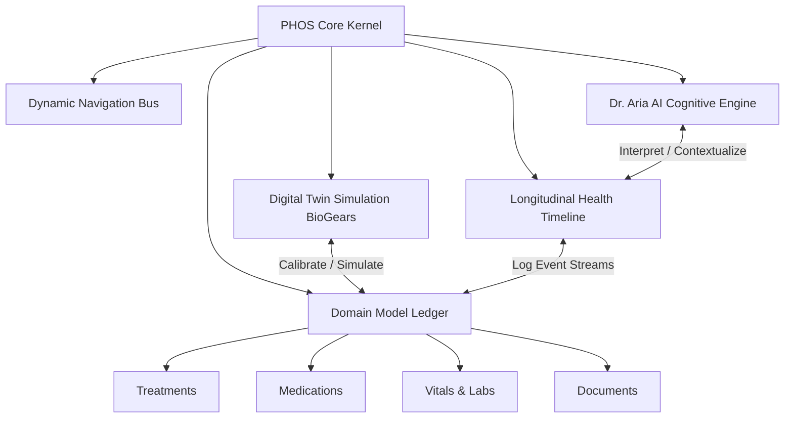
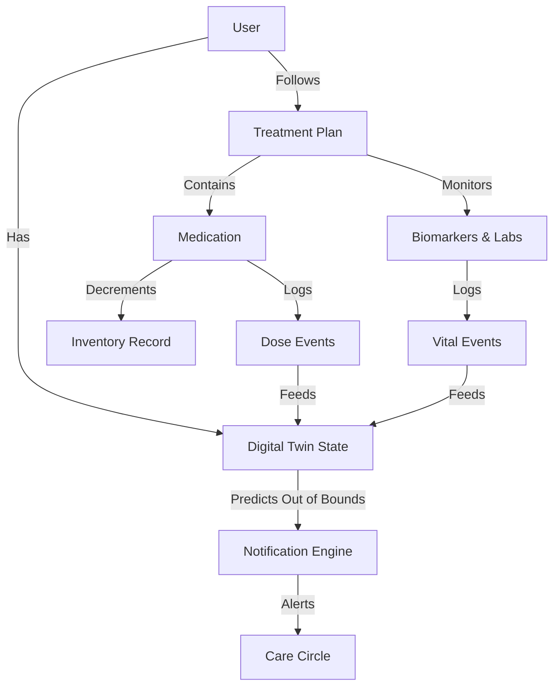
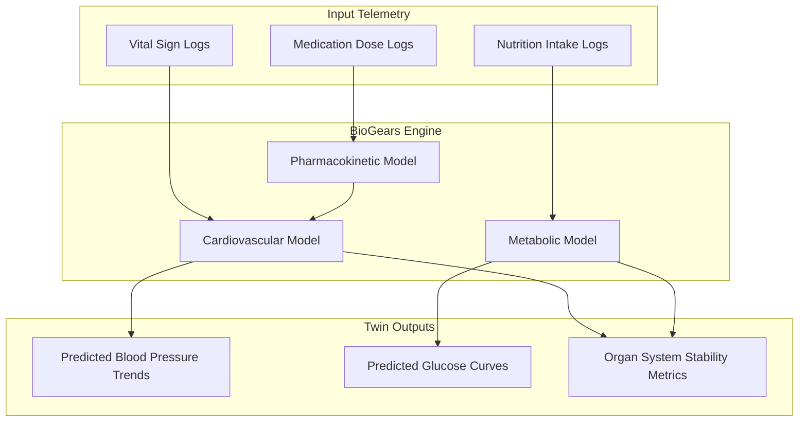

# VitalHealth – VH-001: Product & Information Architecture Specification
## Personal Health Operating System (PHOS) Constitution
**Document Reference:** VH-001-ARCH-REV1  
**Status:** Approved for Implementation  
**Authors:** Chief Product Officer, Healthcare Product Architect, Clinical Systems Designer, Digital Twin Architect  

---

> [!IMPORTANT]
> This document is the master architectural specification for the VitalHealth platform. It acts as the system constitution. All future modules, services, database migrations, and frontends must comply with the patterns, design principles, and relational models defined herein. **Do not write code in this file. Maintain its status as a pure architecture and design blueprint.**

---



---

## 1. Vision

VitalHealth exists because modern digital health software is broken. 

Existing consumer platforms treat human health as a collection of fragmented metrics. Apple Health aggregates database entries from wearable sensors; Google Fit counts steps and active minutes; MyChart serves as a billing portal and a repository for static clinical documents; Medisafe operates as a medication alarm clock. None of these applications model the human body as an integrated, dynamic biological system.

A human being is not an assembly of isolated silos. A medication dosage affects heart rate; a carbohydrate-heavy meal alters blood glucose; sleep quality determines metabolic efficiency; and physiological anomalies impact cognitive performance. 

VitalHealth is a **Personal Health Operating System (PHOS)**. It functions as an active software layer that coordinates clinical data, lifestyle telemetry, environmental contexts, and medical history. By running a localized physiological model (the **Digital Twin**) and a medical reasoning engine (**Dr. Aria AI**), VitalHealth transitions digital health from passive retrospective tracking to active, predictive health management.

---

## 2. Core Philosophy

The design and engineering of VitalHealth must adhere to the following seven architectural pillars:

### I. Health as a Connected Closed-Loop System
No data point in VitalHealth exists in isolation. When a user logs a macronutrient intake, the event is immediately processed by the Digital Twin, which updates the simulation model. This model predicts blood glucose and insulin levels, which are then used by the Medication Vault to verify the timing of the next medication dose. If an anomaly is predicted, the Notification Engine adjusts its alerts.

### II. Single Source of Truth
Every domain entity (e.g., a Document, a Lab Result, a Medication Log) is owned by a single primary ledger. Other modules interact with this data via references and event streams. Duplication of files, values, or states is prohibited to prevent data sync issues.

### III. Automation Over Manual Ingestion
Manual form-filling is a primary cause of user abandonment. VitalHealth prioritizes passive data acquisition. The platform extracts data using on-device OCR for prescriptions, parses wearable telemetry, analyzes photos of meals using computer vision, and calibrates the Digital Twin automatically based on background activity.

### IV. Context Over Raw Telemetry
A heart rate reading of 115 BPM has no clinical meaning without context. The platform calculates context by combining activity logs, location data, historical averages, and active treatment plan data. The system interprets 115 BPM differently if the user is sleeping, running a marathon, or sitting in a stressful meeting.

### V. Privacy-First Local Computing
User health data is private. VitalHealth uses local-first storage, on-device encryption, and runs models on the user's hardware whenever possible. Synchronization and cloud backups are encrypted using zero-knowledge protocols. No unencrypted clinical information is accessible by third parties.

### VI. Human-Centered Clinical Calmness
The UI design is clean, encouraging, and minimal. It avoids complex clinical dashboards in favor of a calm, supportive workspace. Color palettes, typography, and visual assets are chosen to reassure users, avoiding the stressful aesthetics of hospital tools.

---

## 3. Product Principles

To guide product decisions, every feature must align with these core product principles:

* **Reduce Cognitive Load**: Limit information density. The primary screen must focus on the user's immediate needs, hiding complex charts and data sheets under details or search menus.
* **Context-Aware UI**: The interface adapts to the user's current situation. If they are exercising, the screen shows heart rate zones and hydration metrics. If they are preparing for sleep, it transitions to a dark, low-stimulus dashboard.
* **Progressive Disclosure**: Show key summaries first. Allow users to dig into detailed charts, clinical sources, and research papers through clear, secondary navigation actions.
* **Offline-First Resilience**: All core functions—including database searches, medication logs, and Digital Twin simulations—must work without an active internet connection.
* **Clinical Safety Guardrails**: All recommendations generated by Dr. Aria AI must be verified against database constraints, drug interaction charts, and the user's clinical history before they are presented.
* **Consistency of Interface Patterns**: Every module uses the same design patterns for adding data, searching, showing details, and displaying timelines, making the system easy to learn.

---

## 4. Information Architecture (IA)

The VitalHealth platform structure organizes all sub-systems into a clear, unified hierarchy:

```
[VitalHealth Root Kernel]
   ├── Today (Dynamic Daily Regimen Dashboard)
   │    ├── Morning View (Vitals, breakfast targets, early doses)
   │    ├── Afternoon View (Activity tracking, mid-day regimens)
   │    ├── Evening View (Wind-down parameters, night doses)
   │    └── Emergency Mode (One-tap medical summary & contact card)
   ├── Timeline (Unified Chronological Memory Ledger)
   │    ├── Event Logs (Doses, nutrition, symptoms, labs)
   │    └── AI-Generated Daily & Weekly Summaries
   ├── Treatments (Active Clinical Contexts)
   │    ├── Plan Folders (Conditions, Prescriptions, Care Teams)
   │    └── Medical Records & Lab Results
   ├── Cabinet (Medication Vault, Inventory, and Refill Tools)
   ├── Care Circle (Family Sharing and Permissions Dashboard)
   ├── Documents (Unified Health Document Repository)
   └── Settings (System Configurations, Privacy, and Integrations)
```

---

## 5. Platform Navigation

VitalHealth uses a flat, predictable navigation hierarchy to ensure patients can access critical information quickly during emergencies.

```
+-------------------------------------------------------------+
| [Profile Switcher]            [Search]            [Aria AI] |
|                                                             |
|                          DASHBOARD                          |
|                                                             |
|                     [Dynamic Workspace]                     |
|                                                             |
|                                                             |
|                                                             |
+-------------------------------------------------------------+
| [Today]  [Timeline]  [Treatments]  [Cabinet]  [Care Circle] |
+-------------------------------------------------------------+
```

### Navigation Rules & Input Behaviors
- **Bottom Navigation Bar**: Fixed five-tab layout. Switching tabs retains the active state of each tab without resetting scroll positions.
- **Contextual Floating Action Button (FAB)**: Visible on the main dashboard. Tapping it opens a quick-log overlay with options tailored to the active tab:
  - *Today Tab*: Options to log Vitals, Medication, or Symptoms.
  - *Timeline Tab*: Option to add a manual health log or personal note.
  - *Cabinet Tab*: Options to Scan Box/Label or Add Medication.
- **Deep Linking Framework**:
  - `vitalhealth://vitals/log?type=blood_pressure`
  - `vitalhealth://vault/review?medication_id=123`
  - `vitalhealth://twin/calibrate`
- **Global Gestures**: Swiping from the left edge of the screen navigates back. Swiping down on a modal sheet closes it, returning the user to their previous context.

---

## 6. Domain Model

Every data object in VitalHealth is defined by a structured entity model:

### I. User Profile
* **Purpose**: Represents the primary identity, containing demographic data and physiological constants.
* **Lifecycle**: Created during onboarding. Modified by user updates or clinical syncs.
* **Ownership**: Owned by the User. Read-only for Caregivers unless explicit permissions are granted.
* **Relationships**: Relates $1:1$ to the Digital Twin State, $1:N$ to Treatment Plans, and $1:N$ to Timeline Events.

### II. Treatment Plan
* **Purpose**: A clinical container that groups medications, tests, doctors, and symptoms related to a specific diagnosis.
* **Lifecycle**: Created via prescription ingestion or user entry. Deactivated when a condition is resolved.
* **Relationships**: Relates $1:N$ to Medications, $1:N$ to Lab Results, and $1:N$ to Doctors.

### III. Medication
* **Purpose**: Tracks a scheduled or as-needed drug regimen.
* **Lifecycle**: transitions through `Draft` $\rightarrow$ `Started` $\rightarrow$ `Stable` $\rightarrow$ `Review Due` $\rightarrow$ `Doctor Review` $\rightarrow$ `Discontinued`.
* **Relationships**: Belongs to a Treatment Plan. Relates $1:1$ to an Inventory Record.

### IV. Lab Result / Vital Log
* **Purpose**: Stores clinical biomarker levels (e.g., HbA1c) and device telemetry (e.g., blood pressure, heart rate).
* **Lifecycle**: Created via sensor sync, manual entry, or clinic EHR import. Immutable once verified.
* **Relationships**: Relates $1:N$ to the Digital Twin simulation engine.

### VI. Timeline Event
* **Purpose**: An immutable record of an event in the user's health journey.
* **Lifecycle**: Written in real-time. Cannot be modified, but can be annotated or hidden.
* **Relationships**: Links to the source entity (e.g., a logged dose or symptom).

---

## 7. Relationship Architecture

Health is a web of interconnected relationships. The VitalHealth engine manages these dependencies automatically:



### Data Flow Patterns
1. **Medication Log Ingestion**: When a dose event is registered, it:
   - Decrements the active inventory.
   - Appends an entry to the Timeline.
   - Passes pharmacokinetics parameters (dosage, absorption rate) to the Digital Twin.
2. **Biomarker Capture**: When a blood pressure log is recorded, it:
   - Recalibrates the Digital Twin's blood pressure baseline.
   - Adjusts the `Next Review Date` for related hypertension medications if values trend outside safe bounds.

---

## 8. Workspace Architecture

To keep the user experience consistent across different health topics, every module uses a standardized workspace layout:

```
+-------------------------------------------------------------+
| [Module Title]                              [Search]        |
|                                                             |
|  [Dynamic Summary Widget]                                   |
|  (e.g., Current Adherence, Latest Vitals, or Active Plan)   |
|                                                             |
|  +-------------------------------------------------------+  |
|  | PRIMARY ACTION SECTION                                |  |
|  | (Add logs, scan labels, or view today's schedule)     |  |
|  +-------------------------------------------------------+  |
|                                                             |
|  +-------------------------------------------------------+  |
|  | ANALYTICS & TRENDS                                    |  |
|  | (True adherence logs, physiological correlation charts)|  |
|  +-------------------------------------------------------+  |
|                                                             |
|  +-------------------------------------------------------+  |
|  | AI CONTEXT PANEL (Dr. Aria widget for this module)    |  |
|  +-------------------------------------------------------+  |
+-------------------------------------------------------------+
```

---

## 9. Dashboard Philosophy

The Dashboard serves as the central hub of VitalHealth, presenting actionable priorities instead of static graphs.

### Dashboard Rules & Content Guidelines
- **The Priority Queue**: Shows only events requiring immediate action, such as scheduled doses, low stock alerts, or upcoming reviews.
- **Dynamic Banners**:
  - *Morning View (6:00 AM - 11:00 AM)*: Displays sleep quality results, morning medication schedules, and nutrition targets for the day.
  - *Evening View (6:00 PM - Midnight)*: Shows daily progress summaries, evening doses, and tips for winding down.
  - *Emergency Mode*: Triggered by abnormal vitals or manual activation. Displays a high-contrast Medical ID with blood type, active treatments, current medications, and primary caregiver contact info.

---

## 10. Timeline Architecture

The Timeline serves as the platform's longitudinal health memory, documenting all health events chronologically.

```
[08:00 AM] Lisinopril 10mg logged as TAKEN
           Tags: #medication #cardiovascular
           Twin impact: BP simulation updated.
[08:30 AM] Symptom: Dry Cough (Mild)
           Tags: #symptom #respiratory
           Aria Note: Common side effect of Lisinopril.
[12:15 PM] Lab: Systolic BP 138 mmHg (Elevated)
           Tags: #vital #cardiovascular
```

- **Tagging & Filtering**: Events are tagged automatically by the system (e.g., `#medication`, `#vital`, `#symptom`). Users can search events by tag or date.
- **AI-Generated Summaries**: Dr. Aria analyzes the timeline weekly to generate a plain-language summary: *"This week, your average systolic blood pressure improved by 4%, coinciding with a 98% adherence rate to your Lisinopril. We noticed mild dry cough symptoms on Tuesday."*

---

## 11. Digital Twin Architecture

The Digital Twin is a localized physiological simulation engine powered by the open-source **BioGears** framework. It runs on the user's device to predict body responses to lifestyle choices.



### Calibration & Simulation Logic
- **Simulation Frequency**: Runs in the background whenever a new dose, meal, or vital sign is logged, using the local database to update state parameters.
- **Confidence Scoring**: Shows how accurately the model matches the user's real-world measurements. If logged data is sparse, the confidence score drops, and the UI prompts: *"Log a blood pressure reading to recalibrate your Digital Twin."*
- **Safety Boundaries**: The twin does not diagnose disease. It estimates trends to help users understand their health, using clinical limit checks to prevent unsafe predictions.

---

## 12. AI Architecture (Dr. Aria AI)

Dr. Aria AI serves as the user's clinical companion. It uses an on-device language model to explain health concepts in plain language.

- **Sandbox Boundaries**:
  - *Allowed Actions*: Translating medical reports into simple terms, suggesting questions for doctors, and flagging potential drug-drug interactions.
  - *Forbidden Actions*: Diagnosing acute conditions, prescribing medications, or modifying active treatment plans without clinician verification.
- **Clinical Safety Warnings**: All advice generated by Dr. Aria includes a standard disclaimer: *"Dr. Aria is an AI assistant, not a doctor. Confirm important health decisions with your healthcare team."*

---

## 13. Notification Architecture

VitalHealth notifications are proactive alerts designed to prevent alert fatigue.

- **Priority Levels**:
  - *Critical (Red)*: High-risk missed doses or dangerous vital readings. Overrides "Do Not Disturb" modes and alerts caregivers if ignored.
  - *Warning (Amber)*: Refill warnings or upcoming medication reviews. Scheduled during active waking hours.
  - *Informational (Blue)*: Daily summaries or sleep quality reports, sent during quiet periods.
- **Context-Aware Suppression**: Prevents notifications from disrupting sleep, active workouts, or driving, delaying alerts until the user is free.

---

## 14. Document Architecture

All scanned records, lab reports, and prescriptions are stored in a unified **Health Vault**.

- **Single Storage Instance**: Documents are stored once. Modules refer to these files using unique IDs, preventing duplicate files from cluttering storage.
- **OCR Metadata Extraction**: When a document is scanned, the local OCR engine extracts:
  - Clinic name and clinician details.
  - Test dates and results.
  - Drug names, dosages, and schedules.
- **EHR Integration**: Synchronizes directly with healthcare portals using the HL7 FHIR standard to import verified clinical documents.

---

## 15. Family Architecture (Care Circle)

The Care Circle dashboard manages health sharing with family members and caregivers.

- **Roles & Permission Profiles**:
  - *Dependent (Child)*: Managed entirely by parents.
  - *Dependent (Elderly Parent)*: The parent grants view-only or editing access to their children while retaining primary control.
  - *Caregiver*: Receives alerts for missed medications or emergency vital anomalies.
  - *Physician*: Granted temporary access to specific reports or charts during consultations.
- **Biometric Security Gates**: Accessing shared dashboards requires biometric verification (Face ID or Touch ID) to protect family data.

---

## 16. Search Architecture

The Search bar provides a single point of access for all user data.

- **Natural Language Parsing**: Users can search using plain terms, such as *"When did I last take ibuprofen?"* or *"Show my blood pressure reports from last month."*
- **Database Query Routing**: The search engine parses natural language queries, searches the timeline, document vault, and drug databases, and returns results grouped by category.

---

## 17. Analytics Experience

Analytics focus on actual measurements and established clinical models.

- **True Adherence Indexes**: Evaluates compliance using the clinical Proportion of Days Covered (PDC) standard, showing actual coverage rather than basic percentages.
- **Correlative Modeling**: Automatically compares different metrics, such as plotting average daily steps against resting heart rate trends, helping users see how habits impact their vitals.

---

## 18. Security & Privacy

Data security is built into every layer of the Personal Health Operating System:

- **Local Encryption**: Databases are encrypted using SQLCipher with AES-256. Binary documents are encrypted using keys stored in the device's hardware enclave.
- **Zero-Knowledge Cloud Backups**: Cloud synchronization uses end-to-end encryption. The keys are managed on the user's device, ensuring third parties cannot read backed-up data.
- **Audit Logging**: Every data read, update, or deletion is recorded in an unmodifiable local security log.

---

## 19. Offline Architecture

VitalHealth uses an offline-first sync architecture to ensure all core features work without internet access.

- **Local-First Database Operations**: Reads and writes are processed locally. Syncing with the cloud happens in the background when a connection is available.
- **Vector-Clock Conflict Resolution**: Resolves sync conflicts by comparing logical timestamps, ensuring the user's local edits take priority over cloud updates.
- **Sync Queue Management**: Operations performed offline are added to a queue, which retries synchronization using adaptive back-off timing to save battery.

---

## 20. Accessibility

VitalHealth is designed to be accessible to all patients, including those with visual or motor impairments.

- **Dynamic Typography**: Layouts scale cleanly up to 200% font size without overlapping text or breaking interface cards.
- **WCAG 2.1 AA/AAA Compliance**: Colors match contrast requirements, and status badges use distinct icons alongside colors to support colorblind users.
- **Voice Control Ready**: All buttons and interactive areas have clear accessibility labels, making navigation with voice control systems simple.

---

## 21. Design Language

The visual design emphasizes clarity, comfort, and premium quality.

- **Color Tokens**:
  - *Backgrounds*: Slate and deep charcoal (`hsl(220, 20%, 10%)`) for dark mode; soft cream (`hsl(40, 30%, 98%)`) for light mode.
  - *Primary Accents*: Trustworthy blue (`hsl(210, 100%, 50%)`) and comforting green (`hsl(150, 80%, 40%)`) for success states.
  - *Alerts*: Soft amber (`hsl(35, 100%, 50%)`) for reviews; warning red (`hsl(0, 100%, 60%)`) for critical alerts.
- **Component Styling**: Cards use soft, rounded corners (`16px`) with flat borders, avoiding heavy drop shadows to maintain a clean, modern aesthetic.

---

## 22. Module Standards

Every module added to the VitalHealth ecosystem must implement these 10 core specifications:

1. **Vision**: Clinical intent and user goals.
2. **Information Architecture**: Module hierarchy mapping.
3. **Domain Entity Model**: Data structure and relationships.
4. **Lifecycle**: State transitions.
5. **Dashboard Widgets**: Primary and secondary display components.
6. **Timeline Event Generator**: Unified log integration.
7. **Dr. Aria AI Integration**: Interactive guidance.
8. **Offline Caching**: Sync and conflict rules.
9. **Accessibility Mapping**: Alt text, color modes, and tap targets.
10. **Edge Cases**: Out-of-bounds metrics and error handling.

---

## 23. Scalability

The platform architecture is designed to support future health technologies:

- **FHIR EHR Sync**: Syncs data directly with clinical providers using modern healthcare data standards.
- **Genomic Profiles**: Connects medication schedules with genetic markers to warn against potential adverse drug reactions.
- **Advanced Wearables**: Pre-configured pipelines for real-time ECG, continuous glucose monitoring (CGM), and photoplethysmography (PPG) sensors.

---

## 24. Quality Standards

VitalHealth maintains high clinical quality standards:

- **No Placeholder Data**: The platform uses actual sensor inputs and verified user entries. If data is missing, the UI shows an empty state instructing the user how to log it.
- **Traceable Insights**: All health alerts and AI summaries list their sources, showing which vitals, logs, or clinical guidelines triggered the recommendation.

---

*End of Platform Constitution. Approved for engineering implementation.*
