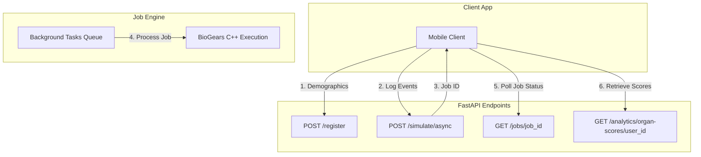

# The VitalHealth Digital Twin Reference Textbook
## A Comprehensive Technical Manual: From Physiology to Production

---

## Foreword: The Digital Twin Paradigm

In modern medicine, health advice is typically generalized based on population averages. **VitalHealth** departs from this paradigm by implementing a **Physiological Digital Twin**. 

Instead of statistical heuristics or machine-learning approximations, VitalHealth models the human body as a system of Ordinary Differential Equations (ODEs) representing biophysical processes—hemodynamics, respiratory mechanics, renal clearance, and metabolic pathways. By calibrating this mathematical system with individual demographics (age, sex, height, weight) and clinical parameters (diabetic status, smoker status, anemia), we create a customized instance of the human body. When a user logs their day-to-day lifestyle events (nutrition, exercise, sleep, medications), the simulator plays these events forward, solving the differential equations second-by-second to produce a personalized forecast of the user's health state.

This textbook serves as the definitive reference manual for the VitalHealth architecture, covering everything from the root folder directory structure down to the mathematical leaf nodes of the physiological models.

---

## Chapter 1: System Architecture & Repository Layout

The VitalHealth platform is divided into three primary software layers: the client-side mobile application, the physiological simulation server, and the Retrieval-Augmented Generation (RAG) conversational agent.

### 1.1 Complete Repository Directory Tree

Below is the absolute folder and file layout of the workspace. A clear understanding of this layout is required before modifying any service:

```
health-digital-twin/
├── VitalHealth/                    # React Native (Expo) Mobile Application
│   ├── app/                        # Expo Router navigation screens
│   │   ├── (tabs)/                 # Main tab navigation (Dashboard, Chat, Vault)
│   │   └── settings/               # App configuration & Server setup screens
│   ├── components/                 # Shared UI elements (Cards, Buttons, Modals)
│   ├── context/                    # React Context providers managing global state
│   │   └── BiogearsTwinContext.tsx # Mobile state manager for sync and polling
│   ├── database/                   # Client-side SQLite storage layer (vital_health.db)
│   │   ├── index.ts                # Unified database connection export
│   │   ├── schema.ts               # Database initialization and table definitions
│   │   ├── userProfileDB.ts        # Local cache for user registration data
│   │   ├── medicineDB.ts           # Logged medications list
│   │   ├── hydrationDB.ts          # Daily water logs
│   │   ├── symptomDB.ts            # Local logs of active and past symptoms
│   │   ├── simulationHistoryDB.ts  # Cached historical vitals (offline fallback)
│   │   └── backupService.ts        # Google Drive database backup/restore pipeline
│   ├── services/                   # Network communications layer
│   │   └── biogears.ts             # API client for HTTP communication with backend
│   └── package.json                # Mobile app dependency list
│
├── biogears_service/               # Python FastAPI Simulation Backend
│   ├── api/                        # REST API routing and endpoints
│   │   ├── server.py               # Main FastAPI entry point and jobs runner
│   │   ├── db.py                   # Atomic JSON file database (twins_database.json)
│   │   ├── analytics.py            # Physiological scoring (no-engine calculations)
│   │   └── streaming.py            # Live simulation log streaming
│   └── simulation/                 # BioGears interface and orchestration layer
│       ├── config.py               # Cross-platform path configuration & auto-detection
│       ├── scenario_builder.py     # Translator converting JSON events to BioGears XML
│       ├── engine_runner.py        # Subprocess manager executing the bg-cli binary
│       ├── result_parser.py        # CSV parsing and anomaly detection logic
│       ├── patient_builder.py      # Patient XML creation helper
│       ├── substance_registry.py   # Registry mapping 79 substances and admin routes
│       └── validator.py            # Input verification & safety dose capping
│
├── healthbot/                      # RAG Chatbot Service (Dr. Aria)
│   ├── api/                        # Chat API layer
│   │   ├── server.py               # FastAPI endpoint hosting LLM & local searches
│   │   └── main.py                 # Startup script
│   ├── core/                       # Personality and safety layers
│   │   ├── character.py            # Dr. Aria's system prompts and intent routers
│   │   └── safety.py               # Medical hallucination and safety validation
│   ├── rag/                        # RAG pipeline
│   │   ├── chunker.py              # Text segmenting logic
│   │   └── context_builder.py      # Retrieval assembler matching documents to queries
│   ├── embeddings/                 # Sentence embedding calculations
│   └── model/                      # Folder containing Qwen2.5-14B GGUF model shards
│
├── biogears_runtime/               # BioGears C++ engine binary (Linux deployment targets)
│   ├── bg-cli                      # BioGears Command Line Interface executable
│   ├── xsd/                        # XML Schema Definition files validating inputs
│   └── share/                      # Default engine assets (patients, environments)
│
├── clinical_data/                  # Storage directory for simulation results
│   ├── states/                     # Serialized XML snapshots of patient vitals
│   └── history/                    # Historical CSV output logs of simulations
│
├── deployment/                     # Production DevOps & Deployment Framework
│   ├── deploy.sh                   # One-command modular setup entrypoint
│   ├── migrate.sh                  # Automated VM-to-VM migration tool
│   ├── update.sh                   # Secure application updates with auto-rollback
│   ├── backup.sh / rollback.sh     # System state backup & restoration utilities
│   ├── doctor.sh / verify.sh       # Comprehensive system diagnostics and testing
│   ├── config/ / templates/        # Configuration library and service templates
│   ├── install/                    # Modular installation step scripts (00-10)
│   └── docs/                       # Production setup and operational guides
│
├── requirements.txt                # Global Python dependencies for BioGears API
└── twins_database.json             # Flat-file database containing user meta profiles
```

### 1.2 Core Technology Stacks
*   **Mobile App**: React Native (TypeScript) built with Expo. Utilizes **Expo Router** for page routing, **AsyncStorage** for persistent URL configuration, **SecureStore** for API keys, and **Expo SQLite** for local offline clinical record synchronization.
*   **Simulation Backend**: Python 3.11 with FastAPI. It leverages **Pandas** and **NumPy** for high-performance CSV processing and mathematical calculations, and standard subprocess pipes for process virtualization.
*   **Conversational Agent**: FastAPI server executing **llama-cpp-python** with GGUF bindings. The system relies on **Qwen2.5-14B-Instruct** for safety, empathy, and medical reasoning, alongside a SentenceTransformers embedding model.
*   **Deployment Target**: Ubuntu 22.04 LTS (Minimum: 8 vCPU, 16 GB RAM). Configured using Nginx as a reverse proxy, caching layers, and systemd daemons.

---

### Chapter 1: Technical Developer Doubts & Q&A

**Q: Why are there two separate Python virtual environments (`venv` and `healthbot_venv`) inside the root directory? Why can't we consolidate them?**  
**A:** BioGears API and the Healthbot chatbot have conflicting dependency versions. Specifically, BioGears API runs on older lightweight versions of FastAPI and Pydantic (to ensure compatibility with legacy mathematical parsers), whereas the Healthbot utilizes the latest FastAPI, Pydantic, and HuggingFace libraries to support LLM execution and quantization engines. Forcing them into the same Python environment causes dependency collision, breaking the typing system.

**Q: The directory structure contains a symlink: `health_ai -> healthbot`. Why is this necessary?**  
**A:** In the chatbot source code, internal components import scripts using the absolute python package namespace `health_ai.*` (e.g., `from health_ai.core.safety import ...`). However, the directory containing the code is named `healthbot/` to avoid naming conflicts with general project folders. The symlink bridges this gap, allowing Python's module resolver to treat the folder `healthbot/` as a package named `health_ai`. Without it, you get `ModuleNotFoundError: No module named 'health_ai'`.

---

## Chapter 2: The BioGears Engine & Patient Calibration

### 2.1 Physics-Based Physiological Modeling
BioGears is a validated, open-source C++ engine that simulates human physiology. Rather than utilizing lookup tables or statistical models, the engine solves mathematical representations of physiological systems. It couples a closed-loop cardiovascular circuit with a multi-compartment respiratory circuit, gas exchange models, and active clearance organs (kidneys, liver).

For instance, the cardiovascular circuit is modeled as an electrical circuit analog (resistors represent vascular resistance, capacitors represent vessel compliance, diodes represent valves, and voltage sources represent active cardiac contraction):

$$Q = \frac{\Delta P}{R}$$

$$\Delta P = \frac{V}{C}$$

Where:
*   $Q$ is blood flow rate.
*   $\Delta P$ is pressure difference across a vascular segment.
*   $R$ is vascular resistance.
*   $V$ is compartmental blood volume.
*   $C$ is compliance of the vessel wall.

### 2.2 Demographic and Clinical Baseline Injection
During the calibration process, the developer registers a patient profile. BioGears customizes the general circuit variables using these specific baseline inputs:

| Input Parameter | Target Unit | Biological Influence in BioGears Circuitry |
| :--- | :--- | :--- |
| **Sex** | Male/Female | Adjusts baseline blood volume (e.g., 75 mL/kg for males vs 65 mL/kg for females), body surface area (BSA) equations, and baseline hemoglobin concentrations. |
| **Age** | Years | Scales systemic vascular compliance (elastance) representing age-related arterial stiffening, and adjusts basal metabolic rate. |
| **Weight** | Kilograms | Determines baseline blood volume, metabolic compartment sizes, total body water volume, and renal glomerular filtration rate. |
| **Height** | Centimeters | Determines pulmonary vital capacity, residual lung volumes, and baseline anatomical dead spaces. |
| **Body Fat** | Fraction (0.02-0.70) | Configures lipophilic substance partitioning, passive metabolic rate scaling, and tissue-level insulin sensitivity. |
| **Baselines (HR, BP)** | bpm, mmHg | Solves a numerical feedback loop at startup, adjusting autonomic gains so the model settles precisely at these resting parameters. |

### 2.3 Chronic Disease Modeling
To simulate chronic patient conditions, the engine loads customized datasets representing pathophysiological adaptations during calibration:

#### 1. Type 1 & Type 2 Diabetes Mellitus
For Type 1 Diabetes, the engine limits the endogenous insulin production rate based on an `InsulinProductionSeverity` factor:

$$\text{Insulin Production} = (1 - \text{Severity}) \times \text{Basal Insulin Production Rate}$$

For Type 2 Diabetes, the engine models peripheral insulin receptor resistance alongside impaired beta-cell function using `InsulinResistanceSeverity` and `InsulinProductionSeverity` respectively. This impairs the transport coefficient of glucose from the vascular compartment into muscle and adipose tissues. The severity is mathematically mapped from the user's HbA1c value:
*   $\text{HbA1c} < 7\%$ (Well Controlled): $\text{Resistance} = 0.3$, $\text{Production Severity} = 0.05$
*   $\text{HbA1c } 7\% - 9\%$ (Moderate): $\text{Resistance} = 0.5$, $\text{Production Severity} = 0.10$
*   $\text{HbA1c} > 9\%$ (Poorly Controlled): $\text{Resistance} = 0.7$, $\text{Production Severity} = 0.15$

#### 2. COPD
COPD is modeled by injecting `ChronicObstructivePulmonaryDiseaseData` with bronchitis and emphysema severity settings (set to 0.2). This:
*   Increases pulmonary flow resistance in distal airways (bronchitis).
*   Reduces the effective surface area for alveolar diffusion, decreasing diffusion capacity (emphysema), which causes a drop in blood oxygen saturation ($SpO_2$).

#### 3. Chronic Anemia
Anemia is modeled by reducing the active red blood cell volume and hemoglobin concentration by a reduction factor of 0.3 (representing a $30\%$ reduction in oxygen-carrying capacity). The cardiovascular system compensates by increasing resting heart rate and cardiac output to maintain peripheral tissue oxygen delivery.

### 2.4 Patient Stabilization Process
Because baseline variables are interdependent, BioGears cannot start simulation immediately. The engine runs a **Stabilization Process** during registration:
1.  A temporary patient XML file is compiled with baselines and chronic conditions.
2.  The engine runs a calibration simulation for **300 seconds** of simulated time.
3.  During this time, the autonomic baroreceptor and chemoreceptor feedback loops adjust blood volumes and autonomic tones until the systems reach homeostatic equilibrium.
4.  Once stabilized, a `SerializeStateData` action saves a binary snapshot representing the calibrated patient: `USER_STATES_DIR/{user_id}.xml`.
5.  All subsequent simulation sessions resume from this snapshot.

---

### Chapter 2: Technical Developer Doubts & Q&A

**Q: When writing a custom patient registration script, I set the body fat fraction to 0.00 (to represent an athlete) and the engine crashed. Why?**  
**A:** BioGears validates patient variables against strict physical limits before commencing stabilization. A body fat fraction of $0.00$ or an age below $18$ violates the physiological model constraints (e.g., adipose tissue compartments cannot have zero mass or volume). In `scenario_builder.py`, safety clamps are enforced: `body_fat` must be between $0.02$ ($2\%$) and $0.70$ ($70\%$). Always inspect `validator.py` to check boundaries.

**Q: Why does the stabilization scenario run for exactly 300 seconds? Can we speed up calibration by reducing it to 30 seconds?**  
**A:** No. If you reduce the stabilization advance time, the transient oscillations in the cardiovascular and endocrine loops will not have settled. If you serialize a state file while heart rate and mean arterial pressure are still oscillating, future simulations starting from that state will fail to converge or immediately trigger emergency autonomic reflexes, leading to inaccurate results or simulation failure. A 300-second stabilization ensures absolute cardiovascular and metabolic equilibrium.

---

## Chapter 3: Data Syncing Pipeline & Timelines

### 3.1 Timeline Chronology & Event Splitting
When a user logs multiple events over a day, the backend cannot execute them as isolated tasks. It reconstructs a sequential, chronologically sorted timeline. In `scenario_builder.py`, incoming event blocks are split into logical start and end boundaries to support overlapping states:

```
Meal logged at 08:00 AM (Value: 500 kcal)
Exercise logged at 06:00 PM (Duration: 30 min)
         │
         ▼ (Timeline Splitting)
T=00:00:00 ── Wake up/Basal state (circadian baseline)
T=08:00:00 ── ConsumeNutrientsAction (Carbs: 50g, Fat: 17g, Protein: 38g, Water: 250mL)
T=18:00:00 ── ExerciseAction (Start: Intensity = 0.6)
T=18:30:00 ── ExerciseAction (End: Intensity = 0.0)
T=24:00:00 ── SerializeStateData (Save state)
```

### 3.2 Timeline Splitting Rules for Event Types
*   **Exercise**: Emits `exercise_start` (intensity $0.0-1.0$), simulates for the designated duration, and then emits `exercise_end` (intensity $0.0$) to ramp down metabolic rates.
*   **Sleep**: Emits a `SleepData` action set to `On`, advances the simulation for the logged duration, and then sets `Sleep` to `Off`.
*   **Stress**: Psychological stress is modeled using `AcuteStressData` (sympathetic activation). It ramps up `Severity` (e.g., $0.5$) at the start, maintains it for the logged duration, decays the intensity by $70\%$ (to model post-stress recovery) for 5 minutes, and then clears the stress state.
*   **Fasting**: Models fasting by executing a time advance without nutrients. BioGears depletion pathways take care of the rest:
    *   *Glycogen depletion*: Systemic glycogen reserves drop over $6-12$ hours.
    *   *Lipolysis and Ketogenesis*: The liver metabolizes fats and amino acids, and blood glucose falls from $\sim 90\text{ mg/dL}$ to $\sim 65\text{ mg/dL}$.
*   **Substance**: Maps logged chemicals (like Caffeine or Ibuprofen) to administration routes specified in `substance_registry.py`.

### 3.3 Past-Event Rewind & Midnight Reset
If a user logs an event retroactively (e.g., registering a morning meal at 3:00 PM), running the simulation directly from the current engine state would create a chronological conflict (simulating backward in time is impossible in a sequential differential equation solver). 

To resolve this:
1.  **Detect chronological mismatch**: The server compares the timestamp of the earliest incoming event ($T_{\text{earliest}}$) against the internal simulator time ($T_{\text{sim}}$) read from the state's metadata file: `USER_STATES_DIR/{user_id}.meta.json`.
2.  **Midnight Rewind**: If $T_{\text{earliest}} < T_{\text{sim}}$, the engine cannot use the current state. It goes back to midnight of that day ($T_{\text{midnight}}$).
3.  **Basal State Calibration**: The engine initializes a state file from midnight, injects a simulated sleep action (capped at 2 hours to prevent performance bottlenecks) to establish overnight cardiorespiratory baselines, and advances the clock to $T_{\text{earliest}}$.
4.  **Forward Simulation**: The chronologically sorted events are played forward from $T_{\text{earliest}}$ to the current time, synchronizing the twin's physiological status with the user's logged activity.

```
Incoming Event: Breakfast at 8:00 AM. Current Engine State: 12:00 PM.
                      │
                      ▼ (Chronological Mismatch Detected)
[Rewind to Midnight] ──► [Simulate Sleep (2h max)] ──► [Advance to 8:00 AM] ──► [Execute Breakfast]
```

### 3.4 Fast Continuation Logic
Simulating 24 hours of physiology can take several minutes. To optimize performance, the server implements **Fast Continuation**:
1.  When a simulation completes successfully, the server writes a metadata file (`{user_id}.meta.json`) containing the exact simulation clock time (`engine_sim_time`) and a list of all events processed in that run.
2.  On the next sync request, the server compares the incoming event list with the list stored in the metadata.
3.  If the incoming list matches the prefix of the processed list, and new events are appended chronologically after the last sync timestamp, the server skips the previously simulated events.
4.  It loads the latest saved state and simulates only the newly appended events.

> [!IMPORTANT]
> The server uses the `engine_sim_time` field stored in `{user_id}.meta.json` rather than the XML file's OS modification time (`getmtime`) to evaluate logical timelines. File modification times drift whenever backups are copied or systems are migrated, which previously caused false data gaps and oversized simulation windows.

---

### Chapter 3: Technical Developer Doubts & Q&A

**Q: Why do we split exercise into two events (start and end)? What happens if we omit the exercise end event?**  
**A:** BioGears is a continuous state-engine. If you emit an action setting exercise intensity to $0.6$ and advance time, the engine will keep the simulation patient running at that intensity indefinitely. If you do not send a recovery action (intensity $0.0$), the model patient will run for the remaining simulated hours at maximum exertion, eventually dying of cardiovascular collapse, respiratory acidosis, or dehydration.

**Q: How does the system handle "Caffeine" when BioGears doesn't natively ship with a Caffeine.xml substance profile?**  
**A:** To model caffeine's physiological effects (sympathetic stimulation and heart rate increase) without complex chemical modeling, `scenario_builder.py` translates a caffeine dose into an `AcuteStressData` action. The stress severity is scaled based on the dose:

$$\text{Severity} = \min\left(0.15, \frac{\text{Dose in mg}}{2000.0}\right)$$

This triggers mild, temporary HPA-axis and sympathetic nervous system responses, raising the model's resting heart rate and blood pressure in a way that matches caffeine's real-world cardiovascular impact.

---

## Chapter 4: API Architecture, Job Queue & Database Layout

### 4.1 REST API Design
The FastAPI server (`biogears_service/api/server.py`) exposes several endpoints to manage profiles and run simulations:



### 4.2 Async Simulation Flow & Background Queue
Because BioGears simulations are computationally heavy, executing them synchronously within HTTP request-response cycles causes connection timeouts. The API implements an asynchronous polling pattern:
1.  **Request Initiation**: The client sends events to `POST /simulate/async`.
2.  **Job Creation**: The server generates a unique UUID (`job_id`), sets its status to `"pending"`, and saves it to a persistent JSON store (`jobs_store.json`).
3.  **Background Handoff**: The task is added to FastAPI’s `BackgroundTasks` queue.
4.  **Client Response**: The server returns HTTP 202 with the `job_id` and a polling URL: `http://<server-ip>/jobs/{job_id}`.
5.  **Execution**: The background worker processes the job:
    *   Translates events to XML (`scenario_builder.py`).
    *   Runs the C++ engine (`engine_runner.py`).
    *   Parses the output CSV and handles anomalies (`result_parser.py`).
    *   Updates the job status in `jobs_store.json` to `"done"` or `"failed"`.
6.  **Polling**: The client polls `GET /jobs/{job_id}` to monitor progress and retrieve results once ready.

### 4.3 SQLite Mobile Database Schema
The mobile application (`VitalHealth`) maintains a local SQLite database (`vital_health.db`) to enable offline usage. The schema is initialized at startup via `database/schema.ts`:

```
┌────────────────────────────────────────────────────────────────────────┐
│                              vital_health.db                           │
├────────────────────────────────────────────────────────────────────────┤
│  ┌──────────────────────────┐         ┌─────────────────────────────┐  │
│  │      user_profile        │         │          hydration          │  │
│  ├──────────────────────────┤         ├─────────────────────────────┤  │
│  │ user_id      TEXT (PK)   │         │ id            INTEGER (PK)  │  │
│  │ age          INTEGER     │         │ user_id       TEXT          │  │
│  │ weight       REAL        │         │ amount_ml     REAL          │  │
│  │ height       REAL        │         │ timestamp     INTEGER       │  │
│  │ sex          TEXT        │         └─────────────────────────────┘  │
│  │ body_fat     REAL        │         ┌─────────────────────────────┐  │
│  │ resting_hr   REAL        │         │          symptoms           │  │
│  │ systolic_bp  REAL        │         ├─────────────────────────────┤  │
│  │ diastolic_bp REAL        │         │ id            INTEGER (PK)  │  │
│  │ conditions   TEXT        │         │ user_id       TEXT          │  │
│  │ is_smoker    INTEGER     │         │ name          TEXT          │  │
│  │ has_anemia   INTEGER     │         │ severity      TEXT          │  │
│  │ has_t1d      INTEGER     │         │ startedAt     INTEGER       │  │
│  │ has_t2d      INTEGER     │         │ resolvedAt    INTEGER       │  │
│  │ hba1c        REAL        │         │ notes         TEXT          │  │
│  └──────────────────────────┘         └─────────────────────────────┘  │
│  ┌──────────────────────────┐         ┌─────────────────────────────┐  │
│  │        medicines         │         │     simulation_history      │  │
│  ├──────────────────────────┤         ├─────────────────────────────┤  │
│  │ id           INTEGER (PK)│         │ id            INTEGER (PK)  │  │
│  │ name         TEXT        │         │ user_id       TEXT          │  │
│  │ dose         TEXT        │         │ timestamp     INTEGER       │  │
│  │ frequency    TEXT        │         │ vitals_json   TEXT          │  │
│  │ time         TEXT        │         │ report_url    TEXT          │  │
│  │ meal         TEXT        │         └─────────────────────────────┘  │
│  │ taken        INTEGER     │                                          │
│  └──────────────────────────┘                                          │
└────────────────────────────────────────────────────────────────────────┘
```

### 4.4 Google Drive Cloud Backup Service
The mobile application handles cloud synchronization and data persistence through `database/backupService.ts`. 

The backup service flow operates as follows:
1.  **Authentication**: The user logs in via OAuth2 to grant access to their Google Drive space.
2.  **Serialization**: The local SQLite database file `vital_health.db` is temporarily closed to prevent write locks, and read as a raw binary blob.
3.  **Upload**: The service checks for an existing application metadata folder on Google Drive. It either overwrites the existing backup file (`vital_health_backup.db`) or uploads a new version with metadata tracking the last sync time and user ID.
4.  **Restore**: When setting up the app on a new device, the user authenticates, downloads the database file, overwrites the local SQLite database container, and restarts the Expo SQLite connection.

---

### Chapter 4: Technical Developer Doubts & Q&A

**Q: During testing, the background worker crashed, and when the server restarted, all active simulations were permanently lost. How does the system handle this?**  
**A:** The system has been upgraded to resolve this. It uses a persistent, file-backed JSON store: `biogears_service/jobs_store.json`. The server loads this file at startup. Job updates are written atomically using a temp-file and rename pattern:

```python
tmp = JOBS_STORE_PATH.with_suffix(".tmp")
tmp.write_text(json.dumps(jobs, default=str), encoding="utf-8")
tmp.replace(JOBS_STORE_PATH)
```

This prevents file corruption during server crashes. Any job that was `"running"` or `"pending"` during a crash is marked as `"failed"` on restart, allowing clients to re-trigger the simulation.

**Q: Why does the rate limiter allow up to 10 simulations per hour instead of running every request?**  
**A:** BioGears is computationally intensive. A single simulation run can consume $100\%$ of a CPU core for up to $20$ seconds. If multiple mobile clients send requests simultaneously, it can easily lead to CPU starvation, slowing down API responses. The server limits users to 10 simulations per rolling hour using a deque tracking request timestamps.

---

## Chapter 5: Analytics & Clinical Calculations (No-Engine Tier)

The backend features a high-performance, no-engine calculations tier in `biogears_service/api/analytics.py` that processes results and computes scores without running the C++ simulator:

```
[Simulation Output CSV] ──► [analytics.py] ──► Health Score (A-F) & Organ Scores
                                           ──► 10-Year Cardiovascular Disease Risk
                                           ──► Time-in-Range (TIR) & Predicted HbA1c
```

### 5.1 Health Score Calculation
The overall health score (scaled $0 - 100$) is computed from the final rows of the simulation output:

$$\text{Health Score} = \frac{\sum_{i=1}^{N} \text{Vital Score}_i}{N} \times 100$$

Individual vital scores are calculated against clinical ranges using a linear decay function:

$$\text{Vital Score} = \begin{cases} 
1.0 & \text{if } \text{Low} \le \text{Value} \le \text{High} \\
\max\left(0.0, 1.0 - \frac{\text{Low} - \text{Value}}{\text{High} - \text{Low}}\right) & \text{if } \text{Value} < \text{Low} \\
\max\left(0.0, 1.0 - \frac{\text{Value} - \text{High}}{\text{High} - \text{Low}}\right) & \text{if } \text{Value} > \text{High}
\end{cases}$$

The clinically defined reference ranges are:
*   **Heart Rate**: $60 - 100 \text{ bpm}$
*   **Systolic BP**: $90 - 120 \text{ mmHg}$
*   **Diastolic BP**: $60 - 80 \text{ mmHg}$
*   **Glucose**: $70 - 140 \text{ mg/dL}$
*   **Respiration Rate**: $12 - 20 \text{ breaths/min}$
*   **Oxygen Saturation ($SpO_2$)**: $94\% - 100\%$ (Raw BioGears fraction $0.94 - 1.0$)
*   **Core Temperature**: $36.5^\circ\text{C} - 37.5^\circ\text{C}$

### 5.2 Organ Health Scores
Vitals are grouped into physiological organ systems to calculate individual organ scores:

| Organ | Associated Simulator Metrics | Score Weighting Formula |
| :--- | :--- | :--- |
| **Heart** | Heart Rate, Systolic BP, Diastolic BP | $\text{Heart Score} = 0.4 \times S_{\text{HR}} + 0.3 \times S_{\text{Sys}} + 0.3 \times S_{\text{Dia}}$ |
| **Lungs** | Oxygen Saturation ($SpO_2$), Respiration Rate | $\text{Lungs Score} = 0.6 \times S_{\text{SpO2}} + 0.4 \times S_{\text{Resp}}$ |
| **Gut** | Glucose, Core Temperature | $\text{Gut Score} = 0.7 \times S_{\text{Glucose}} + 0.3 \times S_{\text{Temp}}$ |
| **Brain** | Core Temperature, Heart Rate | $\text{Brain Score} = 0.6 \times S_{\text{Temp}} + 0.4 \times S_{\text{HR}}$ |

### 5.3 10-Year Cardiovascular Disease (CVD) Risk
The server estimates cardiovascular risk using a point-scoring algorithm based on the Framingham Heart Study model. It factors in demographics and physiological outputs from the simulation, with adjustments for South Asian cohorts:

1.  **Age Points**:
    *   *Male*: $30-34 \text{ yr} \to 0\text{ pts}; 35-39 \to 2\text{ pts}; 40-44 \to 5\text{ pts}; 45-49 \to 6\text{ pts}; 50-54 \to 8\text{ pts}; 55-59 \to 10\text{ pts}; 60-64 \to 11\text{ pts}$
    *   *Female*: $30-34 \text{ yr} \to 0\text{ pts}; 35-39 \to 2\text{ pts}; 40-44 \to 4\text{ pts}; 45-49 \to 5\text{ pts}; 50-54 \to 7\text{ pts}; 55-59 \to 8\text{ pts}; 60-64 \to 9\text{ pts}$
2.  **Blood Pressure Points**:
    *   $\text{Systolic} < 120 \to 0\text{ pts}; 120-129 \to 1\text{ pt}; 130-139 \to 2\text{ pts}; 140-159 \to 3\text{ pts}; \ge 160 \to 4\text{ pts}$
3.  **Smoking Points**: Smoker $\to +4\text{ pts (Male)}$ or $+3\text{ pts (Female)}$
4.  **Diabetes Points**: Diabetic $\to +3\text{ pts}$. Poorly controlled HbA1c ($\ge 9\%$) adds another $+2\text{ pts}$.
5.  **BMI Points**:
    *   $\text{BMI} \ge 30 \to +3\text{ pts}$
    *   $\text{BMI} \ge \text{Overweight Threshold} \to +1\text{ pt}$ (Threshold is $23.0$ for South Asian, $25.0$ for other ethnicities).

#### South Asian Multiplier
Because South Asian populations have a higher genetic predisposition to cardiovascular events, the baseline Framingham risk is multiplied by $1.5$:

$$\text{Final CVD Risk \%} = \min\left(40\%, \text{Base Risk} \times 1.5\right) \quad \text{if Ethnicity} = \text{South Asian}$$

### 5.4 Time-in-Range (TIR) and Glycemic Estimates
The analytics engine monitors simulated blood glucose to calculate Time-in-Range (TIR) percentages:

$$\text{TIR \%} = \frac{\text{Samples within Range}}{\text{Total Samples}} \times 100$$

*   **Non-Diabetic Range**: $70 - 140 \text{ mg/dL}$
*   **Diabetic Range**: $70 - 180 \text{ mg/dL}$ (American Diabetes Association 2023 standard)

#### Predicted HbA1c
The system estimates long-term HbA1c from average simulated blood glucose levels ($eAG$) using the ADAG formula:

$$\text{Predicted HbA1c \%} = \frac{\text{Mean Glucose (mg/dL)} + 46.7}{28.7}$$

---

### Chapter 5: Technical Developer Doubts & Q&A

**Q: Why does the system calculate MAP (Mean Arterial Pressure) directly from BioGears instead of using the standard formula: $MAP = DBP + \frac{1}{3}(SBP - DBP)$?**  
**A:** The standard clinical formula is an approximation that assumes a normal resting heart rate. At higher heart rates, the diastolic phase of the cardiac cycle becomes shorter, which makes the $1/3$ ratio inaccurate. BioGears calculates MAP dynamically by integrating the arterial pressure curve over the cardiac cycle:

$$MAP = \frac{1}{T} \int_{0}^{T} P(t) \, dt$$

This provides a much more accurate physiological measurement, especially during exercise or stress simulations.

**Q: The South Asian BMI threshold is set to 23.0 instead of the global 25.0. What is the clinical basis for this adjustment?**  
**A:** World Health Organization (WHO) and Indian Council of Medical Research (ICMR) guidelines state that South Asian cohorts have a higher body fat percentage and increased metabolic risk at lower BMI levels compared to European cohorts. The threshold is lowered to $23.0$ to ensure the CVD and metabolic risk calculations align with actual risk profiles.

---

## Chapter 6: The Health AI Chatbot (Dr. Aria)

### 6.1 Stateless Client-Side Chunking Architecture
To keep the server lightweight and secure, the RAG chatbot architecture is stateless. The server does not host a persistent vector database:

```
[User Document] ──► Client Chunking & Local Storage (vitals & context)
                            │
                            ▼ (On Query)
[Relevant Chunks + Patient Context + User Query] ──► Server Chat API
                                                       │
                                                       ▼
[Dr. Aria (LLM System Prompt)] ──► Qwen2.5 Engine ──► Final Medical Response
```

1.  **Upload & Chunking**: When a user uploads a medical record, the mobile app sends it to `POST /upload-and-embed`. The server reads the file, generates chunks, calculates embeddings, and returns them to the client.
2.  **Client Storage**: The mobile app stores these document chunks and embeddings locally in its SQLite database.
3.  **RAG Query**: When the user sends a query:
    *   The app calculates the query's vector embedding locally or via `POST /embed-query`.
    *   It performs a cosine similarity search against the locally stored document embeddings to find the most relevant chunks.
    *   It packages the top matching text chunks, the patient's local context (vitals, medications, symptoms), and the query into a single request.
    *   The complete package is sent to the server's `POST /generate` endpoint.

### 6.2 Keyword Routing Engine
The chatbot uses a keyword routing engine to classify queries and build appropriate context:

*   **Medicine Queries**: Detects keywords like `medicine`, `dose`, `side effect`, or `medication`. It parses the patient's logged medications, queries external drug indexes (e.g., RxNorm API), and returns tailored descriptions.
*   **Symptom Queries**: Identifies keywords like `symptom`, `pain`, or `fever`. It checks the patient's active symptom history and formats home-care advice alongside red-flag warnings.
*   **Cross-Domain Queries**: Triggers when a query references both medicines and symptoms (e.g., *"Is my metformin causing this nausea?"*). The system analyzes the active symptom timeline alongside the medication history to flag potential drug-induced symptoms.
*   **Safety Layer**: Validates responses using a medical terminology check, preventing dangerous advice or off-topic conversations.

### 6.3 LLM Engine Initialization
The chatbot runs on a local instance of the **Qwen2.5-14B-Instruct** model, quantized in GGUF format across three file shards. During startup, the engine initializes and attempts to configure GPU acceleration:

```python
# From healthbot/api/server.py
if command -v nvcc &>/dev/null || ls /dev/nvidia* &>/dev/null 2>&1; then
    # CUDA configuration
    _llm = LLMEngine(n_gpu_layers=35)
else:
    # CPU-only fallback
    _llm = LLMEngine(n_gpu_layers=0)
```

If a CUDA-compatible GPU is available, 35 model layers are offloaded to VRAM to accelerate inference. If no GPU is found, the engine falls back to CPU-only execution.

---

### Chapter 6: Technical Developer Doubts & Q&A

**Q: What happens if a user inputs a query containing medical emergencies, like "I have severe crushing chest pain radiating to my left arm"?**  
**A:** The safety layer handles this by analyzing input intents. If keywords associated with acute emergencies are detected, the system bypasses standard RAG pipelines, appends `URGENT_NOTICE`, and outputs a pre-configured response:

> "⚠️ **URGENT MEDICAL NOTICE**: You have described symptoms that may indicate a serious medical emergency (such as a heart attack or stroke). Please do not wait. Call your local emergency number (112, 102, or 911) or proceed to the nearest emergency room immediately."

**Q: Why do we use Qwen2.5-14B-Instruct instead of a smaller, faster model like Llama3-8B?**  
**A:** Medical reasoning requires high precision. Smaller models ($3\text{B}$ to $8\text{B}$) are more prone to hallucinations and often struggle to adhere to medical constraints. The $14\text{B}$ parameter model offers a strong balance, providing the reasoning capabilities needed for clinical safety checks while remaining runnable on standard consumer hardware.

---

## Chapter 7: Production Deployment & DevOps Configurations

To transition the Digital Twin from a local environment to a production server on E2E Cloud, the host environment must be configured to run services persistently.

### 7.1 Port Allocation Map

```
                     ┌──────────────────────────┐
                     │     Nginx HTTP (80)      │
                     └─────────────┬────────────┘
                                   │
                    ┌──────────────┴──────────────┐
             /      ▼                      /ai/   ▼
┌───────────────────────────────┐   ┌───────────────────────────────┐
│     digitaltwin.service       │   │       healthbot.service       │
│  FastAPI Simulation (8000)   │   │  FastAPI chatbot (8001)       │
└───────────────────────────────┘   └───────────────────────────────┘
```

*   **Port 80**: Public-facing Nginx HTTP listener.
*   **Port 8000**: Internal loopback routing requests to the BioGears API service.
*   **Port 8001**: Internal loopback routing requests to the chatbot engine.

### 7.2 Core Nginx Configuration (`/etc/nginx/sites-available/digitaltwin`)
Nginx acts as a reverse proxy, handling SSL termination, gzip compression, static assets, and routing requests:

```nginx
server {
    listen 80;
    server_name your_domain_or_ip;

    # Host static PDF/HTML clinical reports
    location /view-reports/ {
        alias /home/ubuntu/health-digital-twin/reports/;
        autoindex off;
        expires 7d;
    }

    # Route simulation API requests
    location / {
        proxy_pass http://127.0.0.1:8000;
        proxy_http_version 1.1;
        proxy_set_header Upgrade $http_upgrade;
        proxy_set_header Connection 'upgrade';
        proxy_set_header Host $host;
        proxy_cache_bypass $http_upgrade;
        proxy_read_timeout 600s; # Prevents timeouts during long simulations
    }

    # Route chatbot API requests
    location /ai/ {
        proxy_pass http://127.0.0.1:8001/;
        proxy_http_version 1.1;
        proxy_set_header Upgrade $http_upgrade;
        proxy_set_header Connection 'upgrade';
        proxy_set_header Host $host;
        proxy_cache_bypass $http_upgrade;
        proxy_read_timeout 300s;
    }
}
```

### 7.3 Systemd Daemon Configurations

#### 1. BioGears Simulation Service (`/etc/systemd/system/digitaltwin.service`)
```ini
[Unit]
Description=BioGears Physiological Digital Twin Service
After=network.target

[Service]
User=ubuntu
Group=ubuntu
WorkingDirectory=/home/ubuntu/health-digital-twin
Environment="PATH=/home/ubuntu/health-digital-twin/venv/bin"
EnvironmentFile=/home/ubuntu/health-digital-twin/.env
ExecStart=/home/ubuntu/health-digital-twin/venv/bin/uvicorn biogears_service.api.server:app --host 127.0.0.1 --port 8000 --workers 4
Restart=always
RestartSec=5

[Install]
WantedBy=multi-user.target
```

#### 2. Chatbot Service (`/etc/systemd/system/healthbot.service`)
```ini
[Unit]
Description=Dr. Aria Health AI Chatbot Service
After=network.target

[Service]
User=ubuntu
Group=ubuntu
WorkingDirectory=/home/ubuntu/health-digital-twin
Environment="PATH=/home/ubuntu/health-digital-twin/healthbot_venv/bin"
Environment="PORT=8001"
ExecStart=/home/ubuntu/health-digital-twin/healthbot_venv/bin/python3 -m uvicorn health_ai.api.server:app --host 127.0.0.1 --port 8001
Restart=always
RestartSec=10

[Install]
WantedBy=multi-user.target
```

---

### Chapter 7: Technical Developer Doubts & Q&A

**Q: Nginx frequently returns "504 Gateway Timeout" during long simulation runs, even though the service logs show the simulation completed successfully. How do we fix this?**  
**A:** This happens when Nginx's default read timeout (60 seconds) is shorter than the simulation runtime. When a simulation takes $90$ seconds, Nginx closes the client connection prematurely. Adding `proxy_read_timeout 600s;` within the Nginx location block resolves this, keeping the connection open until the simulation completes.

**Q: Why does the deployment framework compile two separate systemd configuration files instead of running both APIs under one process?**  
**A:** Running them separately improves reliability. If the LLM engine runs out of memory (OOM) or crashes due to GPU issues, the BioGears simulation backend remains unaffected. This isolation prevents a crash in the chatbot from bringing down the core physiological simulation services.

---

## Chapter 8: Final Review Exercises

### Section 8.1: Architecture & Data Pipeline
1.  Trace the lifecycle of a logged "Meal" event. Detail the steps from the mobile app's SQLite DB, through the FastAPI payload validation, the XML construction, the C++ execution, and back to the client-side UI.
2.  If the simulation engine crashes, what rollback mechanism ensures the patient's XML state file is not corrupted?
3.  Why is the logical simulation clock (`engine_sim_time`) stored in `meta.json` preferred over the XML file's OS modification time when calculating elapsed simulation gaps?

### Section 8.2: Physiology & baselines
1.  Describe how a chronic anemia condition (reduction factor 0.3) affects oxygen saturation ($SpO_2$) and the cardiovascular system's compensation mechanisms.
2.  What is the purpose of the 300-second stabilization phase during registration, and why will the simulation fail to converge if this phase is shortened?
3.  Formulate the mathematical mapping used to scale Type 2 diabetes severity (insulin resistance and beta-cell production) from a patient's baseline HbA1c value.

### Section 8.3: Calculations & Chatbot Safety
1.  Calculate the 10-year CVD Risk score for a 45-year-old South Asian male smoker with a systolic blood pressure of $135\text{ mmHg}$ and a BMI of $24.2$. Show your calculations step-by-step.
2.  Explain the stateless RAG query pipeline. What are the pros and cons of storing document chunks and embeddings on the client side instead of the server?
3.  How does the chatbot routing engine identify and process queries that link medications with symptoms?

---
*End of Textbook.*
