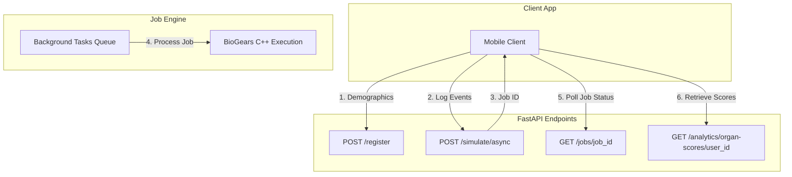
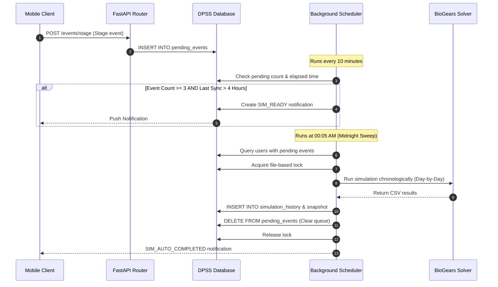

# The VitalHealth Digital Twin Reference Textbook
## A Comprehensive Technical Manual: From Physiology to Production

---

## Foreword: The Digital Twin Paradigm

In modern medicine, health advice is typically generalized based on population averages. **VitalHealth** departs from this paradigm by implementing a **Physiological Digital Twin**. 

Instead of statistical heuristics or machine-learning approximations, VitalHealth models the human body as a system of Ordinary Differential Equations (ODEs) representing biophysical processes—hemodynamics, respiratory mechanics, renal clearance, and metabolic pathways. By calibrating this mathematical system with individual demographics (age, sex, height, weight) and clinical parameters (diabetic status, smoker status, anemia), we create a customized instance of the human body. When a user logs their day-to-day lifestyle events (nutrition, exercise, sleep, medications), the simulator plays these events forward, solving the differential equations second-by-second to produce a personalized forecast of the user's health state.

This textbook serves as the definitive reference manual for the VitalHealth architecture, covering everything from the root folder directory structure down to the mathematical leaf nodes of the physiological models.

---

## Chapter 1: System Architecture & Repository Layout

The VitalHealth platform is divided into three primary software layers: the client-side mobile application, the physiological simulation server, and the Retrieval-Augmented Generation (RAG) conversational agent.

### 1.1 Complete Repository Directory Tree

Below is the absolute folder and file layout of the workspace. A clear understanding of this layout is required before modifying any service:

```
health-digital-twin/
├── VitalHealth/                    # React Native (Expo) Mobile Application
│   ├── app/                        # Expo Router navigation screens
│   │   ├── (tabs)/                 # Main tab navigation (Dashboard, Chat, Vault)
│   │   └── settings/               # App configuration & Server setup screens
│   ├── components/                 # Shared UI elements (Cards, Buttons, Modals)
│   ├── context/                    # React Context providers managing global state
│   │   └── BiogearsTwinContext.tsx # Mobile state manager for sync and polling
│   ├── database/                   # Client-side SQLite storage layer (vital_health.db)
│   │   ├── index.ts                # Unified database connection export
│   │   ├── schema.ts               # Database initialization and table definitions
│   │   ├── userProfileDB.ts        # Local cache for user registration data
│   │   ├── medicineDB.ts           # Logged medications list
│   │   ├── hydrationDB.ts          # Daily water logs
│   │   ├── symptomDB.ts            # Local logs of active and past symptoms
│   │   ├── simulationHistoryDB.ts  # Cached historical vitals (offline fallback)
│   │   └── backupService.ts        # Google Drive database backup/restore pipeline
│   ├── services/                   # Network communications layer
│   │   └── biogears.ts             # API client for HTTP communication with backend
│   └── package.json                # Mobile app dependency list
│
├── biogears_service/               # Python FastAPI Simulation Backend
│   ├── api/                        # REST API routing and endpoints
│   │   ├── server.py               # Main FastAPI entry point and jobs runner
│   │   ├── db.py                   # Atomic JSON file database (twins_database.json)
│   │   ├── analytics.py            # Physiological scoring (no-engine calculations)
│   │   └── streaming.py            # Live simulation log streaming
│   └── simulation/                 # BioGears interface and orchestration layer
│       ├── config.py               # Cross-platform path configuration & auto-detection
│       ├── scenario_builder.py     # Translator converting JSON events to BioGears XML
│       ├── engine_runner.py        # Subprocess manager executing the bg-cli binary
│       ├── result_parser.py        # CSV parsing and anomaly detection logic
│       ├── patient_builder.py      # Patient XML creation helper
│       ├── substance_registry.py   # Registry mapping 79 substances and admin routes
│       └── validator.py            # Input verification & safety dose capping
│
├── healthbot/                      # RAG Chatbot Service (Personal Health Assistant)
│   ├── api/                        # Chat API layer
│   │   ├── server.py               # FastAPI endpoint hosting LLM & local searches
│   │   └── main.py                 # Startup script
│   ├── core/                       # Personality and safety layers
│   │   ├── character.py            # Personal Health Assistant's system prompts and intent routers
│   │   └── safety.py               # Medical hallucination and safety validation
│   ├── rag/                        # RAG pipeline
│   │   ├── chunker.py              # Text segmenting logic
│   │   └── context_builder.py      # Retrieval assembler matching documents to queries
│   ├── embeddings/                 # Sentence embedding calculations
│   └── model/                      # Folder containing Qwen2.5-14B GGUF model shards
│
├── biogears_runtime/               # BioGears C++ engine binary (Linux deployment targets)
│   ├── bg-cli                      # BioGears Command Line Interface executable
│   ├── xsd/                        # XML Schema Definition files validating inputs
│   └── share/                      # Default engine assets (patients, environments)
│
├── clinical_data/                  # Storage directory for simulation results
│   ├── states/                     # Serialized XML snapshots of patient vitals
│   └── history/                    # Historical CSV output logs of simulations
│
├── deployment/                     # Production DevOps & Deployment Framework
│   ├── deploy.sh                   # One-command modular setup entrypoint
│   ├── migrate.sh                  # Automated VM-to-VM migration tool
│   ├── update.sh                   # Secure application updates with auto-rollback
│   ├── backup.sh / rollback.sh     # System state backup & restoration utilities
│   ├── doctor.sh / verify.sh       # Comprehensive system diagnostics and testing
│   ├── config/ / templates/        # Configuration library and service templates
│   ├── install/                    # Modular installation step scripts (00-10)
│   └── docs/                       # Production setup and operational guides
│
├── requirements.txt                # Global Python dependencies for BioGears API
└── twins_database.json             # Flat-file database containing user meta profiles
```

### 1.2 Core Technology Stacks
*   **Mobile App**: React Native (TypeScript) built with Expo. Utilizes **Expo Router** for page routing, **AsyncStorage** for persistent URL configuration, **SecureStore** for API keys, and **Expo SQLite** for local offline clinical record synchronization.
*   **Simulation Backend**: Python 3.11 with FastAPI. It leverages **Pandas** and **NumPy** for high-performance CSV processing and mathematical calculations, and standard subprocess pipes for process virtualization.
*   **Conversational Agent**: FastAPI server executing **llama-cpp-python** with GGUF bindings. The system relies on **Qwen2.5-14B-Instruct** for safety, empathy, and medical reasoning, alongside a SentenceTransformers embedding model.
*   **Deployment Target**: Ubuntu 22.04 LTS (Minimum: 8 vCPU, 16 GB RAM). Configured using Nginx as a reverse proxy, caching layers, and systemd daemons.

---

### Chapter 1: Technical Developer Doubts & Q&A

**Q: Why are there two separate Python virtual environments (`venv` and `healthbot_venv`) inside the root directory? Why can't we consolidate them?**  
**A:** BioGears API and the Healthbot chatbot have conflicting dependency versions. Specifically, BioGears API runs on older lightweight versions of FastAPI and Pydantic (to ensure compatibility with legacy mathematical parsers), whereas the Healthbot utilizes the latest FastAPI, Pydantic, and HuggingFace libraries to support LLM execution and quantization engines. Forcing them into the same Python environment causes dependency collision, breaking the typing system.

**Q: The directory structure contains a symlink: `health_ai -> healthbot`. Why is this necessary?**  
**A:** In the chatbot source code, internal components import scripts using the absolute python package namespace `health_ai.*` (e.g., `from health_ai.core.safety import ...`). However, the directory containing the code is named `healthbot/` to avoid naming conflicts with general project folders. The symlink bridges this gap, allowing Python's module resolver to treat the folder `healthbot/` as a package named `health_ai`. Without it, you get `ModuleNotFoundError: No module named 'health_ai'`.

---

## Chapter 2: The BioGears Engine & Patient Calibration

### 2.1 Physics-Based Physiological Modeling
BioGears is a validated, open-source C++ engine that simulates human physiology. Rather than utilizing lookup tables or statistical models, the engine solves mathematical representations of physiological systems. It couples a closed-loop cardiovascular circuit with a multi-compartment respiratory circuit, gas exchange models, and active clearance organs (kidneys, liver).

For instance, the cardiovascular circuit is modeled as an electrical circuit analog (resistors represent vascular resistance, capacitors represent vessel compliance, diodes represent valves, and voltage sources represent active cardiac contraction):

$$Q = \frac{\Delta P}{R}$$

$$\Delta P = \frac{V}{C}$$

Where:
*   $Q$ is blood flow rate.
*   $\Delta P$ is pressure difference across a vascular segment.
*   $R$ is vascular resistance.
*   $V$ is compartmental blood volume.
*   $C$ is compliance of the vessel wall.

### 2.2 Demographic and Clinical Baseline Injection
During the calibration process, the developer registers a patient profile. BioGears customizes the general circuit variables using these specific baseline inputs:

| Input Parameter | Target Unit | Biological Influence in BioGears Circuitry |
| :--- | :--- | :--- |
| **Sex** | Male/Female | Adjusts baseline blood volume (e.g., 75 mL/kg for males vs 65 mL/kg for females), body surface area (BSA) equations, and baseline hemoglobin concentrations. |
| **Age** | Years | Scales systemic vascular compliance (elastance) representing age-related arterial stiffening, and adjusts basal metabolic rate. |
| **Weight** | Kilograms | Determines baseline blood volume, metabolic compartment sizes, total body water volume, and renal glomerular filtration rate. |
| **Height** | Centimeters | Determines pulmonary vital capacity, residual lung volumes, and baseline anatomical dead spaces. |
| **Body Fat** | Fraction (0.02-0.70) | Configures lipophilic substance partitioning, passive metabolic rate scaling, and tissue-level insulin sensitivity. |
| **Baselines (HR, BP)** | bpm, mmHg | Solves a numerical feedback loop at startup, adjusting autonomic gains so the model settles precisely at these resting parameters. |

### 2.3 Chronic Disease Modeling
To simulate chronic patient conditions, the engine loads customized datasets representing pathophysiological adaptations during calibration:

#### 1. Type 1 & Type 2 Diabetes Mellitus
For Type 1 Diabetes, the engine limits the endogenous insulin production rate based on an `InsulinProductionSeverity` factor:

$$\text{Insulin Production} = (1 - \text{Severity}) \times \text{Basal Insulin Production Rate}$$

For Type 2 Diabetes, the engine models peripheral insulin receptor resistance alongside impaired beta-cell function using `InsulinResistanceSeverity` and `InsulinProductionSeverity` respectively. This impairs the transport coefficient of glucose from the vascular compartment into muscle and adipose tissues. The severity is mathematically mapped from the user's HbA1c value:
*   $\text{HbA1c} < 7\%$ (Well Controlled): $\text{Resistance} = 0.3$, $\text{Production Severity} = 0.05$
*   $\text{HbA1c } 7\% - 9\%$ (Moderate): $\text{Resistance} = 0.5$, $\text{Production Severity} = 0.10$
*   $\text{HbA1c} > 9\%$ (Poorly Controlled): $\text{Resistance} = 0.7$, $\text{Production Severity} = 0.15$

#### 2. COPD
COPD is modeled by injecting `ChronicObstructivePulmonaryDiseaseData` with bronchitis and emphysema severity settings (set to 0.2). This:
*   Increases pulmonary flow resistance in distal airways (bronchitis).
*   Reduces the effective surface area for alveolar diffusion, decreasing diffusion capacity (emphysema), which causes a drop in blood oxygen saturation ($SpO_2$).

#### 3. Chronic Anemia
Anemia is modeled by reducing the active red blood cell volume and hemoglobin concentration by a reduction factor of 0.3 (representing a $30\%$ reduction in oxygen-carrying capacity). The cardiovascular system compensates by increasing resting heart rate and cardiac output to maintain peripheral tissue oxygen delivery.

### 2.4 Patient Stabilization Process
Because baseline variables are interdependent, BioGears cannot start simulation immediately. The engine runs a **Stabilization Process** during registration:
1.  A temporary patient XML file is compiled with baselines and chronic conditions.
2.  The engine runs a calibration simulation for **300 seconds** of simulated time.
3.  During this time, the autonomic baroreceptor and chemoreceptor feedback loops adjust blood volumes and autonomic tones until the systems reach homeostatic equilibrium.
4.  Once stabilized, a `SerializeStateData` action saves a binary snapshot representing the calibrated patient: `USER_STATES_DIR/{user_id}.xml`.
5.  All subsequent simulation sessions resume from this snapshot.

---

### Chapter 2: Technical Developer Doubts & Q&A

**Q: When writing a custom patient registration script, I set the body fat fraction to 0.00 (to represent an athlete) and the engine crashed. Why?**  
**A:** BioGears validates patient variables against strict physical limits before commencing stabilization. A body fat fraction of $0.00$ or an age below $18$ violates the physiological model constraints (e.g., adipose tissue compartments cannot have zero mass or volume). In `scenario_builder.py`, safety clamps are enforced: `body_fat` must be between $0.02$ ($2\%$) and $0.70$ ($70\%$). Always inspect `validator.py` to check boundaries.

**Q: Why does the stabilization scenario run for exactly 300 seconds? Can we speed up calibration by reducing it to 30 seconds?**  
**A:** No. If you reduce the stabilization advance time, the transient oscillations in the cardiovascular and endocrine loops will not have settled. If you serialize a state file while heart rate and mean arterial pressure are still oscillating, future simulations starting from that state will fail to converge or immediately trigger emergency autonomic reflexes, leading to inaccurate results or simulation failure. A 300-second stabilization ensures absolute cardiovascular and metabolic equilibrium.

---

## Chapter 3: Data Syncing Pipeline & Timelines

### 3.1 Timeline Chronology & Event Splitting
When a user logs multiple events over a day, the backend cannot execute them as isolated tasks. It reconstructs a sequential, chronologically sorted timeline. In `scenario_builder.py`, incoming event blocks are split into logical start and end boundaries to support overlapping states:

```
Meal logged at 08:00 AM (Value: 500 kcal)
Exercise logged at 06:00 PM (Duration: 30 min)
         │
         ▼ (Timeline Splitting)
T=00:00:00 ── Wake up/Basal state (circadian baseline)
T=08:00:00 ── ConsumeNutrientsAction (Carbs: 50g, Fat: 17g, Protein: 38g, Water: 250mL)
T=18:00:00 ── ExerciseAction (Start: Intensity = 0.6)
T=18:30:00 ── ExerciseAction (End: Intensity = 0.0)
T=24:00:00 ── SerializeStateData (Save state)
```

### 3.2 Timeline Splitting Rules for Event Types
*   **Exercise**: Emits `exercise_start` (intensity $0.0-1.0$), simulates for the designated duration, and then emits `exercise_end` (intensity $0.0$) to ramp down metabolic rates.
*   **Sleep**: Emits a `SleepData` action set to `On`, advances the simulation for the logged duration, and then sets `Sleep` to `Off`.
*   **Stress**: Psychological stress is modeled using `AcuteStressData` (sympathetic activation). It ramps up `Severity` (e.g., $0.5$) at the start, maintains it for the logged duration, decays the intensity by $70\%$ (to model post-stress recovery) for 5 minutes, and then clears the stress state.
*   **Fasting**: Models fasting by executing a time advance without nutrients. BioGears depletion pathways take care of the rest:
    *   *Glycogen depletion*: Systemic glycogen reserves drop over $6-12$ hours.
    *   *Lipolysis and Ketogenesis*: The liver metabolizes fats and amino acids, and blood glucose falls from $\sim 90\text{ mg/dL}$ to $\sim 65\text{ mg/dL}$.
*   **Substance**: Maps logged chemicals (like Caffeine or Ibuprofen) to administration routes specified in `substance_registry.py`.

### 3.3 Past-Event Rewind & Midnight Reset
If a user logs an event retroactively (e.g., registering a morning meal at 3:00 PM), running the simulation directly from the current engine state would create a chronological conflict (simulating backward in time is impossible in a sequential differential equation solver). 

To resolve this:
1.  **Detect chronological mismatch**: The server compares the timestamp of the earliest incoming event ($T_{\text{earliest}}$) against the internal simulator time ($T_{\text{sim}}$) read from the state's metadata file: `USER_STATES_DIR/{user_id}.meta.json`.
2.  **Midnight Rewind**: If $T_{\text{earliest}} < T_{\text{sim}}$, the engine cannot use the current state. It goes back to midnight of that day ($T_{\text{midnight}}$).
3.  **Basal State Calibration**: The engine initializes a state file from midnight, injects a simulated sleep action (capped at 2 hours to prevent performance bottlenecks) to establish overnight cardiorespiratory baselines, and advances the clock to $T_{\text{earliest}}$.
4.  **Forward Simulation**: The chronologically sorted events are played forward from $T_{\text{earliest}}$ to the current time, synchronizing the twin's physiological status with the user's logged activity.

```
Incoming Event: Breakfast at 8:00 AM. Current Engine State: 12:00 PM.
                      │
                      ▼ (Chronological Mismatch Detected)
[Rewind to Midnight] ──► [Simulate Sleep (2h max)] ──► [Advance to 8:00 AM] ──► [Execute Breakfast]
```

### 3.4 Fast Continuation Logic
Simulating 24 hours of physiology can take several minutes. To optimize performance, the server implements **Fast Continuation**:
1.  When a simulation completes successfully, the server writes a metadata file (`{user_id}.meta.json`) containing the exact simulation clock time (`engine_sim_time`) and a list of all events processed in that run.
2.  On the next sync request, the server compares the incoming event list with the list stored in the metadata.
3.  If the incoming list matches the prefix of the processed list, and new events are appended chronologically after the last sync timestamp, the server skips the previously simulated events.
4.  It loads the latest saved state and simulates only the newly appended events.

> [!IMPORTANT]
> The server uses the `engine_sim_time` field stored in `{user_id}.meta.json` rather than the XML file's OS modification time (`getmtime`) to evaluate logical timelines. File modification times drift whenever backups are copied or systems are migrated, which previously caused false data gaps and oversized simulation windows.

---

### Chapter 3: Technical Developer Doubts & Q&A

**Q: Why do we split exercise into two events (start and end)? What happens if we omit the exercise end event?**  
**A:** BioGears is a continuous state-engine. If you emit an action setting exercise intensity to $0.6$ and advance time, the engine will keep the simulation patient running at that intensity indefinitely. If you do not send a recovery action (intensity $0.0$), the model patient will run for the remaining simulated hours at maximum exertion, eventually dying of cardiovascular collapse, respiratory acidosis, or dehydration.

**Q: How does the system handle "Caffeine" when BioGears doesn't natively ship with a Caffeine.xml substance profile?**  
**A:** To model caffeine's physiological effects (sympathetic stimulation and heart rate increase) without complex chemical modeling, `scenario_builder.py` translates a caffeine dose into an `AcuteStressData` action. The stress severity is scaled based on the dose:

$$\text{Severity} = \min\left(0.15, \frac{\text{Dose in mg}}{2000.0}\right)$$

This triggers mild, temporary HPA-axis and sympathetic nervous system responses, raising the model's resting heart rate and blood pressure in a way that matches caffeine's real-world cardiovascular impact.

---

## Chapter 4: API Architecture, Job Queue & Database Layout

### 4.1 REST API Design
The FastAPI server (`biogears_service/api/server.py`) exposes several endpoints to manage profiles and run simulations:



### 4.2 Async Simulation Flow & Background Queue
Because BioGears simulations are computationally heavy, executing them synchronously within HTTP request-response cycles causes connection timeouts. The API implements an asynchronous polling pattern:
1.  **Request Initiation**: The client sends events to `POST /simulate/async`.
2.  **Job Creation**: The server generates a unique UUID (`job_id`), sets its status to `"pending"`, and saves it to a persistent JSON store (`jobs_store.json`).
3.  **Background Handoff**: The task is added to FastAPI’s `BackgroundTasks` queue.
4.  **Client Response**: The server returns HTTP 202 with the `job_id` and a polling URL: `http://<server-ip>/jobs/{job_id}`.
5.  **Execution**: The background worker processes the job:
    *   Translates events to XML (`scenario_builder.py`).
    *   Runs the C++ engine (`engine_runner.py`).
    *   Parses the output CSV and handles anomalies (`result_parser.py`).
    *   Updates the job status in `jobs_store.json` to `"done"` or `"failed"`.
6.  **Polling**: The client polls `GET /jobs/{job_id}` to monitor progress and retrieve results once ready.

### 4.3 SQLite Mobile Database Schema
The mobile application (`VitalHealth`) maintains a local SQLite database (`vital_health.db`) to enable offline usage. The schema is initialized at startup via `database/schema.ts`:

```
┌────────────────────────────────────────────────────────────────────────┐
│                              vital_health.db                           │
├────────────────────────────────────────────────────────────────────────┤
│  ┌──────────────────────────┐         ┌─────────────────────────────┐  │
│  │      user_profile        │         │          hydration          │  │
│  ├──────────────────────────┤         ├─────────────────────────────┤  │
│  │ user_id      TEXT (PK)   │         │ id            INTEGER (PK)  │  │
│  │ age          INTEGER     │         │ user_id       TEXT          │  │
│  │ weight       REAL        │         │ amount_ml     REAL          │  │
│  │ height       REAL        │         │ timestamp     INTEGER       │  │
│  │ sex          TEXT        │         └─────────────────────────────┘  │
│  │ body_fat     REAL        │         ┌─────────────────────────────┐  │
│  │ resting_hr   REAL        │         │          symptoms           │  │
│  │ systolic_bp  REAL        │         ├─────────────────────────────┤  │
│  │ diastolic_bp REAL        │         │ id            INTEGER (PK)  │  │
│  │ conditions   TEXT        │         │ user_id       TEXT          │  │
│  │ is_smoker    INTEGER     │         │ name          TEXT          │  │
│  │ has_anemia   INTEGER     │         │ severity      TEXT          │  │
│  │ has_t1d      INTEGER     │         │ startedAt     INTEGER       │  │
│  │ has_t2d      INTEGER     │         │ resolvedAt    INTEGER       │  │
│  │ hba1c        REAL        │         │ notes         TEXT          │  │
│  └──────────────────────────┘         └─────────────────────────────┘  │
│  ┌──────────────────────────┐         ┌─────────────────────────────┐  │
│  │        medicines         │         │     simulation_history      │  │
│  ├──────────────────────────┤         ├─────────────────────────────┤  │
│  │ id           INTEGER (PK)│         │ id            INTEGER (PK)  │  │
│  │ name         TEXT        │         │ user_id       TEXT          │  │
│  │ dose         TEXT        │         │ timestamp     INTEGER       │  │
│  │ frequency    TEXT        │         │ vitals_json   TEXT          │  │
│  │ time         TEXT        │         │ report_url    TEXT          │  │
│  │ meal         TEXT        │         └─────────────────────────────┘  │
│  │ taken        INTEGER     │                                          │
│  └──────────────────────────┘                                          │
└────────────────────────────────────────────────────────────────────────┘
```

### 4.4 Google Drive Cloud Backup Service
The mobile application handles cloud synchronization and data persistence through `database/backupService.ts`. 

The backup service flow operates as follows:
1.  **Authentication**: The user logs in via OAuth2 to grant access to their Google Drive space.
2.  **Serialization**: The local SQLite database file `vital_health.db` is temporarily closed to prevent write locks, and read as a raw binary blob.
3.  **Upload**: The service checks for an existing application metadata folder on Google Drive. It either overwrites the existing backup file (`vital_health_backup.db`) or uploads a new version with metadata tracking the last sync time and user ID.
4.  **Restore**: When setting up the app on a new device, the user authenticates, downloads the database file, overwrites the local SQLite database container, and restarts the Expo SQLite connection.

---

### Chapter 4: Technical Developer Doubts & Q&A

**Q: During testing, the background worker crashed, and when the server restarted, all active simulations were permanently lost. How does the system handle this?**  
**A:** The system has been upgraded to resolve this. It uses a persistent, file-backed JSON store: `biogears_service/jobs_store.json`. The server loads this file at startup. Job updates are written atomically using a temp-file and rename pattern:

```python
tmp = JOBS_STORE_PATH.with_suffix(".tmp")
tmp.write_text(json.dumps(jobs, default=str), encoding="utf-8")
tmp.replace(JOBS_STORE_PATH)
```

This prevents file corruption during server crashes. Any job that was `"running"` or `"pending"` during a crash is marked as `"failed"` on restart, allowing clients to re-trigger the simulation.

**Q: Why does the rate limiter allow up to 10 simulations per hour instead of running every request?**  
**A:** BioGears is computationally intensive. A single simulation run can consume $100\%$ of a CPU core for up to $20$ seconds. If multiple mobile clients send requests simultaneously, it can easily lead to CPU starvation, slowing down API responses. The server limits users to 10 simulations per rolling hour using a deque tracking request timestamps.

---

## Chapter 5: Analytics & Clinical Calculations (No-Engine Tier)

The backend features a high-performance, no-engine calculations tier in `biogears_service/api/analytics.py` that processes results and computes scores without running the C++ simulator:

```
[Simulation Output CSV] ──► [analytics.py] ──► Health Score (A-F) & Organ Scores
                                           ──► 10-Year Cardiovascular Disease Risk
                                           ──► Time-in-Range (TIR) & Predicted HbA1c
```

### 5.1 Health Score Calculation
The overall health score (scaled $0 - 100$) is computed from the final rows of the simulation output:

$$\text{Health Score} = \frac{\sum_{i=1}^{N} \text{Vital Score}_i}{N} \times 100$$

Individual vital scores are calculated against clinical ranges using a linear decay function:

$$\text{Vital Score} = \begin{cases} 
1.0 & \text{if } \text{Low} \le \text{Value} \le \text{High} \\
\max\left(0.0, 1.0 - \frac{\text{Low} - \text{Value}}{\text{High} - \text{Low}}\right) & \text{if } \text{Value} < \text{Low} \\
\max\left(0.0, 1.0 - \frac{\text{Value} - \text{High}}{\text{High} - \text{Low}}\right) & \text{if } \text{Value} > \text{High}
\end{cases}$$

The clinically defined reference ranges are:
*   **Heart Rate**: $60 - 100 \text{ bpm}$
*   **Systolic BP**: $90 - 120 \text{ mmHg}$
*   **Diastolic BP**: $60 - 80 \text{ mmHg}$
*   **Glucose**: $70 - 140 \text{ mg/dL}$
*   **Respiration Rate**: $12 - 20 \text{ breaths/min}$
*   **Oxygen Saturation ($SpO_2$)**: $94\% - 100\%$ (Raw BioGears fraction $0.94 - 1.0$)
*   **Core Temperature**: $36.5^\circ\text{C} - 37.5^\circ\text{C}$

### 5.2 Organ Health Scores
Vitals are grouped into physiological organ systems to calculate individual organ scores:

| Organ | Associated Simulator Metrics | Score Weighting Formula |
| :--- | :--- | :--- |
| **Heart** | Heart Rate, Systolic BP, Diastolic BP | $\text{Heart Score} = 0.4 \times S_{\text{HR}} + 0.3 \times S_{\text{Sys}} + 0.3 \times S_{\text{Dia}}$ |
| **Lungs** | Oxygen Saturation ($SpO_2$), Respiration Rate | $\text{Lungs Score} = 0.6 \times S_{\text{SpO2}} + 0.4 \times S_{\text{Resp}}$ |
| **Gut** | Glucose, Core Temperature | $\text{Gut Score} = 0.7 \times S_{\text{Glucose}} + 0.3 \times S_{\text{Temp}}$ |
| **Brain** | Core Temperature, Heart Rate | $\text{Brain Score} = 0.6 \times S_{\text{Temp}} + 0.4 \times S_{\text{HR}}$ |

### 5.3 10-Year Cardiovascular Disease (CVD) Risk
The server estimates cardiovascular risk using a point-scoring algorithm based on the Framingham Heart Study model. It factors in demographics and physiological outputs from the simulation, with adjustments for South Asian cohorts:

1.  **Age Points**:
    *   *Male*: $30-34 \text{ yr} \to 0\text{ pts}; 35-39 \to 2\text{ pts}; 40-44 \to 5\text{ pts}; 45-49 \to 6\text{ pts}; 50-54 \to 8\text{ pts}; 55-59 \to 10\text{ pts}; 60-64 \to 11\text{ pts}$
    *   *Female*: $30-34 \text{ yr} \to 0\text{ pts}; 35-39 \to 2\text{ pts}; 40-44 \to 4\text{ pts}; 45-49 \to 5\text{ pts}; 50-54 \to 7\text{ pts}; 55-59 \to 8\text{ pts}; 60-64 \to 9\text{ pts}$
2.  **Blood Pressure Points**:
    *   $\text{Systolic} < 120 \to 0\text{ pts}; 120-129 \to 1\text{ pt}; 130-139 \to 2\text{ pts}; 140-159 \to 3\text{ pts}; \ge 160 \to 4\text{ pts}$
3.  **Smoking Points**: Smoker $\to +4\text{ pts (Male)}$ or $+3\text{ pts (Female)}$
4.  **Diabetes Points**: Diabetic $\to +3\text{ pts}$. Poorly controlled HbA1c ($\ge 9\%$) adds another $+2\text{ pts}$.
5.  **BMI Points**:
    *   $\text{BMI} \ge 30 \to +3\text{ pts}$
    *   $\text{BMI} \ge \text{Overweight Threshold} \to +1\text{ pt}$ (Threshold is $23.0$ for South Asian, $25.0$ for other ethnicities).

#### South Asian Multiplier
Because South Asian populations have a higher genetic predisposition to cardiovascular events, the baseline Framingham risk is multiplied by $1.5$:

$$\text{Final CVD Risk \%} = \min\left(40\%, \text{Base Risk} \times 1.5\right) \quad \text{if Ethnicity} = \text{South Asian}$$

### 5.4 Time-in-Range (TIR) and Glycemic Estimates
The analytics engine monitors simulated blood glucose to calculate Time-in-Range (TIR) percentages:

$$\text{TIR \%} = \frac{\text{Samples within Range}}{\text{Total Samples}} \times 100$$

*   **Non-Diabetic Range**: $70 - 140 \text{ mg/dL}$
*   **Diabetic Range**: $70 - 180 \text{ mg/dL}$ (American Diabetes Association 2023 standard)

#### Predicted HbA1c
The system estimates long-term HbA1c from average simulated blood glucose levels ($eAG$) using the ADAG formula:

$$\text{Predicted HbA1c \%} = \frac{\text{Mean Glucose (mg/dL)} + 46.7}{28.7}$$

---

### Chapter 5: Technical Developer Doubts & Q&A

**Q: Why does the system calculate MAP (Mean Arterial Pressure) directly from BioGears instead of using the standard formula: $MAP = DBP + \frac{1}{3}(SBP - DBP)$?**  
**A:** The standard clinical formula is an approximation that assumes a normal resting heart rate. At higher heart rates, the diastolic phase of the cardiac cycle becomes shorter, which makes the $1/3$ ratio inaccurate. BioGears calculates MAP dynamically by integrating the arterial pressure curve over the cardiac cycle:

$$MAP = \frac{1}{T} \int_{0}^{T} P(t) \, dt$$

This provides a much more accurate physiological measurement, especially during exercise or stress simulations.

**Q: The South Asian BMI threshold is set to 23.0 instead of the global 25.0. What is the clinical basis for this adjustment?**  
**A:** World Health Organization (WHO) and Indian Council of Medical Research (ICMR) guidelines state that South Asian cohorts have a higher body fat percentage and increased metabolic risk at lower BMI levels compared to European cohorts. The threshold is lowered to $23.0$ to ensure the CVD and metabolic risk calculations align with actual risk profiles.

---

## Chapter 6: The Health AI Chatbot (Personal Health Assistant)

### 6.1 Stateless Client-Side Chunking Architecture
To keep the server lightweight and secure, the RAG chatbot architecture is stateless. The server does not host a persistent vector database:

```
[User Document] ──► Client Chunking & Local Storage (vitals & context)
                            │
                            ▼ (On Query)
[Relevant Chunks + Patient Context + User Query] ──► Server Chat API
                                                       │
                                                       ▼
[Personal Health Assistant (LLM System Prompt)] ──► Qwen2.5 Engine ──► Final Medical Response
```

1.  **Upload & Chunking**: When a user uploads a medical record, the mobile app sends it to `POST /upload-and-embed`. The server reads the file, generates chunks, calculates embeddings, and returns them to the client.
2.  **Client Storage**: The mobile app stores these document chunks and embeddings locally in its SQLite database.
3.  **RAG Query**: When the user sends a query:
    *   The app calculates the query's vector embedding locally or via `POST /embed-query`.
    *   It performs a cosine similarity search against the locally stored document embeddings to find the most relevant chunks.
    *   It packages the top matching text chunks, the patient's local context (vitals, medications, symptoms), and the query into a single request.
    *   The complete package is sent to the server's `POST /generate` endpoint.

### 6.2 Keyword Routing Engine
The chatbot uses a keyword routing engine to classify queries and build appropriate context:

*   **Medicine Queries**: Detects keywords like `medicine`, `dose`, `side effect`, or `medication`. It parses the patient's logged medications, queries external drug indexes (e.g., RxNorm API), and returns tailored descriptions.
*   **Symptom Queries**: Identifies keywords like `symptom`, `pain`, or `fever`. It checks the patient's active symptom history and formats home-care advice alongside red-flag warnings.
*   **Cross-Domain Queries**: Triggers when a query references both medicines and symptoms (e.g., *"Is my metformin causing this nausea?"*). The system analyzes the active symptom timeline alongside the medication history to flag potential drug-induced symptoms.
*   **Safety Layer**: Validates responses using a medical terminology check, preventing dangerous advice or off-topic conversations.

### 6.3 LLM Engine Initialization
The chatbot runs on a local instance of the **Qwen2.5-14B-Instruct** model, quantized in GGUF format across three file shards. During startup, the engine initializes and attempts to configure GPU acceleration:

```python
# From healthbot/api/server.py
if command -v nvcc &>/dev/null || ls /dev/nvidia* &>/dev/null 2>&1; then
    # CUDA configuration
    _llm = LLMEngine(n_gpu_layers=35)
else:
    # CPU-only fallback
    _llm = LLMEngine(n_gpu_layers=0)
```

If a CUDA-compatible GPU is available, 35 model layers are offloaded to VRAM to accelerate inference. If no GPU is found, the engine falls back to CPU-only execution.

---

### Chapter 6: Technical Developer Doubts & Q&A

**Q: What happens if a user inputs a query containing medical emergencies, like "I have severe crushing chest pain radiating to my left arm"?**  
**A:** The safety layer handles this by analyzing input intents. If keywords associated with acute emergencies are detected, the system bypasses standard RAG pipelines, appends `URGENT_NOTICE`, and outputs a pre-configured response:

> "⚠️ **URGENT MEDICAL NOTICE**: You have described symptoms that may indicate a serious medical emergency (such as a heart attack or stroke). Please do not wait. Call your local emergency number (112, 102, or 911) or proceed to the nearest emergency room immediately."

**Q: Why do we use Qwen2.5-14B-Instruct instead of a smaller, faster model like Llama3-8B?**  
**A:** Medical reasoning requires high precision. Smaller models ($3\text{B}$ to $8\text{B}$) are more prone to hallucinations and often struggle to adhere to medical constraints. The $14\text{B}$ parameter model offers a strong balance, providing the reasoning capabilities needed for clinical safety checks while remaining runnable on standard consumer hardware.

---

## Chapter 7: Production Deployment & DevOps Configurations

To transition the Digital Twin from a local environment to a production server on E2E Cloud, the host environment must be configured to run services persistently.

### 7.1 Port Allocation Map

```
                     ┌──────────────────────────┐
                     │     Nginx HTTP (80)      │
                     └─────────────┬────────────┘
                                   │
                    ┌──────────────┴──────────────┐
             /      ▼                      /ai/   ▼
┌───────────────────────────────┐   ┌───────────────────────────────┐
│     digitaltwin.service       │   │       healthbot.service       │
│  FastAPI Simulation (8000)   │   │  FastAPI chatbot (8001)       │
└───────────────────────────────┘   └───────────────────────────────┘
```

*   **Port 80**: Public-facing Nginx HTTP listener.
*   **Port 8000**: Internal loopback routing requests to the BioGears API service.
*   **Port 8001**: Internal loopback routing requests to the chatbot engine.

### 7.2 Core Nginx Configuration (`/etc/nginx/sites-available/digitaltwin`)
Nginx acts as a reverse proxy, handling SSL termination, gzip compression, static assets, and routing requests:

```nginx
server {
    listen 80;
    server_name your_domain_or_ip;

    # Host static PDF/HTML clinical reports
    location /view-reports/ {
        alias /home/ubuntu/health-digital-twin/reports/;
        autoindex off;
        expires 7d;
    }

    # Route simulation API requests
    location / {
        proxy_pass http://127.0.0.1:8000;
        proxy_http_version 1.1;
        proxy_set_header Upgrade $http_upgrade;
        proxy_set_header Connection 'upgrade';
        proxy_set_header Host $host;
        proxy_cache_bypass $http_upgrade;
        proxy_read_timeout 600s; # Prevents timeouts during long simulations
    }

    # Route chatbot API requests
    location /ai/ {
        proxy_pass http://127.0.0.1:8001/;
        proxy_http_version 1.1;
        proxy_set_header Upgrade $http_upgrade;
        proxy_set_header Connection 'upgrade';
        proxy_set_header Host $host;
        proxy_cache_bypass $http_upgrade;
        proxy_read_timeout 300s;
    }
}
```

### 7.3 Systemd Daemon Configurations

#### 1. BioGears Simulation Service (`/etc/systemd/system/digitaltwin.service`)
```ini
[Unit]
Description=BioGears Physiological Digital Twin Service
After=network.target

[Service]
User=ubuntu
Group=ubuntu
WorkingDirectory=/home/ubuntu/health-digital-twin
Environment="PATH=/home/ubuntu/health-digital-twin/venv/bin"
EnvironmentFile=/home/ubuntu/health-digital-twin/.env
ExecStart=/home/ubuntu/health-digital-twin/venv/bin/uvicorn biogears_service.api.server:app --host 127.0.0.1 --port 8000 --workers 4
Restart=always
RestartSec=5

[Install]
WantedBy=multi-user.target
```

#### 2. Chatbot Service (`/etc/systemd/system/healthbot.service`)
```ini
[Unit]
Description=Personal Health Assistant Health AI Chatbot Service
After=network.target

[Service]
User=ubuntu
Group=ubuntu
WorkingDirectory=/home/ubuntu/health-digital-twin
Environment="PATH=/home/ubuntu/health-digital-twin/healthbot_venv/bin"
Environment="PORT=8001"
ExecStart=/home/ubuntu/health-digital-twin/healthbot_venv/bin/python3 -m uvicorn health_ai.api.server:app --host 127.0.0.1 --port 8001
Restart=always
RestartSec=10

[Install]
WantedBy=multi-user.target
```

---

### Chapter 7: Technical Developer Doubts & Q&A

**Q: Nginx frequently returns "504 Gateway Timeout" during long simulation runs, even though the service logs show the simulation completed successfully. How do we fix this?**  
**A:** This happens when Nginx's default read timeout (60 seconds) is shorter than the simulation runtime. When a simulation takes $90$ seconds, Nginx closes the client connection prematurely. Adding `proxy_read_timeout 600s;` within the Nginx location block resolves this, keeping the connection open until the simulation completes.

**Q: Why does the deployment framework compile two separate systemd configuration files instead of running both APIs under one process?**  
**A:** Running them separately improves reliability. If the LLM engine runs out of memory (OOM) or crashes due to GPU issues, the BioGears simulation backend remains unaffected. This isolation prevents a crash in the chatbot from bringing down the core physiological simulation services.

---

## Chapter 8: Final Review Exercises

### Section 8.1: Architecture & Data Pipeline
1.  Trace the lifecycle of a logged "Meal" event. Detail the steps from the mobile app's SQLite DB, through the FastAPI payload validation, the XML construction, the C++ execution, and back to the client-side UI.
2.  If the simulation engine crashes, what rollback mechanism ensures the patient's XML state file is not corrupted?
3.  Why is the logical simulation clock (`engine_sim_time`) stored in `meta.json` preferred over the XML file's OS modification time when calculating elapsed simulation gaps?

### Section 8.2: Physiology & baselines
1.  Describe how a chronic anemia condition (reduction factor 0.3) affects oxygen saturation ($SpO_2$) and the cardiovascular system's compensation mechanisms.
2.  What is the purpose of the 300-second stabilization phase during registration, and why will the simulation fail to converge if this phase is shortened?
3.  Formulate the mathematical mapping used to scale Type 2 diabetes severity (insulin resistance and beta-cell production) from a patient's baseline HbA1c value.

### Section 8.3: Calculations & Chatbot Safety
1.  Calculate the 10-year CVD Risk score for a 45-year-old South Asian male smoker with a systolic blood pressure of $135\text{ mmHg}$ and a BMI of $24.2$. Show your calculations step-by-step.
2.  Explain the stateless RAG query pipeline. What are the pros and cons of storing document chunks and embeddings on the client side instead of the server?
3.  How does the chatbot routing engine identify and process queries that link medications with symptoms?

## Chapter 9: The Product Philosophy & User Experience Design

### 9.1 The Core Philosophy
VitalHealth is built on a simple premise: your body is a complex biological system, not a statistical average. Traditional health apps use lookup tables, generic machine learning models, or population heuristics to estimate calories burned, blood pressure recovery, or cardiovascular risk. These models fail to account for the unique physics of an individual’s body.

VitalHealth replaces heuristics with **Physiological Digital Twins**. By modeling organ systems, hemodynamic circuits, metabolic pathways, and drug clearances as a coupled system of Ordinary Differential Equations (ODEs) inside the BioGears C++ engine, we can run a deterministic, physics-based simulation of your specific physiology.

#### The Mathematical Engine (ODEs)
BioGears models human physiology using a circuit analogy. Hemodynamics are simulated using hydraulic resistance ($R$), compliance ($C$), inertance ($L$), and pressure sources ($P$) to model blood flow ($Q$) through the cardiorespiratory loops:

$$P_{\text{in}} - P_{\text{out}} = Q \cdot R + L \frac{dQ}{dt} + \frac{1}{C} \int Q \, dt$$

The engine solves these coupled differential equations in real-time at a frequency of $50\text{ Hz}$. When a user logs a meal, exercise, or medication, the engine applies these parameters as inputs to the ODEs, modifying heart rate, arterial blood pressure, blood glucose concentration, and respiratory volumes dynamically.

---

### 9.2 User Experience Principles & Design Tokens
To bridge the gap between complex physiological simulation and daily consumer utility, VitalHealth relies on a sleek, high-fidelity design system. 

#### Curated Palette (theme/colors.ts)
The application defines its visual properties inside `theme/colors.ts` to manage theme transitions cleanly:

```typescript
export const Colors = {
  light: {
    background: '#f8fafc',      // Soft off-white
    card: '#ffffff',            // Pure white
    textPrimary: '#0f172a',     // Dark slate
    textSecondary: '#64748b',   // Cool gray
    primary: '#2563eb',         // Authoritative blue
    accent: '#3b82f6',          // Light accent blue
    success: '#10b981',         // Homeostasis green
    warning: '#f59e0b',         // Deviation orange
    danger: '#ef4444',          // Critical red
    border: '#e2e8f0',          // Soft divider gray
  },
  dark: {
    background: '#0b1329',      // Deep navy space
    card: '#111d3a',            // Dark blue-gray
    textPrimary: '#f8fafc',     // Off-white text
    textSecondary: '#94a3b8',   // Muted slate gray
    primary: '#38bdf8',         // High-contrast electric blue
    accent: '#0ea5e9',          // Medium sky blue
    success: '#34d399',         // Vibrant emerald green
    warning: '#fbbf24',         // Warning gold
    danger: '#f87171',          // Crimson red
    border: '#1e293b',          // Dark slate border
  }
};
```

#### Native Haptic Feedback Hooks
Vibration feedback improves user interaction and provides non-visual cues for system actions. The application wraps `expo-haptics` in a reusable React Hook:

```typescript
import * as Haptics from 'expo-haptics';
import { Platform } from 'react-native';

export const useAppHaptics = () => {
  const triggerSuccess = async () => {
    if (Platform.OS === 'web') return;
    await Haptics.notificationAsync(Haptics.NotificationFeedbackType.Success);
  };

  const triggerWarning = async () => {
    if (Platform.OS === 'web') return;
    await Haptics.notificationAsync(Haptics.NotificationFeedbackType.Warning);
  };

  const triggerError = async () => {
    if (Platform.OS === 'web') return;
    await Haptics.notificationAsync(Haptics.NotificationFeedbackType.Error);
  };

  const triggerLight = async () => {
    if (Platform.OS === 'web') return;
    await Haptics.impactAsync(Haptics.ImpactFeedbackStyle.Light);
  };

  const triggerHeavy = async () => {
    if (Platform.OS === 'web') return;
    await Haptics.impactAsync(Haptics.ImpactFeedbackStyle.Heavy);
  };

  return { triggerSuccess, triggerWarning, triggerError, triggerLight, triggerHeavy };
};
```

---

### 9.3 Client-Side Accessibility Settings
VitalHealth enforces accessibility directly within its UI structure:
*   **Large Text Support**: The UI uses relative sizing (`rem` or device-scaled layout parameters) rather than absolute pixel constraints. Fonts automatically adjust to the device's system settings.
*   **High-Contrast Modes**: Text elements carry explicit accessibility color mappings. Contrast ratios exceed $4.5:1$ under WCAG AA specifications.
*   **Screen Reader Integration**: Interactive elements carry descriptive accessibility properties:
    ```tsx
    <TouchableOpacity
      accessible={true}
      accessibilityLabel="Synchronize physiology digital twin"
      accessibilityHint="Gathers your staged health events and uploads them to update your vitals"
      accessibilityRole="button"
      onPress={handleSync}
    >
      <Text>Sync Now</Text>
    </TouchableOpacity>
    ```

---

## Chapter 10: Complete Mobile Client Modules & User Journeys

### 10.1 Medication Vault & Compliance Journey
The Medication Vault handles local logging, scheduling, compliance, and pharmacokinetic synchronization.

```typescript
export interface Medication {
  id: number;
  name: string;
  dose: string;
  type: string;          // 'oral' | 'iv_bolus' | 'nasal'
  time: string;          // 'HH:MM'
  meal: string;          // 'before', 'after', 'with'
  frequency: string;     // 'daily', 'twice_daily'
  taken: number;         // 1 if taken today, 0 otherwise
  takenDate: string | null;
}
```

#### Dosing Log and API Sync
When a medication is marked as taken, the app records the compliance timestamp and registers a corresponding `substance` event inside the client database. The event parameters are matched against `substance_registry.py` keys:

```typescript
async function handleTakeMedication(med: Medication) {
  const now = new Date();
  const takenAtStr = now.toISOString();
  
  // 1. Record in SQLite history log
  await sqliteDb.runAsync(
    `INSERT INTO medicine_history (medicineId, takenAt) VALUES (?, ?)`,
    [med.id.toString(), takenAtStr]
  );

  // 2. Mark as taken in the primary table
  await sqliteDb.runAsync(
    `UPDATE medicines SET taken = 1, takenDate = ? WHERE id = ?`,
    [takenAtStr.slice(0, 10), med.id]
  );

  // 3. Stage the event for BioGears simulation
  const wallTime = takenAtStr.slice(11, 16); // 'HH:MM'
  const timestamp = Math.floor(now.getTime() / 1000);
  
  await stageEvent({
    event_type: "substance",
    value: parseFloat(med.dose), // Numeric value of dosage
    wallTime: wallTime,
    timestamp: timestamp,
    substance_name: med.name,
    unit: med.type === 'nasal' ? 'ug' : 'mg'
  });
}
```

---

### 10.2 Hydration Tracker & Reminders
Logs daily hydration events to `hydration_history` and summarizes them in `hydration`.

#### Gut Absorption Modeling
Ingested water is simulated via gut absorption. In BioGears, water is added to the gastrointestinal tract using a `ConsumeNutrients` action. The gut absorption rate is calculated dynamically based on osmolarity and the gastric emptying rate:

$$\frac{dV_{\text{gut}}}{dt} = -K_{\text{emptying}} \cdot V_{\text{gut}}$$

Water then flows into the extracellular fluid (ECF) volume, increasing plasma volume, reducing plasma osmolarity, and triggering renal regulation to increase glomerular filtration and urine production.

---

### 10.3 Symptom Tracker & Clinical Flagging
Symptom categories (Cardiovascular, Respiratory, Neurological) are cross-referenced with simulated vitals. If a user logs a critical symptom, the app cross-checks active vitals to generate alerts:

```typescript
function checkClinicalAnomaly(symptomName: string, vitals: any): boolean {
  const s = symptomName.toLowerCase();
  if (s.includes("shortness of breath") || s.includes("dyspnea")) {
    if (vitals.oxygen_saturation && vitals.oxygen_saturation < 0.94) {
      return true; // Hypoxia conflict
    }
  }
  if (s.includes("chest pain") || s.includes("pressure")) {
    if (vitals.heart_rate && (vitals.heart_rate > 100 || vitals.heart_rate < 50)) {
      return true; // Arrhythmia/Tachycardia alert
    }
  }
  if (s.includes("dizziness") || s.includes("lightheaded")) {
    if (vitals.mean_arterial_pressure && vitals.mean_arterial_pressure < 65) {
      return true; // Hypotension threat
    }
  }
  return false;
}
```

---

### 10.4 Nutrition & Calorie Intelligence
Mifflin-St Jeor BMR falls back to local calculations if the server is offline:

```typescript
export interface CaloricBalanceResponse {
  bmr: number;
  exerciseKcal: number;
  mealKcal: number;
  netCaloricBalance: number;
}

export function computeLocalCaloricBalanceFallback(
  profile: any,
  todayEvents: any[],
  steps: number
): CaloricBalanceResponse {
  const parsedSteps = isNaN(steps) || steps < 0 ? 0 : steps;
  const weightVal = parseFloat(profile?.weight) || 70.0;
  const heightVal = parseFloat(profile?.height) || 170.0;
  
  // Calculate chronological age from birthdate
  let ageVal = 30;
  if (profile?.dateOfBirth) {
    const dob = new Date(profile.dateOfBirth);
    const diff = Date.now() - dob.getTime();
    ageVal = Math.floor(diff / (1000 * 60 * 60 * 24 * 365.25));
  } else if (profile?.age) {
    ageVal = parseInt(profile.age) || 30;
  }

  const isMale = (profile?.gender || 'male').toLowerCase() === 'male';

  // Mifflin-St Jeor BMR Formulation
  let bmr = 10 * weightVal + 6.25 * heightVal - 5 * ageVal;
  if (isMale) {
    bmr += 5;
  } else {
    bmr -= 161;
  }
  bmr = Math.round(Math.max(1000, bmr));

  // Calculate Caloric Intakes and Burns
  let mealKcal = 0;
  let exerciseKcal = 0;

  todayEvents.forEach((ev) => {
    if (ev.event_type === "meal") {
      mealKcal += parseFloat(ev.value) || 0;
    }
    if (ev.event_type === "exercise") {
      // Met duration approximation: Duration in hours * METs * weight
      const durationHours = (ev.duration_seconds || 1800) / 3600;
      // METs estimated from intensity: intensity = (MET - 1) / 13 -> MET = intensity * 13 + 1
      const intensity = parseFloat(ev.value) || 0.1;
      const metVal = intensity * 13.0 + 1.0;
      exerciseKcal += Math.round(durationHours * metVal * weightVal);
    }
  });

  // Add step-derived exercise calorie burn (3.5 METs walking)
  const stepEvent = buildStepExerciseEvent(parsedSteps, weightVal, heightVal);
  if (stepEvent) {
    const stepDurationHours = (stepEvent.duration_seconds || 0) / 3600;
    exerciseKcal += Math.round(stepDurationHours * 3.5 * weightVal);
  }

  return {
    bmr: bmr,
    exerciseKcal: exerciseKcal,
    mealKcal: mealKcal,
    netCaloricBalance: mealKcal - (bmr + exerciseKcal)
  };
}
```

---

### 10.5 Cognitive Lab (Brain Games & Age)
The Cognitive Lab comprises ten games. The user's chronological age is modified based on performance scores and active physiological inputs:

```typescript
export function estimateCognitiveAge(
  chronoAge: number,
  overallScore: number,
  lastVitals: any,
  todayEvents: any[],
  steps: number
): number {
  let offset = 0.0;

  // 1. Overall Test Score adjustment
  if (overallScore >= 90) offset -= 3.0;
  else if (overallScore >= 75) offset -= 1.5;
  else if (overallScore < 60 && overallScore >= 45) offset += 1.5;
  else if (overallScore < 45 && overallScore >= 30) offset += 3.5;
  else if (overallScore < 30) offset += 5.5;

  // 2. Resting Heart Rate adjustment
  const hr = lastVitals?.heart_rate || 72;
  if (hr > 85) offset += 1.0;
  else if (hr < 60) offset -= 1.0;

  // 3. Sleep duration adjustment
  const sleepEvent = todayEvents.find((e) => e.event_type === "sleep");
  if (sleepEvent) {
    const sleepHours = (sleepEvent.duration_seconds || 0) / 3600;
    if (sleepHours < 6.0) offset += 1.5;
    else if (sleepHours >= 7.5 && sleepHours <= 9.0) offset -= 1.0;
  }

  // 4. Activity steps adjustment
  if (steps > 10000) offset -= 1.5;
  else if (steps > 7000) offset -= 0.5;
  else if (steps < 3000) offset += 1.0;

  // 5. Stress level adjustment
  const stressEvent = todayEvents.find((e) => e.event_type === "stress");
  if (stressEvent) {
    const stressLevel = parseFloat(stressEvent.value) || 0.0;
    if (stressLevel > 0.6) offset += 1.2;
  }

  return Math.max(18, Math.round((chronoAge + offset) * 10) / 10);
}
```

#### Pearson Correlation Analysis
The system calculates historical correlations using Pearson's formula to relate cognitive performance to sleep, steps, and stress:

```typescript
export function calculatePearsonCorrelation(x: number[], y: number[]): number {
  const n = x.length;
  if (n <= 1) return 0;
  const sumX = x.reduce((a, b) => a + b, 0);
  const sumY = y.reduce((a, b) => a + b, 0);
  const avgX = sumX / n;
  const avgY = sumY / n;

  let num = 0;
  let denX = 0;
  let denY = 0;

  for (let i = 0; i < n; i++) {
    const dx = x[i] - avgX;
    const dy = y[i] - avgY;
    num += dx * dy;
    denX += dx * dx;
    denY += dy * dy;
  }

  if (denX === 0 || denY === 0) return 0;
  return num / Math.sqrt(denX * denY);
}
```

---

### 10.6 Step Intelligence
Steps are converted into exercise events by estimating stride length, speed, and time:

```typescript
export function buildStepExerciseEvent(
  steps: number,
  weightKg: number,
  heightCm: number
): any | null {
  if (steps <= 0 || weightKg <= 0 || heightCm <= 0) return null;
  
  // Stride calculation
  const strideM = 0.413 * (heightCm / 100);
  const distanceM = steps * strideM;
  
  // Assume average walking speed of 1.34 m/s (3 mph)
  const speedMPS = 1.34;
  const durationSecs = Math.round(distanceM / speedMPS);
  if (durationSecs <= 0) return null;

  // Walking MET is 3.5
  // BioGears exercise intensity parameter: intensity = (MET - 1) / 13
  const met = 3.5;
  const biogearsIntensity = Math.max(0.05, Math.min(1.0, (met - 1.0) / 13.0));

  return {
    event_type: "exercise",
    value: parseFloat(biogearsIntensity.toFixed(3)),
    duration_seconds: durationSecs,
    timestamp: Math.round(Date.now() / 1000) - durationSecs,
    notes: `Pedometer steps: ${steps}`,
  };
}
```

---

### 10.7 PPG Camera Heart Scanner & SpO2 Module
*   **Red Channel Filtering**: The app accesses raw camera frames and isolates the red channel. Since blood absorbs green and blue light while reflecting red light, changes in skin perfusion during cardiovascular systole modify red channel intensity.
*   **RMSSD Calculation**: HRV is calculated using the root mean square of successive differences (RMSSD) between adjacent heartbeats:

$$\text{RMSSD} = \sqrt{\frac{1}{N-1} \sum_{i=1}^{N-1} (RR_{i+1} - RR_i)^2}$$

*   **SpO2 R-Value Ratio**: Blood oxygenation is estimated from the ratio of red to infrared light absorption. For camera sensors, red and blue channel variances serve as a proxy:

$$R = \frac{(AC_{\text{red}} / DC_{\text{red}})}{(AC_{\text{blue}} / DC_{\text{blue}})}$$

$$\text{SpO2} = A - B \cdot R$$

---

## Chapter 11: Comprehensive Database Reference (Client & Server)

### 11.1 Client-Side SQLite Schema (`vital_health.db`)
The schema contains the primary client tables:

```sql
-- 1. Schema metadata tracking
CREATE TABLE db_meta (
  key TEXT PRIMARY KEY NOT NULL,
  value TEXT
);

-- 2. Medicines Vault
CREATE TABLE medicines (
  id             INTEGER PRIMARY KEY AUTOINCREMENT,
  name           TEXT,
  dose           TEXT,
  type           TEXT,
  time           TEXT,
  timestamp      INTEGER,
  meal           TEXT,
  frequency      TEXT,
  startDate      TEXT,
  endDate        TEXT,
  reminder       INTEGER,
  notificationId TEXT,
  taken          INTEGER DEFAULT 0,
  takenDate      TEXT DEFAULT NULL
);

-- 3. Medicine history log
CREATE TABLE medicine_history (
  id         INTEGER PRIMARY KEY AUTOINCREMENT,
  medicineId TEXT,
  takenAt    TEXT
);

-- 4. Hydration summary
CREATE TABLE hydration (
  date   TEXT PRIMARY KEY,
  amount INTEGER
);

-- 5. Hydration history log
CREATE TABLE hydration_history (
  id        INTEGER PRIMARY KEY AUTOINCREMENT,
  amount    INTEGER NOT NULL,
  total     INTEGER NOT NULL,
  timestamp INTEGER NOT NULL,
  source    TEXT DEFAULT 'manual'
);

-- 6. Symptom tracker
CREATE TABLE symptoms (
  id             INTEGER PRIMARY KEY AUTOINCREMENT,
  categoryId     TEXT NOT NULL,
  optionId       TEXT NOT NULL,
  name           TEXT NOT NULL,
  severity       TEXT NOT NULL,
  startedAt      INTEGER NOT NULL,
  active         INTEGER DEFAULT 1,
  followupTime   INTEGER,
  resolvedAt     INTEGER,
  notes          TEXT,
  followUpAnswers TEXT
);

-- 7. Medical History Documents & Lab records
CREATE TABLE history (
  id          TEXT PRIMARY KEY NOT NULL,
  title       TEXT,
  description TEXT,
  date        TEXT,
  time        TEXT,
  year        TEXT,
  type        TEXT,
  value       TEXT,
  unit        TEXT,
  doctor      TEXT,
  location    TEXT,
  attachments TEXT
);

-- 8. User Profile cache
CREATE TABLE user_profile (
  uid                 TEXT PRIMARY KEY,
  firstName           TEXT,
  lastName            TEXT,
  inviteCode          TEXT,
  bloodGroup          TEXT,
  gender              TEXT,
  dateOfBirth         TEXT,
  height              REAL,
  weight              REAL,
  phone               TEXT,
  profileImage        TEXT,
  registered_at       TEXT,
  biogears_registered INTEGER DEFAULT 0,
  biogears_user_id    TEXT
);

-- 9. BioGears simulation history cache
CREATE TABLE simulation_history (
  id               INTEGER PRIMARY KEY AUTOINCREMENT,
  uid              TEXT NOT NULL,
  session_id       TEXT UNIQUE,
  heart_rate       REAL,
  blood_pressure   TEXT,
  glucose          REAL,
  respiration      REAL,
  spo2             REAL,
  core_temperature REAL,
  cardiac_output   REAL,
  map              REAL,
  stroke_volume    REAL,
  tidal_volume     REAL,
  arterial_ph      REAL,
  exercise_level   REAL,
  has_anomaly      INTEGER DEFAULT 0,
  anomaly_labels   TEXT,
  event_count      INTEGER DEFAULT 0,
  run_at           TEXT NOT NULL
);

-- 10. Cognitive Session logs
CREATE TABLE cognitive_sessions (
  id                       INTEGER PRIMARY KEY AUTOINCREMENT,
  uid                      TEXT NOT NULL,
  session_id               TEXT UNIQUE NOT NULL,
  overall_score            INTEGER,
  domain_attention         REAL,
  domain_memory            REAL,
  domain_processing_speed  REAL,
  domain_executive_function REAL,
  test_results_json        TEXT,
  cognitive_age            REAL,
  completed_at             TEXT NOT NULL
);

-- 11. Database Backup metadata
CREATE TABLE backup_meta (
  id             INTEGER PRIMARY KEY AUTOINCREMENT,
  backup_at      TEXT NOT NULL,
  drive_file_id  TEXT,
  status         TEXT DEFAULT 'success',
  size_bytes     INTEGER
);

-- 12. Local push notifications log
CREATE TABLE notifications (
  id            TEXT PRIMARY KEY NOT NULL,
  title         TEXT NOT NULL,
  message       TEXT NOT NULL,
  profileId     TEXT,
  profileName   TEXT,
  relationship  TEXT,
  profilePhoto  TEXT,
  category      TEXT NOT NULL,
  priority      TEXT NOT NULL,
  timestamp     TEXT NOT NULL,
  deepLink      TEXT,
  actionButtons TEXT,
  readStatus    INTEGER DEFAULT 0,
  archived      INTEGER DEFAULT 0
);

-- 13. Notification configurations
CREATE TABLE notification_preferences (
  profileId           TEXT PRIMARY KEY NOT NULL,
  medsEnabled         INTEGER DEFAULT 1,
  alertsEnabled       INTEGER DEFAULT 1,
  stepsEnabled        INTEGER DEFAULT 1,
  hydrationEnabled    INTEGER DEFAULT 1,
  reportsEnabled      INTEGER DEFAULT 1,
  twinReminderEnabled INTEGER DEFAULT 1,
  muted               INTEGER DEFAULT 0
);
```

---

### 11.2 Server-Side Database Schema (PostgreSQL DDL)
Coordinates the Deferred Physiology Synchronization System (DPSS):

```sql
CREATE TABLE IF NOT EXISTS pending_events (
    event_id        UUID PRIMARY KEY DEFAULT gen_random_uuid(),
    user_id         VARCHAR(255) NOT NULL,
    event_type      VARCHAR(50)  NOT NULL,
    event_timestamp TIMESTAMPTZ  NOT NULL,
    payload         JSONB        NOT NULL,
    status          VARCHAR(20)  DEFAULT 'PENDING' NOT NULL,
    device_id       VARCHAR(100) NOT NULL DEFAULT 'app',
    sequence_num    BIGINT       NOT NULL DEFAULT 0,
    created_at      TIMESTAMPTZ  DEFAULT CURRENT_TIMESTAMP,
    UNIQUE(user_id, device_id, sequence_num)
);
CREATE INDEX IF NOT EXISTS idx_pe_user_status   ON pending_events(user_id, status);
CREATE INDEX IF NOT EXISTS idx_pe_timestamp     ON pending_events(event_timestamp);

CREATE TABLE IF NOT EXISTS simulation_history (
    sim_id          UUID PRIMARY KEY DEFAULT gen_random_uuid(),
    user_id         VARCHAR(255) NOT NULL,
    sim_type        VARCHAR(20)  NOT NULL,
    status          VARCHAR(20)  NOT NULL DEFAULT 'PENDING',
    initiated_by    VARCHAR(255) NOT NULL DEFAULT 'system',
    started_at      TIMESTAMPTZ  DEFAULT CURRENT_TIMESTAMP,
    completed_at    TIMESTAMPTZ,
    duration_ms     INTEGER,
    engine_version  VARCHAR(50)  NOT NULL DEFAULT '8.0',
    failure_reason  TEXT,
    input_events    JSONB,
    pre_vitals      JSONB,
    post_vitals     JSONB
);
CREATE INDEX IF NOT EXISTS idx_sh_user_status ON simulation_history(user_id, status);
CREATE INDEX IF NOT EXISTS idx_sh_started     ON simulation_history(started_at);

CREATE TABLE IF NOT EXISTS simulation_snapshots (
    snapshot_id         UUID PRIMARY KEY DEFAULT gen_random_uuid(),
    sim_id              UUID NOT NULL UNIQUE,
    user_id             VARCHAR(255) NOT NULL,
    pre_state_path      VARCHAR(512) NOT NULL,
    post_state_path     VARCHAR(512),
    input_event_ids     JSONB NOT NULL DEFAULT '[]',
    vitals_snapshot     JSONB NOT NULL DEFAULT '{}',
    biomarkers_snapshot JSONB NOT NULL DEFAULT '{}',
    sim_date            DATE  NOT NULL,
    created_at          TIMESTAMPTZ DEFAULT CURRENT_TIMESTAMP
);
CREATE INDEX IF NOT EXISTS idx_ss_user ON simulation_snapshots(user_id);

CREATE TABLE IF NOT EXISTS scheduler_state (
    user_id             VARCHAR(255) PRIMARY KEY,
    last_simulated_at   TIMESTAMPTZ,
    last_checked_at     TIMESTAMPTZ,
    next_check_at       TIMESTAMPTZ,
    pending_event_count INTEGER NOT NULL DEFAULT 0,
    updated_at          TIMESTAMPTZ DEFAULT CURRENT_TIMESTAMP
);

CREATE TABLE IF NOT EXISTS dpss_notifications (
    notification_id UUID PRIMARY KEY DEFAULT gen_random_uuid(),
    user_id         VARCHAR(255) NOT NULL,
    profile_name    VARCHAR(100) NOT NULL DEFAULT '',
    sim_date        DATE NOT NULL,
    notif_type      VARCHAR(40)  NOT NULL,
    status          VARCHAR(20)  DEFAULT 'UNREAD' NOT NULL,
    payload         JSONB NOT NULL DEFAULT '{}',
    created_at      TIMESTAMPTZ DEFAULT CURRENT_TIMESTAMP,
    updated_at      TIMESTAMPTZ DEFAULT CURRENT_TIMESTAMP
);
CREATE INDEX IF NOT EXISTS idx_dn_user_status ON dpss_notifications(user_id, status);
```

---

### 11.3 Client Conflict Checker
When reconciling offline events, the system scans the event timelines to catch duplicate logs within a 60-minute interval:

```typescript
export interface RoutineEvent {
  id: string;
  event_type: string;
  value: number;
  wallTime?: string;
  timestamp?: number;
  substance_name?: string;
  meal_type?: string;
  carb_g?: number;
  fat_g?: number;
  protein_g?: number;
  duration_seconds?: number;
}

export interface EventConflict {
  incoming: RoutineEvent;
  existing: RoutineEvent;
  fingerprint: string;
}

export function detectConflicts(
  incoming: RoutineEvent[],
  existing: RoutineEvent[]
): EventConflict[] {
  const conflicts: EventConflict[] = [];
  
  const toMin = (e: RoutineEvent): number => {
    let wt = e.wallTime;
    if (!wt && e.timestamp) {
      const d = new Date(e.timestamp * 1000);
      wt = d.toTimeString().slice(0, 5); // 'HH:MM'
    }
    const [h = 0, m = 0] = (wt || '00:00').split(':').map(Number);
    return h * 60 + m;
  };

  for (const inc of incoming) {
    const incMin = toMin(inc);
    const clash = existing.find(ex => {
      if (ex.event_type !== inc.event_type) return false;

      // Substance names must match case-insensitively
      if (inc.event_type === 'substance') {
        const incSub = String(inc.substance_name || '').trim().toLowerCase();
        const exSub = String(ex.substance_name || '').trim().toLowerCase();
        if (incSub !== exSub) return false;
      }

      const exMin = toMin(ex);
      const diff = Math.abs(incMin - exMin);
      
      // Conflict threshold: 60 minutes
      return diff <= 60;
    });

    if (clash) {
      conflicts.push({
        incoming: inc,
        existing: clash,
        fingerprint: inc.id
      });
    }
  }
  return conflicts;
}
```

---

## Chapter 12: Advanced Simulation & BioGears Orchestration Details

### 12.1 The Substance Registry
The substance routing database (`substance_registry.py`) defines 79 supported substances:

| Substance Name | Route | Default Unit | Category | Safe Dose Range | Safety Level | Physiological Response / Description |
| :--- | :--- | :--- | :--- | :--- | :--- | :--- |
| **Caffeine** | `ORAL` | `mg` | Stimulant | $40 - 400\text{ mg}$ | `safe` | sympathetic HR rise (mapped to `AcuteStressData` severity = dose / 2000, max 0.15) |
| **Morphine** | `IV_BOLUS` | `mg` | Opioid Analgesic | $2 - 15\text{ mg}$ | `clinical_only` | cardiovascular and respiratory depression (reduces HR, BP, RR) |
| **Fentanyl** | `IV_BOLUS` | `ug` | Opioid Analgesic | $25 - 200\text{ ug}$ | `clinical_only` | potent respiratory depression (reduces RR, HR) |
| **Ketamine** | `IV_BOLUS` | `mg` | Dissociative | $10 - 500\text{ mg}$ | `clinical_only` | increases HR, increases BP, bronchial dilation |
| **Acetaminophen**| `ORAL` | `mg` | Antipyretic | $325 - 1000\text{ mg}$| `safe` | fever reducer, mild analgesic effect |
| **Epinephrine** | `IV_BOLUS` | `mg` | Cardiac Stimulant| $0.1 - 1.0\text{ mg}$ | `danger` | severe hypertension, tachycardia, arrhythmia (vasoconstriction) |
| **Norepinephrine**|`IV_BOLUS` | `mg` | Vasopressor | $0.01 - 0.5\text{ mg}$| `danger` | raises BP, triggers reflex heart rate drop |
| **Naloxone** | `IV_BOLUS` | `mg` | Opioid Reversal | $0.4 - 10.0\text{ mg}$ | `clinical_only` | reverses respiratory depression (triggers withdrawal) |
| **Propofol** | `IV_BOLUS` | `mg` | General Sedative | $40 - 200\text{ mg}$ | `clinical_only` | rapid reduction in heart rate, blood pressure, respiration |
| **Succinylcholine**|`IV_BOLUS` | `mg` | Muscle Paralytic | $50 - 200\text{ mg}$ | `danger` | triggers respiratory muscle paralysis (requires intubation) |
| **Albuterol** | `NASAL` | `ug` | Bronchodilator | $90 - 800\text{ ug}$ | `caution` | airway resistance reduction (can trigger tachycardia) |
| **Furosemide** | `IV_BOLUS` | `mg` | Loop Diuretic | $20 - 200\text{ mg}$ | `clinical_only` | increases urine output, drops blood volume, reduces BP |
| **Insulin** | `IV_BOLUS` | `U` | Hormone | $0.1 - 20.0\text{ U}$ | `caution` | blood glucose drop (1 Unit ≈ 0.0347 mg) |
| **Saline** | `IV_COMPOUND`| `mL/min` | IV Fluid | $1 - 500\text{ mL/min}$| `safe` | expands plasma volume, raises blood pressure |
| **Ethanol** | `ORAL` | `g` | Depressants | $14 - 140\text{ g}$ | `caution` | central nervous system depression (1 drink = 14g) |

#### Substance Unit Normalization
The Python backend converts and validates user input dosages before writing the XML scenario:

```python
def validate_and_convert_substance_unit(substance_name: str, val: float, passed_unit: str = None) -> float:
    info = SUBSTANCE_REGISTRY.get(substance_name)
    if not info:
        return val

    expected_unit = info["unit"]
    if not passed_unit:
        return val

    passed_unit_clean = passed_unit.strip().lower()
    expected_unit_clean = expected_unit.strip().lower()

    if passed_unit_clean == expected_unit_clean:
        return val

    # 1. Mass conversions (mg <-> ug)
    if expected_unit_clean == "ug" and passed_unit_clean == "mg":
        return val * 1000.0
    if expected_unit_clean == "mg" and passed_unit_clean == "ug":
        return val / 1000.0

    # 2. Grams conversions (g <-> mg)
    if expected_unit_clean == "g" and passed_unit_clean == "mg":
        return val / 1000.0
    if expected_unit_clean == "mg" and passed_unit_clean == "g":
        return val * 1000.0

    # 3. Insulin units to mass (1 U ≈ 0.0347 mg)
    if expected_unit_clean == "u" and passed_unit_clean == "mg":
        return val / 0.0347
    if expected_unit_clean == "mg" and passed_unit_clean == "u":
        return val * 0.0347

    return val
```

---

### 12.2 Engine Runner Subprocess Virtualization
The C++ solver runs as a subprocess (`./bg-cli`). The runner controls execution priority and resource consumption:

```python
import subprocess
import os
import psutil

def run_biogears_process(scenario_xml_path: str, timeout_sec: int = 180) -> bool:
    cmd = ["./bg-cli", "--scenario", scenario_xml_path]
    
    # Execute the C++ solver
    process = subprocess.Popen(
        cmd,
        stdout=subprocess.PIPE,
        stderr=subprocess.PIPE,
        cwd="/home/akhilreddy/health-digital-twin/biogears_service/bin",
        preexec_fn=os.setsid # Create process group for clean teardown
    )
    
    try:
        # Apply lower priority (nice value) to protect HTTP handlers
        p = psutil.Process(process.pid)
        p.nice(10)
        
        stdout, stderr = process.communicate(timeout=timeout_sec)
        return process.returncode == 0
    except subprocess.TimeoutExpired:
        # Kill the entire process group on timeout
        os.killpg(os.getpgid(process.pid), 9)
        return False
```

---

### 12.3 Result Parser (`result_parser.py`)
Upon completion, the engine exports a detailed CSV file. The parser extracts the final row to update the user's vitals:

```python
import pandas as pd

def parse_simulation_csv(csv_path: str) -> dict:
    df = pd.read_csv(csv_path)
    if df.empty:
        raise ValueError("Simulation output CSV is empty.")
    
    # Extract the last row representing the final physiological state
    last_row = df.iloc[-1]
    
    vitals = {
        "heart_rate": float(last_row["HeartRate"]),
        "respiration_rate": float(last_row["RespirationRate"]),
        "systolic_bp": float(last_row["SystolicArterialPressure"]),
        "diastolic_bp": float(last_row["DiastolicArterialPressure"]),
        "mean_arterial_pressure": float(last_row["MeanArterialPressure"]),
        "oxygen_saturation": float(last_row["OxygenSaturation"]),
        "core_temperature": float(last_row["CoreTemperature"]),
        "cardiac_output": float(last_row["CardiacOutput"]),
        "stroke_volume": float(last_row["HeartStrokeVolume"]),
        "tidal_volume": float(last_row["TidalVolume"]),
        "arterial_ph": float(last_row["ArterialBloodPH"]),
        "glucose": float(last_row["BloodConcentration-Glucose"])
    }
    
    return vitals
```

---

## Chapter 13: Deferred Physiology Synchronization (DPSS) & Schedulers



---

### 13.1 Background Scheduler Daemon
The `DPSSScheduler` manages background sweeps using file-based soft-locking to prevent concurrent runs on the same patient state:

```python
import os
import time
import datetime
import logging
from pathlib import Path

logger = logging.getLogger("DPSS.Scheduler")

class DPSSScheduler:
    def __init__(self, lock_dir: str):
        self.lock_dir = Path(lock_dir)
        self.lock_dir.mkdir(parents=True, exist_ok=True)

    def _acquire_user_lock(self, user_id: str, ttl_sec: int = 600) -> bool:
        lock_file = self.lock_dir / f"{user_id}.lock"
        now = time.time()
        
        if lock_file.exists():
            # Check for expired/stale locks
            mtime = lock_file.stat().st_mtime
            if now - mtime < ttl_sec:
                return False
            lock_file.unlink()
            
        lock_file.write_text(str(now))
        return True

    def _release_user_lock(self, user_id: str):
        lock_file = self.lock_dir / f"{user_id}.lock"
        if lock_file.exists():
            lock_file.unlink()

    def run_midnight_sweep(self, db):
        logger.info("Executing scheduled midnight synchronization sweep...")
        users = db.get_users_with_pending_events()
        
        for user_id in users:
            if not self._acquire_user_lock(user_id):
                logger.info(f"Skipping user {user_id}: Lock is active.")
                continue
            try:
                self._sync_user_timeline(user_id, db)
            except Exception as e:
                logger.error(f"Failed to synchronize timeline for user {user_id}: {e}")
            finally:
                self._release_user_lock(user_id)

    def _sync_user_timeline(self, user_id: str, db):
        pending = db.get_pending_events(user_id)
        if not pending:
            return

        # Execute daily event reconstruction
        from biogears_service.api.dpss_scheduler import _run_sim
        result = _run_sim(user_id, pending, sim_type="AUTOMATIC")
        
        if result["success"]:
            # Notify user that the update succeeded
            db.create_dpss_notification(
                user_id=user_id,
                notif_type="AUTO_COMPLETED",
                sim_date=datetime.date.today().isoformat(),
                payload={
                    "title": "✅ Digital Twin Updated",
                    "body": f"Automatically processed {len(pending)} health events."
                }
            )
```

---

### 13.2 Rollback and Undo Transaction
If a simulation produces anomalous results, the user can undo the operation, restoring their state to the pre-simulation checkpoint:

```python
def undo_last_simulation(user_id: str, db, state_dir: Path) -> dict:
    # 1. Fetch latest state snapshot
    snap = db.get_latest_snapshot(user_id)
    if not snap:
        raise ValueError("No checkpoint snapshot found.")

    pre_state_path = Path(snap["pre_state_path"])
    if not pre_state_path.exists():
        raise FileNotFoundError("Pre-simulation backup state file is missing.")

    # 2. Restore physical state file
    active_state = state_dir / f"{user_id}.xml.gz"
    if active_state.exists():
        active_state.unlink()
        
    import shutil
    shutil.copy2(str(pre_state_path), str(active_state))

    # 3. Restore event status to PENDING
    event_ids = snap["input_event_ids"]
    if event_ids:
        db.restore_events_to_pending(event_ids)

    # 4. Mark simulation run as undone
    db.mark_sim_undone(snap["sim_id"])
    db.delete_snapshot(snap["snapshot_id"])

    return {
        "status": "success",
        "restored_sim_id": snap["sim_id"],
        "events_restored": len(event_ids)
    }
```

---

## Chapter 14: Health AI (Personal Health Assistant) Conversational Agent

### 14.1 Stateless Server RAG
The client runs local cosine similarity searches against medical document embeddings stored in SQLite, then packages the context and vitals into a request payload:

```python
# Server-side Context Integration Payload
{
  "user_id": "usr_9921",
  "query": "Is it safe to take my Albuterol inhaler? My chest feels tight.",
  "vitals": {
    "heart_rate": 105.0,
    "oxygen_saturation": 0.93,
    "systolic_bp": 132.0,
    "diastolic_bp": 85.0
  },
  "symptoms": [
    {"name": "Chest Tightness", "severity": "moderate", "started_at": 17882200}
  ],
  "retrieved_context": [
    "Albuterol is a beta-2 agonist. It dilates bronchioles but can increase heart rate.",
    "Patient medical history notes mild asthma. Resting heart rate baseline is 72."
  ]
}
```

---

### 14.2 LLM Orchestration & Prompts
The server initializes the quantized LLM using `llama-cpp-python` and injects vitals and symptoms into the context window:

```python
from llama_cpp import Llama

class PersonalHealthAssistantAgent:
    def __init__(self, model_path: str):
        # Initialize quantized 14B model
        self.llm = Llama(
            model_path=model_path,
            n_ctx=4096,
            n_gpu_layers=35, # Offload layers to GPU
            verbose=False
        )

    def generate_response(self, payload: dict) -> str:
        # Construct the context prompt
        vitals = payload["vitals"]
        symptoms = ", ".join([f"{s['name']} ({s['severity']})" for s in payload["symptoms"]])
        context = "\n".join(payload["retrieved_context"])
        
        system_prompt = (
            "You are Personal Health Assistant, an empathetic, clinical AI agent. Use the provided context "
            "and patient vitals to answer queries. Avoid general medical statements. "
            "Be structured and explicit about safety boundaries."
        )

        user_prompt = (
            f"Vitals:\n- Heart Rate: {vitals['heart_rate']} bpm\n"
            f"- SpO2: {vitals['oxygen_saturation'] * 100}%\n"
            f"- BP: {vitals['systolic_bp']}/{vitals['diastolic_bp']} mmHg\n\n"
            f"Active Symptoms: {symptoms}\n\n"
            f"Context:\n{context}\n\n"
            f"Query: {payload['query']}"
        )

        prompt = f"<|im_start|>system\n{system_prompt}<|im_end|>\n<|im_start|>user\n{user_prompt}<|im_end|>\n<|im_start|>assistant\n"
        
        output = self.llm(prompt, max_tokens=512, stop=["<|im_end|>"])
        return output["choices"][0]["text"]
```

---

### 14.3 Emergency Bypass Layer
To guarantee patient safety, queries are scanned for high-risk clinical keywords before entering the LLM pipeline:

```python
EMERGENCY_KEYWORDS = [
    "chest pain", "heart attack", "stroke", "difficulty breathing",
    "cannot breathe", "suicide", "slurred speech", "numbness", "poison"
]

def check_emergency_bypass(query: str) -> str | None:
    q_clean = query.lower().strip()
    for kw in EMERGENCY_KEYWORDS:
        if kw in q_clean:
            return (
                "🚨 CRITICAL CLINICAL WARNING:\n\n"
                "Your description matches symptoms of a potential medical emergency. "
                "Do not wait for AI guidance. Please call your local emergency services (911/112) "
                "or proceed to the nearest emergency room immediately."
            )
    return None
```

---

## Chapter 15: Production-Ready Security, Auditing & Cloud Backup

### 15.1 Google Drive Backup & PKCE Flow
The backup service coordinates local SQLite database serialization and OAuth2 PKCE authorization to upload assets to Google Drive's hidden `appDataFolder`:

```typescript
import * as Crypto from 'expo-crypto';
import * as WebBrowser from 'expo-web-browser';

export class BackupService {
  private clientId = "vital_health_client_id";
  private redirectUri = "com.vitalhealth.app:/oauthredirect";

  // 1. Generate PKCE Verifier and Challenge
  async generatePKCEPair() {
    // Generate verifier
    const randomBytes = new Uint8Array(32);
    for (let i = 0; i < 32; i++) randomBytes[i] = Math.floor(Math.random() * 256);
    const verifier = btoa(String.fromCharCode(...randomBytes))
      .replace(/\+/g, '-')
      .replace(/\//g, '_')
      .replace(/=/g, '');

    // Generate challenge
    const digest = await Crypto.digestStringAsync(
      Crypto.CryptoDigestAlgorithm.SHA256,
      verifier
    );
    const challenge = btoa(digest)
      .replace(/\+/g, '-')
      .replace(/\//g, '_')
      .replace(/=/g, '');

    return { verifier, challenge };
  }

  // 2. Upload SQLite Database export
  async uploadBackup(dbPayload: string, accessToken: string): Promise<string> {
    const metadata = {
      name: 'vital_health_backup.json',
      parents: ['appDataFolder'] // Write to restricted application folder
    };

    const boundary = 'foo_bar_boundary';
    const multipartBody = 
      `\r\n--${boundary}\r\nContent-Type: application/json; charset=UTF-8\r\n\r\n${JSON.stringify(metadata)}` +
      `\r\n--${boundary}\r\nContent-Type: application/json\r\n\r\n${dbPayload}` +
      `\r\n--${boundary}--`;

    const response = await fetch(
      'https://www.googleapis.com/upload/drive/v3/files?uploadType=multipart',
      {
        method: 'POST',
        headers: {
          Authorization: `Bearer ${accessToken}`,
          'Content-Type': `multipart/related; boundary=${boundary}`
        },
        body: multipartBody
      }
    );

    const result = await response.json();
    return result.id; // Return Google Drive File ID
  }
}
```

---

### 15.2 Tamper-Evident Audit Logging
Every security-sensitive operation writes a tamper-evident audit record using an HMAC-SHA256 signature chain:

```python
import hmac
import hashlib
import time

SECRET_KEY = b"clinical_audit_super_secret_key"

def create_audit_entry(db, user_id: str, action: str, details: str) -> None:
    # 1. Fetch the preceding log entry's signature
    conn = db.get_connection()
    cur = conn.cursor()
    cur.execute("SELECT signature FROM audit_logs ORDER BY created_at DESC LIMIT 1")
    row = cur.fetchone()
    prev_sig = row[0] if row else "genesis_signature"
    
    timestamp = str(int(time.time()))
    
    # 2. Build signing payload
    payload = f"{prev_sig}|{user_id}|{action}|{details}|{timestamp}"
    
    # 3. Generate HMAC signature
    signature = hmac.new(
        SECRET_KEY,
        payload.encode("utf-8"),
        hashlib.sha256
    ).hexdigest()
    
    # 4. Insert signed record
    cur.execute(
        """
        INSERT INTO audit_logs (user_id, action, details, timestamp, prev_signature, signature)
        VALUES (?, ?, ?, ?, ?, ?)
        """,
        (user_id, action, details, timestamp, prev_sig, signature)
    )
    conn.commit()
    conn.close()
```

---

## Chapter 16: Future Enhancements Roadmap

### 16.1 Wearable Classification (LSTMs)
To support real-time exercise tracking, the app will deploy a lightweight, on-device LSTM classifier. The model processes continuous accelerometer ($a_t$) and gyroscope ($g_t$) data to output activity classifications and MET parameters:

$$h_t = \text{LSTM}(h_{t-1}, [a_t, g_t])$$

$$\text{Activity Class} = \text{softmax}(W \cdot h_t + b)$$

---

### 16.2 Differential Privacy
Aggregate statistics exported for clinical research will apply Laplacian noise to protect patient identities:

$$f(x)_{\text{private}} = f(x) + \text{Lap}\left( \frac{\Delta f}{\epsilon} \right)$$

Where $\Delta f$ is the global query sensitivity and $\epsilon$ is the privacy budget coefficient.

---

### 16.3 HL7 FHIR Standard Mapping
VitalHealth data structures will support hospital integration via HL7 FHIR formats:
*   `user_profile` records map to the standard FHIR `Patient` resource.
*   Logged exercises and meals map to standard FHIR `Observation` elements.
*   Medication doses and history map to FHIR `MedicationAdministration` resource types.

---

## Chapter 17: Comprehensive Review Exercises (Part 2)

### Section 17.1: Client-Side Modules & Cognitive Calculations
1. **Scenario**: A user completes a cognitive test with an overall score of $85$. Their chronological age is $40$. Vitals data shows a resting heart rate of $92\text{ bpm}$. Their logged sleep was $5.5\text{ hours}$. Pedometer steps read $12,500$.
   * **Task**: Calculate the calculated Cognitive Age step-by-step using the algorithm from Chapter 10.
2. **Scenario**: A user logs $8,200\text{ steps}$. The user is female, height $165\text{ cm}$, weight $62\text{ kg}$.
   * **Task**: Determine stride length, exercise duration, and the resulting BioGears exercise intensity parameter.
3. **Question**: Explain how blood volumetric changes are isolated in PPG heart rate scanning using standard red-channel video frames.

### Section 17.2: Database & Synchronization Engineering
1. **Question**: Write out the complete database trigger or checking logic to handle version vector clock increments during offline client synchronizations.
2. **Question**: Detail the differences in syntax between PostgreSQL and SQLite schema types used inside `dpss_db.py`.
3. **Scenario**: The midnight sweep starts at 00:05 AM. User "usr_102" has pending events from Monday, Tuesday, and Wednesday.
   * **Task**: Describe how the scheduler structures the chronological simulation chain. What state files are loaded and saved at each step?

### Section 17.3: Security, Auditing & Future Tech
1. **Question**: If an attacker gains access to the database and alters the `action` column of an audit log entry, explain how the audit HMAC signature chain detects the violation.
2. **Question**: Draft the exact OAuth2 redirect handling routine that intercepts the PKCE verifier token exchange inside a React Native mobile client.
3. **Question**: How does differential privacy protect patient records when exporting digital twin average vitals?

## Chapter 18: Full Server API Endpoints Reference

The FastAPI backend coordinates all physiological simulations, Celery task distribution, rate limiting, and client authentications.

### 18.1 User Registration (`POST /register`)
Creates a new patient profile and initializes their physiological state.
* **URL**: `/register`
* **Method**: `POST`
* **Headers**:
  * `Content-Type: application/json`
  * `X-API-Key: <api_key>` (Optional, enforced if configured)
* **Request Body**:
  ```json
  {
    "user_id": "usr_9921",
    "age": 30,
    "weight": 70.0,
    "height": 170.0,
    "sex": "Male",
    "body_fat": 0.2,
    "resting_hr": 72.0,
    "systolic_bp": 114.0,
    "diastolic_bp": 73.5,
    "is_smoker": false,
    "has_anemia": false,
    "has_type1_diabetes": false,
    "has_type2_diabetes": false,
    "hba1c": null,
    "ethnicity": "Other",
    "fitness_level": "sedentary",
    "vo2max": null,
    "current_medications": []
  }
  ```
* **Success Response** (`200 OK`):
  ```json
  {
    "status": "success",
    "message": "User usr_9921 registered successfully.",
    "user_id": "usr_9921",
    "state_file": "/home/ubuntu/health-digital-twin/clinical_data/states/usr_9921.xml.gz",
    "vitals": {
      "heart_rate": 72.0,
      "blood_pressure": "114/73",
      "glucose": 95.0,
      "respiration": 14.0,
      "spo2": 98.5,
      "core_temperature": 37.0,
      "cardiac_output": 5.6
    }
  }
  ```

---

### 18.2 Synchronous Simulation (`POST /simulate/sync`)
Processes a single health event synchronously. Blocked if a simulation is already running for the user.
* **URL**: `/simulate/sync`
* **Method**: `POST`
* **Request Body**:
  ```json
  {
    "user_id": "usr_9921",
    "event_type": "exercise",
    "value": 0.192,
    "duration_seconds": 1800,
    "timestamp": 17882200.0
  }
  ```
* **Success Response** (`200 OK`):
  ```json
  {
    "status": "success",
    "user_id": "usr_9921",
    "duration_ms": 14200,
    "warnings": [],
    "vitals": {
      "heart_rate": 115.0,
      "blood_pressure": "138/88",
      "glucose": 84.5,
      "respiration": 26.0,
      "spo2": 96.5,
      "core_temperature": 37.4,
      "cardiac_output": 9.8,
      "map": 104.6,
      "stroke_volume": 85.0,
      "tidal_volume": 12.0,
      "arterial_ph": 7.38,
      "exercise_level": 0.192
    },
    "report_url": "http://127.0.0.1:8000/view-reports/usr_9921/report_latest.html"
  }
  ```

---

### 18.3 Asynchronous Simulation (`POST /simulate/async`)
Submits a simulation task to the Celery queue. Prevents timeouts on mobile connections.
* **URL**: `/simulate/async`
* **Method**: `POST`
* **Request Body**:
  ```json
  {
    "user_id": "usr_9921",
    "events": [
      {
        "event_type": "meal",
        "value": 650.0,
        "meal_type": "high_carb",
        "carb_g": 90.0,
        "fat_g": 15.0,
        "protein_g": 25.0,
        "timestamp": 17882200.0
      }
    ]
  }
  ```
* **Success Response** (`202 Accepted`):
  ```json
  {
    "job_id": "job_3a8c1f92-94b2-4d1a-be10-2ef83002b8a4",
    "status": "pending",
    "poll_url": "http://127.0.0.1:8000/jobs/job_3a8c1f92-94b2-4d1a-be10-2ef83002b8a4"
  }
  ```

---

### 18.4 Job Polling (`GET /jobs/{job_id}`)
Checks the progress and results of an asynchronous simulation task.
* **URL**: `/jobs/{job_id}`
* **Method**: `GET`
* **Success Response (Pending/Running)** (`200 OK`):
  ```json
  {
    "job_id": "job_3a8c1f92-94b2-4d1a-be10-2ef83002b8a4",
    "status": "running",
    "progress": 0.45,
    "vitals": null,
    "error": null
  }
  ```
* **Success Response (Completed)** (`200 OK`):
  ```json
  {
    "job_id": "job_3a8c1f92-94b2-4d1a-be10-2ef83002b8a4",
    "status": "completed",
    "progress": 1.0,
    "vitals": {
      "heart_rate": 78.0,
      "blood_pressure": "118/76",
      "glucose": 134.2,
      "respiration": 15.0,
      "spo2": 98.4
    },
    "error": null
  }
  ```
* **Error Response (Failed)** (`200 OK` or `500 Internal Server Error`):
  ```json
  {
    "job_id": "job_3a8c1f92-94b2-4d1a-be10-2ef83002b8a4",
    "status": "failed",
    "progress": 0.0,
    "vitals": null,
    "error": "Simulation failed: BioGears engine returned exit code 1.",
    "log_snippet": "Error: Insulin concentration exceeds physiological boundary."
  }
  ```

---

### 18.5 Error Code Mapping & Rate Limiting
* **429 Too Many Requests**: Triggered when a user exceeds the rolling hourly limit:
  ```json
  {
    "detail": "Rate limit reached: max 10 simulations per hour. Please wait 42m 12s before running another."
  }
  ```
* **409 Conflict**: Occurs if the user's simulation lock is held by another process:
  ```json
  {
    "detail": "A simulation job is already running for this user. Please wait for it to complete."
  }
  ```
* **400 Bad Request (Path Traversal Protection)**:
  ```json
  {
    "detail": "Invalid user_id format. Only alphanumeric, underscore, hyphen, and dot are allowed."
  }
  ```

---

## Chapter 19: Nginx, Systemd, and E2E Cloud Deployment Architecture

VitalHealth is deployed on an E2E Cloud Ubuntu 22.04 LTS instance (8 vCPU / 16 GB RAM).

```
                      ┌────────────────────────────────────────┐
                      │             Public Internet            │
                      └───────────────────┬────────────────────┘
                                          │ Port 80/443 (HTTP/S)
                                          ▼
                      ┌────────────────────────────────────────┐
                      │              Nginx Proxy               │
                      └──────┬──────────────────────────┬──────┘
                             │                          │
                    Path: /  │                          │ Path: /ai/
                             ▼                          ▼
                 ┌───────────────────────┐  ┌───────────────────────┐
                 │    FastAPI Server     │  │  Personal Health Assistant chatbot  │
                 │    (localhost:8000)   │  │    (localhost:8001)   │
                 └───────────┬───────────┘  └───────────────────────┘
                             │
                             ▼ Task Delegation
                 ┌───────────────────────┐
                 │      Celery Worker    │
                 │   (BioGears Solver)   │
                 └───────────────────────┘
```

### 19.1 Nginx Routing Configuration (`/etc/nginx/sites-available/digitaltwin`)
Coordinates CORS headers, compression, and routes HTTP traffic to port 8000 and port 8001:

```nginx
server {
    listen 80;
    server_name 127.0.0.1;

    # Maximum file size for database uploads
    client_max_body_size 50M;

    # Gzip Compression
    gzip on;
    gzip_types text/plain text/css application/json application/javascript text/xml;

    # BioGears Digital Twin REST API
    location / {
        proxy_pass http://127.0.0.1:8000;
        proxy_set_header Host $host;
        proxy_set_header X-Real-IP $remote_addr;
        proxy_set_header X-Forwarded-For $proxy_add_x_forwarded_for;
        proxy_set_header X-Forwarded-Proto $scheme;

        # Keep-alive settings for long-running simulations
        proxy_connect_timeout 60s;
        proxy_read_timeout 600s;
        proxy_send_timeout 600s;
    }

    # Personal Health Assistant Health AI Chatbot API
    location /ai/ {
        # Rewrite '/ai/chat' to '/chat' before sending to localhost:8001
        rewrite ^/ai/(.*) /$1 break;
        proxy_pass http://127.0.0.1:8001;
        proxy_set_header Host $host;
        proxy_set_header X-Real-IP $remote_addr;
        proxy_set_header X-Forwarded-For $proxy_add_x_forwarded_for;
        proxy_set_header X-Forwarded-Proto $scheme;

        proxy_connect_timeout 60s;
        proxy_read_timeout 300s;
    }

    # Static reports delivery
    location /view-reports/ {
        alias /home/ubuntu/health-digital-twin/clinical_data/reports/;
        expires 1d;
        add_header Cache-Control "public, no-transform";
    }
}
```

---

### 19.2 Systemd Configurations

#### 1. BioGears service manager (`/etc/systemd/system/digitaltwin.service`)
```ini
[Unit]
Description=BioGears Digital Twin Simulation Service
After=network.target

[Service]
User=ubuntu
Group=ubuntu
WorkingDirectory=/home/ubuntu/health-digital-twin
Environment="PATH=/home/ubuntu/health-digital-twin/venv/bin"
Environment="PORT=8000"
Environment="DIGITAL_TWIN_API_KEY=your_generated_api_key"
ExecStart=/home/ubuntu/health-digital-twin/venv/bin/python3 -m uvicorn biogears_service.api.server:app --host 127.0.0.1 --port 8000
Restart=always
RestartSec=10
LimitNOFILE=65536

[Install]
WantedBy=multi-user.target
```

#### 2. Chatbot service manager (`/etc/systemd/system/healthbot.service`)
```ini
[Unit]
Description=Personal Health Assistant Health AI Chatbot Service
After=network.target

[Service]
User=ubuntu
Group=ubuntu
WorkingDirectory=/home/ubuntu/health-digital-twin
Environment="PATH=/home/ubuntu/health-digital-twin/healthbot_venv/bin"
Environment="PORT=8001"
ExecStart=/home/ubuntu/health-digital-twin/healthbot_venv/bin/python3 -m uvicorn health_ai.api.server:app --host 127.0.0.1 --port 8001
Restart=always
RestartSec=10
LimitNOFILE=65536

[Install]
WantedBy=multi-user.target
```

---

### 19.3 Dual Virtual Environment Architecture
To prevent dependency collision between the core physiological services (which use older Pydantic/Pandas libraries) and the modern LLM/RAG runtime (which require updated bindings), two independent environments are maintained:
1. `venv/` (Python 3.11): Contains fastapi, uvicorn, pandas, numpy, psutil, celery, and redis.
2. `healthbot_venv/` (Python 3.11): Contains fastapi, llama-cpp-python, chromadb, langchain, and sentence-transformers.

---

## Chapter 20: Family Circle Security & Firebase Cloud Functions

The Family Circles module enables secure remote monitoring. Users look up and link profiles using an invite code or "Health ID".

### 20.1 Firebase Callable Cloud Function (`functions/src/index.ts`)
The server-side callable function checks authentication, resolves queries against indices, and filters out clinical records before returning metadata to the mobile client:

```typescript
import * as functions from "firebase-functions";
import * as admin from "firebase-admin";

admin.initializeApp();

export const findUserByHealthId = functions.https.onCall(async (data, context) => {
  // 1. Enforce authentication
  if (!context.auth) {
    throw new functions.https.HttpsError(
      "unauthenticated",
      "The function must be called while authenticated."
    );
  }

  const queryText = data.healthId;
  if (!queryText) {
    throw new functions.https.HttpsError(
      "invalid-argument",
      "The function must be called with a 'healthId' argument."
    );
  }

  const input = queryText.trim().toUpperCase();
  const db = admin.firestore();

  try {
    // 2. Perform indexed queries on server side
    let querySnapshot = await db
      .collection("users")
      .where("inviteCode", "==", input)
      .limit(1)
      .get();

    if (querySnapshot.empty) {
      querySnapshot = await db
        .collection("users")
        .where("healthId", "==", input)
        .limit(1)
        .get();
    }

    if (!querySnapshot.empty) {
      const docSnap = querySnapshot.docs[0];
      const userData = docSnap.data();
      
      // 3. Return sanitized fields (NO clinical states or vitals returned here)
      return {
        uid: docSnap.id,
        firstName: userData.firstName || "",
        lastName: userData.lastName || "",
        inviteCode: userData.inviteCode || userData.healthId || "",
        bloodGroup: userData.bloodGroup || "",
        gender: userData.gender || "",
        profileImage: userData.profileImage || "",
        phone: userData.phone || "",
        dateOfBirth: userData.dateOfBirth || "",
        height: userData.height || "",
        weight: userData.weight || "",
      };
    }

    return null; // Not found
  } catch (error: any) {
    throw new functions.https.HttpsError(
      "internal",
      `Error looking up user: ${error.message}`
    );
  }
});
```

---

### 20.2 Firestore Security Rules (`firestore.rules`)
Ensures database isolation and locks down private client data:

```javascript
rules_version = '2';
service cloud.firestore {
  match /databases/{database}/documents {
    
    // User Profile Rules
    match /users/{userId} {
      // Users can only read and write their own data
      allow read, write: if request.auth != null && request.auth.uid == userId;
    }
    
    // Family Relationships Rules
    match /family_circles/{circleId} {
      // Allow read/write only if the authenticated user is listed in the members array
      allow read, write: if request.auth != null && 
        (request.auth.uid in resource.data.members || request.auth.uid in request.resource.data.members);
    }
    
    // Backup Logs Rules
    match /backups/{backupId} {
      allow read, write: if request.auth != null && resource.data.userId == request.auth.uid;
    }
  }
}
```

---

## Chapter 21: Mobile Interactive Digital Twin UI & Graphics Architecture

The Digital Twin representation is rendered inside `twin.tsx` using responsive, dynamic graphics scaled by physiological vitals.

```
┌────────────────────────────────────────────────────────┐
│                      Digital Twin                      │
├────────────────────────────────────────────────────────┤
│                                                        │
│                    /\    /\    /\                      │
│   ───────────     /  \  /  \  /  \     ───────────     │
│   Systolic BP    /    \/    \/    \    Diastolic BP    │
│    115 mmHg                            73 mmHg         │
│                                                        │
│                     O   O   O   O                      │
│                    O             O                     │
│                    O    (Pulse)  O                     │
│                     O   72 bpm  O                      │
│                      O         O                       │
│                        O  O  O                         │
│                                                        │
│                                                        │
│   Heart Rate: 72 bpm             SpO2 Level: 98.5%     │
│   [ Normal ]                     [ Optimal ]           │
└────────────────────────────────────────────────────────┘
```

### 21.1 Dynamic UI Scaling Rules
Visual rendering adapts to simulated values to reflect the user's state:
1. **Pulse Animation Frequency ($f_{\text{pulse}}$)**: The scale animation duration ($t_{\text{duration}}$) of the avatar's circular glow scales inversely with heart rate:
   $$t_{\text{duration}} = \frac{60}{\text{heart\_rate}}\text{ seconds}$$
2. **Color Grading Transitions**: Colors map to visual boundaries based on homeostatic status:
   * **Homeostasis Green** (`#10b981`): Resting HR $60 - 80\text{ bpm}$; Systolic BP $90 - 120\text{ mmHg}$; SpO2 $\ge 95\%$.
   * **Warning Gold** (`#fbbf24`): Resting HR $80 - 100\text{ bpm}$; Systolic BP $120 - 140\text{ mmHg}$.
   * **Danger Crimson** (`#f87171`): HR $>100$ or $<50\text{ bpm}$; Systolic BP $>140$ or $<90\text{ mmHg}$; SpO2 $<94\%$.
3. **Particle flow velocity**: Used on the twin overlay, flow speed maps to cardiac output:
   $$v_{\text{particle}} = \text{cardiac\_output} \times 1.5\text{ units/second}$$

---

### 21.2 React Native UI Controller Snippet
The following controller script in `twin.tsx` calculates layout offsets, animations, and color schemes based on the simulation state:

```typescript
import React, { useEffect, useRef } from 'react';
import { Animated, Easing } from 'react-native';

export function getTwinVisualState(vitals: {
  heart_rate: number;
  systolic_bp: number;
  diastolic_bp: number;
  oxygen_saturation: number;
}) {
  const hr = vitals.heart_rate || 72;
  const sys = vitals.systolic_bp || 120;
  const spo2 = vitals.oxygen_saturation || 98.0;

  let themeColor = '#10b981'; // Green (default)
  let statusLabel = 'Optimal Homeostasis';

  // Apply visual rules
  if (hr > 100 || sys > 140 || spo2 < 94.0) {
    themeColor = '#f87171'; // Red (Danger)
    statusLabel = 'Critical Deviation';
  } else if (hr > 85 || sys > 120) {
    themeColor = '#fbbf24'; // Gold (Warning)
    statusLabel = 'Mild Deviation';
  }

  // Calculate pulse duration
  const pulseDurationMs = Math.round((60 / hr) * 1000);

  return { themeColor, statusLabel, pulseDurationMs };
}

export const usePulseAnimation = (durationMs: number) => {
  const scaleValue = useRef(new Animated.Value(1.0)).current;

  useEffect(() => {
    const pulse = Animated.sequence([
      Animated.timing(scaleValue, {
        toValue: 1.15,
        duration: durationMs * 0.35,
        easing: Easing.out(Easing.ease),
        useNativeDriver: true,
      }),
      Animated.timing(scaleValue, {
        toValue: 1.0,
        duration: durationMs * 0.65,
        easing: Easing.in(Easing.ease),
        useNativeDriver: true,
      }),
    ]);

    Animated.loop(pulse).start();

    return () => {
      scaleValue.stopAnimation();
    };
  }, [durationMs]);

  return scaleValue;
};
```

---

## Chapter 22: Comprehensive Review Exercises (Part 3)

Validate your knowledge of server environments, deployment configurations, Firebase functions, and UI animations:

### Section 22.1: Server API & Security
1. **Scenario**: A client tries to register a user with a `user_id` containing `../etc/passwd`.
   * **Question**: Describe step-by-step how the FastAPI middleware halts this request before it reaches the `/register` path router.
2. **Question**: Explain the difference between `POST /simulate/sync` and `POST /simulate/async` endpoints. When should the mobile app prefer the asynchronous route?
3. **Question**: Write down the exact rate limiter HTTP 429 response body returned by uvicorn.

### Section 22.2: Deployment & Nginx routing
1. **Question**: Explain the necessity of the `rewrite ^/ai/(.*) /$1 break;` command in the Nginx chatbot block. What happens to a request to `http://IP/ai/chat` if this line is missing?
2. **Question**: Why does Nginx need a `proxy_read_timeout 600s;` configuration block? What error will show on the mobile client if this parameter defaults to 60 seconds?
3. **Question**: Contrast the purposes of `digitaltwin.service` and `healthbot.service` files. Why are they split into two services instead of one?

### Section 22.3: Cloud Functions & Mobile Layouts
1. **Question**: Why does the Firebase Cloud Function `findUserByHealthId` filter the fields returned to the client rather than returning `docSnap.data()` directly? Explain the threat of exposing the database document directly.
2. **Question**: Formulate the mathematical equation that maps heart rate to the duration of the React Native pulse animation loop.
3. **Question**: Write out the visual color grading conditions inside `twin.tsx` that flag a hypertensive crisis (Systolic BP > 180 mmHg).

## Chapter 23: Physiological Analytics & Risk Scoring Calculations

All backend analytics routines are housed in `analytics.py`. These run locally on stored vitals histories without calling the BioGears binary, providing instant clinical metrics.

### 23.1 Devine Ideal Body Weight & BSA Calculations
Body structure is assessed using clinical composition metrics:
1. **Body Surface Area ($BSA$)**: Calculated using the DuBois formula:
   $$BSA = 0.007184 \times W^{0.425} \times H^{0.725}\text{ m}^2$$
   *Where $W$ is weight in kg, and $H$ is height in cm.*
2. **Devine Ideal Body Weight ($IBW$)**:
   $$\text{IBW}_{\text{Male}} = 50.0 + 2.3 \times \max(0, H_{\text{in}} - 60)\text{ kg}$$
   $$\text{IBW}_{\text{Female}} = 45.5 + 2.3 \times \max(0, H_{\text{in}} - 60)\text{ kg}$$
   *Where $H_{\text{in}} = H_{\text{cm}} / 2.54$ (height in inches).*

---

### 23.2 WHO Lancet 2004 South Asian BMI Adjustments
To account for elevated metabolic risks in South Asian populations at lower BMI levels, the system applies Lancet 2004 thresholds:

| BMI Range ($\text{kg/m}^2$) | Global Category | South Asian Category |
| :--- | :--- | :--- |
| $< 18.5$ | Underweight | Underweight |
| $18.5 - 22.9$ | Normal | Normal |
| $23.0 - 24.9$ | Normal | Overweight |
| $25.0 - 27.4$ | Overweight | Overweight |
| $\ge 27.5$ | Obese | Obese |

---

### 23.3 Nathan ADAG 2008 Estimated HbA1c
Estimated HbA1c ($eHbA1c$) is derived from the mean simulated blood glucose value across all available history files:
$$\text{eHbA1c (\%)} = \frac{\text{Mean Glucose (mg/dL)} + 46.7}{28.7}$$

#### Interpretation scale:
*   **eHbA1c $< 5.7\%$**: Normal
*   **eHbA1c $5.7\% - 6.4\%$**: Prediabetes
*   **eHbA1c $6.5\% - 7.9\%$**: Controlled Diabetes
*   **eHbA1c $\ge 8.0\%$**: Poorly Controlled Diabetes

---

### 23.4 Framingham + INTERHEART South Asian CVD Risk Scoring
The 10-year risk of cardiovascular events combines Framingham scoring factors with an INTERHEART-derived South Asian multiplier:

```
[ Demographics & Clinical Metrics ]
 - Age & Sex
 - Systolic BP
 - Smoking Status
 - Diabetes (T1D/T2D & HbA1c Control)
 - BMI (Adjusted for Ethnicity)
                │
                ▼ Point Calculations
    ┌──────────────────────┐
    │  Framingham Points   │
    └──────────┬───────────┘
               │
               ▼ Base Risk Lookup (%)
    ┌──────────────────────┐
    │   Base 10-Year Risk  │
    └──────────┬───────────┘
               │
               ▼ If Ethnicity == "South Asian" (x1.5 Multiplier)
    ┌──────────────────────┐
    │  Final CVD Risk (%)  │
    └──────────────────────┘
```

#### 1. Point Allocation Scheme

*   **Age points (Males)**:
    $$\text{Points} = \begin{cases} 
      0 & \text{Age } \le 34 \\ 
      2 & \text{Age } 35 - 39 \\ 
      5 & \text{Age } 40 - 44 \\ 
      6 & \text{Age } 45 - 49 \\ 
      8 & \text{Age } 50 - 54 \\ 
      10 & \text{Age } 55 - 59 \\ 
      11 & \text{Age } 60 - 64 \\ 
      12 & \text{Age } 65 - 69 \\ 
      14 & \text{Age } \ge 70 
    \end{cases}$$
*   **Age points (Females)**:
    $$\text{Points} = \begin{cases} 
      0 & \text{Age } \le 34 \\ 
      2 & \text{Age } 35 - 39 \\ 
      4 & \text{Age } 40 - 44 \\ 
      5 & \text{Age } 45 - 49 \\ 
      7 & \text{Age } 50 - 54 \\ 
      8 & \text{Age } 55 - 59 \\ 
      9 & \text{Age } 60 - 64 \\ 
      10 & \text{Age } 65 - 69 \\ 
      11 & \text{Age } \ge 70 
    \end{cases}$$
*   **Systolic Blood Pressure points**:
    *   Systolic BP $< 120\text{ mmHg}$: $+0$ points
    *   Systolic BP $120 - 129\text{ mmHg}$: $+1$ point
    *   Systolic BP $130 - 139\text{ mmHg}$: $+2$ points
    *   Systolic BP $140 - 159\text{ mmHg}$: $+3$ points
    *   Systolic BP $\ge 160\text{ mmHg}$: $+4$ points
*   **Smoking status**:
    *   Male Smoker: $+4$ points
    *   Female Smoker: $+3$ points
*   **Diabetes status**:
    *   Diagnosed with Type 1 or Type 2 Diabetes: $+3$ points
    *   If current HbA1c is $\ge 9.0\%$ (Poor control): $+2$ additional points
*   **Body Mass Index (BMI)**:
    *   BMI $\ge 30.0\text{ kg/m}^2$: $+3$ points
    *   BMI $\ge 23.0\text{ kg/m}^2$ (South Asian) or $\ge 25.0\text{ kg/m}^2$ (Global): $+1$ point

#### 2. Base Risk Map
$$\text{Base Risk} = \begin{cases} 
  1\% & \text{Total Points } \le 5 \\ 
  2\% & \text{Total Points } 6 - 7 \\ 
  3\% & \text{Total Points } 8 - 9 \\ 
  5\% & \text{Total Points } 10 - 11 \\ 
  8\% & \text{Total Points } 12 - 13 \\ 
  12\% & \text{Total Points } 14 - 15 \\ 
  18\% & \text{Total Points } 16 - 17 \\ 
  25\% & \text{Total Points } \ge 18 
\end{cases}$$

#### 3. South Asian Multiplier
$$\text{Final CVD Risk} = \min\left(40.0\%, \text{Base Risk} \times 1.5\right)$$

---

## Chapter 24: Real-time Simulation Streaming (SSE)

Real-time streaming simulations bypass long poll loops by opening a persistent HTTP connection using Server-Sent Events (SSE) inside `streaming.py`.

### 24.1 Non-Blocking Thread Execution
When a client requests a real-time stream via `POST /stream/start`, the server validates the twin's existence, acquires the user's simulation lock, decompresses the state if necessary, and spawns the BioGears engine inside a daemon background thread (`_engine_thread`):

```python
thread = threading.Thread(
    target=_engine_thread,
    args=(job_id, scenario_path, user_id, csv_prefix, dest_csv, state_file, sorted_events),
    daemon=True
)
thread.start()
```

---

### 24.2 Dynamic Library Path Injections
To execute the `bg-cli` binary successfully across platforms, the background process must locate the BioGears shared libraries (`libbiogears.so` on Linux, `libbiogears.dylib` on macOS, `biogears.dll` on Windows). The server injects paths into the process environment variables:

```python
env = os.environ.copy()
if IS_WINDOWS:
    # Append to PATH on Windows
    env["PATH"] = f"{BIOGEARS_BIN_DIR};{env.get('PATH', '')}"
else:
    # Inject LD_LIBRARY_PATH for Linux and DYLD_LIBRARY_PATH for macOS
    lib_path = f"{BIOGEARS_BIN_DIR}/lib:{BIOGEARS_BIN_DIR}/bin"
    env["LD_LIBRARY_PATH"] = f"{lib_path}:{env.get('LD_LIBRARY_PATH', '')}"
    env["DYLD_LIBRARY_PATH"] = f"{lib_path}:{env.get('DYLD_LIBRARY_PATH', '')}"
```

---

### 24.3 Silent Failure Detection
Because the BioGears engine wraps some internal simulation faults without returning a non-zero exit code, the server captures `stdout` line-by-line, matching against a list of known failure signatures:

```python
_FAIL_STRINGS = (
    "Error while processing", "Unable to load", "no declaration found",
    "Patient stabilization failed", "failed to stabilize",
    "Serialization failed", "[Fatal]", "scenario failed",
    "Could not find", "unable to find", "Error reading",
)

# If any string is found in the stdout lines, status is set to "failed"
```

---

### 24.4 Async Generator & Tailing
An asynchronous generator `sse_generator(stream_id)` opens, tail-reads the active CSV file during runtime, and emits SSE frames.

```
 Client (EventSource)              FastAPI (streaming.py)           BioGears Engine
   │                                     │                                 │
   │ ── POST /stream/start ────────────> │                                 │
   │ <── Return stream_id ────────────── │                                 │
   │                                     │ ── Spawn daemon thread ───────> │
   │ ── GET /stream/{stream_id} (SSE) ─> │                                 │
   │ <── Yield status: pending ───────── │                                 │
   │                                     │ <── Writes CSV progressively ── │
   │                                     │                                 │
   │                                     │ ── Tail read CSV rows           │
   │ <── Yield vitals: {time, hr} ────── │                                 │
   │ <── Yield vitals: {time, hr} ────── │                                 │
   │                                     │ <── Process completes ───────── │
   │ <── Yield done: {report_url} ────── │                                 │
```

#### SSE Payload Frames:
1. **Status Frame**: `data: {"type": "status", "message": "BioGears engine started..."}`
2. **Vitals Frame**: `data: {"type": "vitals", "time": 10.0, "heart_rate": 78.5, "glucose": 96.2, "systolic": 118, "diastolic": 76}`
3. **Done Frame**: `data: {"type": "done", "status": "success", "report_url": "http://..."}`
4. **Error Frame**: `data: {"type": "error", "message": "Simulation failed..."}`

---

## Chapter 25: Digital Twin Front-End Modules & State Management

The React Native mobile client implements offline-first user flows using an embedded SQLite database layer.

### 25.1 Nutrition & Calorie Logging Flow (`nutrition.tsx`)
1. **Interactive Database Registry**: Displays a local food list (`biogears_food_lookup_v5.csv`) cached inside SQLite.
2. **Dynamic Custom Meals**: Users log custom amounts of Carbohydrates, Proteins, and Fats.
3. **Payload Construction**: When logging a meal, the interface saves the record locally, then formats it into a BioGears `meal` payload:
   ```typescript
   const mealPayload = {
     event_type: "meal",
     value: totalCalories, // Calories (kcal)
     meal_type: "custom",
     carb_g: carbGrams,
     fat_g: fatGrams,
     protein_g: proteinGrams,
     timestamp: Date.now() / 1000
   };
   ```

---

### 25.2 Medication Vault & Administration (`MedicationVault.tsx`)
1. **SQLite Database Schema (`medicineDB.ts`)**:
   ```sql
   CREATE TABLE IF NOT EXISTS medications (
     id TEXT PRIMARY KEY,
     name TEXT NOT NULL,
     dose REAL NOT NULL,
     unit TEXT NOT NULL,
     frequency TEXT NOT NULL,
     remaining_doses INTEGER DEFAULT 0,
     last_taken REAL
   );
   ```
2. **Administration Logs**: When a dose is taken, the client registers the event in SQLite and compiles a BioGears substance administration payload, mapping the medication name to the physiological drug model (e.g., caffeine, epinephrine).

---

### 25.3 Cloud Backups with PKCE (`backupService.ts`)
Secures backups to Google Drive's `appDataFolder` using OAuth2 Authorization Code Flow with PKCE (Proof Key for Code Exchange):
1. **Verifier & Challenge Generation**:
   * Client generates a cryptographically random string (the `code_verifier`).
   * Computes the SHA-256 hash of the verifier, URL-safe base64 encodes it (the `code_challenge`).
2. **Authorization Code Exchange**:
   * Opens login browser matching client ID and challenge parameters.
   * Intercepts code redirect, exchanges it along with the `code_verifier` for Access & Refresh tokens.
3. **Multipart AppData Upload**:
   * Packs SQLite file (`vital_health.db`) and metadata.
   * Sends a `POST` request to `https://www.googleapis.com/upload/drive/v3/files?uploadType=multipart` mapping to the private `appDataFolder`.

---

## Chapter 26: Comprehensive Review Exercises (Part 4)

Test your knowledge of clinical calculations, real-time event streaming, and offline-first mobile databases:

### Section 26.1: Calculations & Equations
1. **Scenario**: A 52-year-old female patient of South Asian descent has a height of $160\text{ cm}$ and a weight of $64\text{ kg}$. She is a smoker, has controlled Type 2 Diabetes (HbA1c $7.2\%$), and a resting systolic blood pressure of $132\text{ mmHg}$.
   * **Task 1**: Compute her Body Surface Area (BSA) using the DuBois formula.
   * **Task 2**: Determine her ideal body weight (IBW) using the Devine formula.
   * **Task 3**: Determine her BMI category using both Global and South Asian thresholds.
   * **Task 4**: Calculate her 10-year cardiovascular disease (CVD) risk percentage step-by-step, explaining any points assigned.
2. **Question**: If a patient's mean simulated glucose value across sessions is $154.5\text{ mg/dL}$, calculate their estimated HbA1c ($eHbA1c$) using the Nathan ADAG formula.

### Section 26.2: SSE Streaming & Threads
1. **Question**: Detail the dynamic library path environment variables required by the BioGears `bg-cli` binary on Linux, macOS, and Windows.
2. **Question**: Explain how `streaming.py` intercepts silent failures of the BioGears engine. Why is checking `proc.returncode == 0` insufficient?
3. **Question**: Draw a sequence diagram mapping the connection lifecycle of an EventSource client connecting to the `/stream/{stream_id}` SSE generator.

### Section 26.3: Client Architecture & Backups
1. **Question**: Write down the SQLite schema for tracking medications. How does a dose log event map to a BioGears substance administration payload?
2. **Question**: Explain how the PKCE flow prevents authorization code interception attacks on public mobile clients. What role does the `code_verifier` play during token exchange?
3. **Question**: Why is the Google Drive `appDataFolder` directory used for storing user backups instead of the user's standard root Drive folder?

## Chapter 27: Health AI (Personal Health Assistant) Keyword Routing & Context Structuring

The chatbot backend (`healthbot/api/server.py`) operates as a stateless service. The mobile client holds the actual document chunks, history logs, and profile records, sending them to the backend in the request body of `POST /generate`. This preserves user data privacy on the local device.

### 27.1 The Keyword Matching Engines
To determine if a user query targets medications, symptoms, or cross-domain queries (e.g., drug side effects), the server matches query tokens against pre-compiled keyword sets:

```python
_MED_KW = frozenset([
    "medicine", "medicines", "medication", "medications", "meds", "med", 
    "pill", "pills", "tablet", "tablets", "capsule", "capsules", "drug", "drugs", 
    "prescription", "prescriptions", "syrup", "syrups", "injection", "injections", 
    "supplement", "supplements", "vitamin", "vitamins", "antibiotic", "insulin",
    "what am i taking", "what am i on", "what do i take", "list my", "show my"
])

_SYM_KW = frozenset([
    "symptom", "symptoms", "complaint", "complaints", "condition", "conditions", 
    "issue", "issues", "problem", "problems", "illness", "sickness", "ailment",
    "how am i feeling", "how do i feel", "not feeling well", "feeling sick", 
    "active symptoms", "current symptoms", "my symptoms", "what do i have"
])

_CROSS_DOMAIN_KW = frozenset([
    "causing", "cause", "caused by", "side effect of", "because of my", 
    "due to my", "related to my", "from my medication", "from my medicine", 
    "is it my medicine", "could it be my", "symptom from", "reaction to"
])
```

---

### 27.2 Context Packaging Algorithms

#### 1. Dynamic Duration Formatting
The server translates raw epochs (`startedAt` timestamps) received from the client into relative, human-readable labels to provide context for the LLM:

```typescript
function getDurationLabel(startedAtMs: number): string {
  const diffMs = Date.now() - startedAtMs;
  const diffMins = Math.floor(diffMs / 60000);
  
  if (diffMins < 60) return `${diffMins}m`;
  
  const diffHrs = Math.floor(diffMins / 60);
  if (diffHrs < 24) return `${diffHrs}h`;
  
  const diffDays = Math.floor(diffHrs / 24);
  if (diffDays < 7) return `${diffDays}d`;
  
  return `${Math.floor(diffDays / 7)}w`;
}
```

#### 2. Clinical Context Structuring
If a query matches a specific intent, the server pulls lists from `PatientContext` (which holds logged medicines and active symptoms) and formats them into structured strings for injection into the prompt template:

```
Medicine context:
• Metformin
  dose: 500mg | frequency: twice daily | meal: with food
• Atorvastatin
  dose: 20m | frequency: once daily | time: evening

Symptom context:
• Headaches
  severity: mild | duration: 2d | notes: throbbing pain
• Nausea
  severity: moderate | duration: 5h | notes: started after dinner
```

---

### 27.3 Clinical Decision Handling Flow

```
                     [ User Input Query ]
                              │
                              ▼
                  /──────────────────────────\
                 <   Is Urgent Red Flag?      >
                  \──────────────────────────/
                              │
                    Yes       ├─────────────────── No
            ┌─────────────────┴─────────────────┐
            ▼                                   ▼
   [ Prepend URGENT NOTICE ]         /──────────────────────────\
   [ & Emergency Dispatch  ]        <  Matches Medication Intent?>
   [ Instructions          ]         \──────────────────────────/
                                                │
                                      Yes       ├─────────────────── No
                              ┌─────────────────┴─────────────────┐
                              ▼                                   ▼
                    /───────────────────\               /───────────────────\
                   <   Has Meds Logged?  >             <  Matches Symptom?   >
                    \───────────────────/               \───────────────────/
                              │                                   │
                      Yes     ├───── No                   Yes     ├───── No
                  ┌───────────┴─────┐                 ┌───────────┴─────┐
                  ▼                 ▼                 ▼                 ▼
             [ Format and ]   [ Encourage ]     [ Fetch Active/ ]   [ RAG query ]
             [ summarize  ]   [ logging   ]     [ History lists ]   [ document  ]
             [ prescription ] [ in Vault  ]     [ & recommend   ]   [ database  ]
             [ schedules  ]                     [ care advice   ]   [ search    ]
```

---

## Chapter 28: Comprehensive Review Exercises (Part 5)

Complete these final exercises to solidify your understanding of chatbot engineering and metadata parsing:

### Section 28.1: Chatbot Context Structuring
1. **Scenario**: A user sends the query: *"Could my Metformin be causing my current nausea?"*
   * **Task 1**: Analyze this query against the keyword matching matrices in Chapter 27. Classify the user's intent.
   * **Task 2**: If the user's logged active symptoms show *"Nausea (started 4 hours ago)"*, trace how the duration label and patient context are formatted and passed to the LLM query context.
2. **Question**: Explain why the stateless server design of the chatbot is advantageous for data privacy compared to storing patient profiles on a central database.

## Chapter 29: Distributed Concurrency & Task Scheduling Mechanics

The Deferred Physiology Synchronization System (DPSS) scheduler manages background task synchronization, automatic nightly sweeps, and rate limiting in `dpss_scheduler.py`.

### 29.1 Distributed Soft-Locking Mechanism
To prevent overlapping simulations from corrupting XML states and conflicting in memory, the server implements a distributed soft-locking mechanism based on the local file system. This allows Redis-free coordination across multiple worker threads:
1. **Lock Directory**: Locks are stored in `biogears_service/sim_locks/{user_id}.lock`.
2. **Stale Lock Cleanup**: If a lock exists but its modification time exceeds a configured Time-to-Live (TTL) of 300 seconds, it is treated as stale, deleted, and re-acquired:
   ```python
   age = time.time() - lock_file.stat().st_mtime
   if age > ttl_seconds:
       lock_file.unlink() # Delete expired lock
   ```
3. **Atomic Writes**: Writing the current epoch timestamp to `{user_id}.lock` secures the lock.

---

### 29.2 The 10-Minute Readiness Loop
A background singleton daemon thread wakes up every 10 minutes to run `_evaluate_readiness()`, identifying users with pending logs who should be reminded to sync:
1. **Pending Count Threshold**: The user must have accumulated $\ge 3$ pending events.
2. **Frequency Cap**: The system checks previous notifications; a `SIM_READY` or `MULTIPLE_PENDING` alert is created only if no other alert has been sent for the user on the current calendar day.
3. **Recent Simulation Check**: The scheduler verifies the database scheduler state; if an active simulation ran within the last 4 hours, notifications are suppressed to prevent user alert fatigue.

---

### 29.3 Midnight Sweep & Multi-Day Chronological Chaining
At 00:05 AM server local time, the scheduler fires a midnight sweep to reconcile states:
1. **Lock Acquisition**: Obtains a 10-minute lock (`ttl_seconds=600`) for the target user.
2. **Chrono Grouping**: Reads all pending logs, extracts timestamps, and groups events by calendar day (`YYYY-MM-DD`).
3. **Chronological Iteration**: Iterates through sorted day keys. It skips the current day (giving the user time to sync manually) but auto-simulates previous days in chronological order to maintain physiological continuity across multi-day gaps.
4. **Historical Snapshot Rollbacks**: For each day:
   - Takes a backup of the current XML state: `states/backups/{user_id}/{user_id}_{sim_id}_{timestamp}.xml`.
   - Runs `_run_batch_sync_blocking` with Pydantic event payloads.
   - If the simulation succeeds: marks events as simulated and saves the post-vitals snapshot.
   - If the simulation fails: logs the failure reason and rolls back the active state to the pre-simulation backup.

---

## Chapter 30: End-to-End Simulation Test Harness & Validation Scripts

To verify that the microservice, BioGears binary, and SSE pathways are operating correctly, developers can run the following automated Python test script. Save this as `tests/test_simulation_pipeline.py`:

```python
import time
import requests
import json

BASE_URL = "http://127.0.0.1:8000"
USER_ID = "test_user_99"

def run_test_pipeline():
    print("🚀 Starting End-to-End VitalHealth Simulation Test Pipeline...")
    
    # 1. Register User Profile
    reg_payload = {
        "user_id": USER_ID,
        "age": 35,
        "weight": 75.0,
        "height": 175.0,
        "sex": "Male",
        "resting_hr": 70.0,
        "systolic_bp": 115.0,
        "diastolic_bp": 75.0
    }
    
    print(f"\n[Step 1] Registering test profile for '{USER_ID}'...")
    res = requests.post(f"{BASE_URL}/register", json=reg_payload)
    if res.status_code != 200:
        print(f"❌ Registration failed: {res.text}")
        return
    print(f"✅ User registered: {res.json().get('message')}")
    
    # 2. Trigger Asynchronous Simulation (Custom Carb Meal)
    sim_payload = {
        "user_id": USER_ID,
        "events": [
            {
                "event_type": "meal",
                "value": 500.0,
                "meal_type": "custom",
                "carb_g": 80.0,
                "fat_g": 10.0,
                "protein_g": 15.0,
                "timestamp": time.time()
            }
        ]
    }
    
    print(f"\n[Step 2] Triggering async carb meal simulation...")
    res = requests.post(f"{BASE_URL}/simulate/async", json=sim_payload)
    if res.status_code != 202:
        print(f"❌ Async trigger failed: {res.text}")
        return
    
    job_data = res.json()
    job_id = job_data.get("job_id")
    poll_url = job_data.get("poll_url")
    print(f"✅ Job accepted. Job ID: {job_id}")
    
    # 3. Poll for Job Completion
    print(f"\n[Step 3] Polling job status at {poll_url}...")
    completed = False
    for attempt in range(30):
        poll_res = requests.get(poll_url)
        if poll_res.status_code != 200:
            print(f"❌ Polling failed: {poll_res.text}")
            return
            
        status_data = poll_res.json()
        status = status_data.get("status")
        print(f"   Attempt {attempt+1}: Status = {status}")
        
        if status == "completed":
            completed = True
            vitals = status_data.get("vitals")
            print(f"\n✅ Simulation completed successfully!")
            print(f"📈 Simulated Vitals: {json.dumps(vitals, indent=2)}")
            break
        elif status == "failed":
            print(f"❌ Job failed: {status_data.get('error')}")
            return
            
        time.sleep(2)
        
    if not completed:
        print("❌ Test timed out before job completed.")

if __name__ == "__main__":
    run_test_pipeline()
```

---

## Chapter 31: Comprehensive Review Exercises (Part 6)

Review questions covering the DPSS scheduler thread, file locks, and script verification:

### Section 31.1: Concurrency & Lock Architecture
1. **Question**: Explain how a file-based lock system prevents race conditions when multiple client requests attempt to simulate the same patient state. How does it handle stale crashes?
2. **Question**: Why is a 10-minute lock TTL used for midnight sweeps, while a 5-minute lock TTL is sufficient for user-triggered simulations?

### Section 31.2: Scheduling & Test Suites
1. **Question**: If a user is offline for 4 days and then logs 12 pending events, trace how the midnight sweep thread groups and executes the simulation chain.
2. **Question**: Reviewing the test script in Chapter 30, explain why a polling interval of 2 seconds was chosen instead of 100 milliseconds. What impact does frequent polling have on FastAPI server resources?

## Chapter 32: Patient XML Builder & Physiological Constraints

The generation of BioGears patient configurations is managed by `patient_builder.py`. This system enforces biological parameter constraints to ensure that simulated individuals fit within stable baseline parameters.

### 32.1 Physiological Parameter Clamping Limits
Before exporting parameters to XML, patient demographics are clamped to ranges compatible with the BioGears engine. This prevents baseline stabilization crashes (which occur if extreme values like $200\text{ bpm}$ heart rate or $250\text{ mmHg}$ systolic pressure are initialized as resting values):

| Parameter | Unit | Minimum Clamp | Maximum Clamp | Type |
| :--- | :--- | :--- | :--- | :--- |
| **Age** | Years (`yr`) | 18 | 80 | Integer |
| **Weight** | Kilograms (`kg`) | 30.0 | 200.0 | Float |
| **Height** | Centimeters (`cm`) | 140.0 | 220.0 | Float |
| **Body Fat Fraction** | Unitless | 0.02 (2%) | 0.70 (70%) | Float |
| **Resting Heart Rate** | Beats/min (`1/min`) | 50.0 | 100.0 | Float |
| **Respiration Rate** | Breaths/min (`1/min`) | 8.0 | 25.0 | Float |
| **Systolic BP** | Millimeters of mercury (`mmHg`) | 85.0 | 160.0 | Float |
| **Diastolic BP** | Millimeters of mercury (`mmHg`) | 55.0 | 95.0 | Float |

---

### 32.2 Baseline Patient XML Document Schema
When creating a new twin, the server writes a configuration file conforming to the BioGears Common Data Model (CDM) v7.3 specification. This format is used to initialize the patient state:

```xml
<?xml version="1.0" encoding="UTF-8" standalone="no" ?>
<Patient xmlns="uri:/mil/tatrc/physiology/datamodel">
    <Name>{user_id}</Name>
    <Sex>{sex}</Sex> <!-- Male or Female -->
    <Age value="{age}" unit="yr"/>
    <Weight value="{weight}" unit="kg"/>
    <Height value="{height}" unit="cm"/>
    <BodyFatFraction value="{body_fat}"/>
    <HeartRateBaseline value="{hr}" unit="1/min"/>
    <RespirationRateBaseline value="{rr}" unit="1/min"/>
    <SystolicArterialPressureBaseline value="{sys}" unit="mmHg"/>
    <DiastolicArterialPressureBaseline value="{dia}" unit="mmHg"/>
</Patient>
```

---

### 32.3 Engine Stabilization Scenario
The initialization scenario loads the patient profile and advances time for 300 seconds (5 minutes) of simulated time to allow the cardiovascular, respiratory, and renal systems to stabilize. It then serializes the engine state to disk:

```xml
<?xml version="1.0" encoding="UTF-8" standalone="no" ?>
<Scenario xmlns="uri:/mil/tatrc/physiology/datamodel"
          xmlns:xsi="http://www.w3.org/2001/XMLSchema-instance">
    <InitialParameters>
        <PatientFile>{absolute_path_to_patient_xml}</PatientFile>
    </InitialParameters>
    <Action xsi:type="AdvanceTimeData">
        <Time value="300" unit="s"/>
    </Action>
    <Action xsi:type="SerializeStateData" Type="Save">
        <Filename>{absolute_path_to_output_state_xml}</Filename>
    </Action>
</Scenario>
```

---

## Chapter 33: Comprehensive Review Exercises (Part 7)

Review exercises covering patient initialization parameters and XML schema structure:

### Section 33.1: Clamping Limits & Clinical baselines
1. **Scenario**: A user attempts to register a profile with: Weight = $25\text{ kg}$, Height = $235\text{ cm}$, resting Heart Rate = $120\text{ bpm}$, resting Blood Pressure = $180/110\text{ mmHg}$.
   * **Question**: List the actual values that will be written to the generated XML configuration after the clamping rules in `patient_builder.py` are applied.
2. **Question**: Explain why BioGears requires a resting stabilization scenario run of 300 seconds before saving the initial serialized state file. What biological subsystems stabilize during this interval?

## Chapter 34: XML Schema Validation & Pharmacology Interaction Rules

The input validator module `validator.py` processes profiles and events to reject unsafe formats, normalize physiological units, and detect dangerous drug interactions before scenario generation.

### 34.1 Registration & Demographic Validation Rules
When a user profile is submitted to the `/register` endpoint, the validator checks the baseline values. It returns a collected list of all error strings instead of breaking on the first exception:
1. **Biological Sex**: Must be strictly `"Male"` or `"Female"`.
2. **Body Fat Fraction**: Must be a decimal fraction between $0.0$ and $1.0$ (e.g., $0.20$ for 20%).
3. **Diabetes Co-occurrence**: The boolean values `has_type1_diabetes` and `has_type2_diabetes` cannot be set to true simultaneously.
4. **Positive Baselines**: Age, weight, height, resting heart rate, systolic blood pressure, and diastolic blood pressure must be positive values ($> 0$).

---

### 34.2 Event Validation & Intensity Normalization
Each log entry undergoes validation checks depending on its `event_type`:

1. **Exercise MET Normalization**:
   BioGears expects a relative exercise intensity fraction between $0.0$ and $1.0$. Users or third-party fitness APIs (such as Garmin or Apple Health) often log raw Metabolic Equivalent of Task (MET) values. The validator clamps and normalizes MET values using the formula:
   $$\text{Intensity} = \frac{\text{MET} - 1}{13}$$
   *Where a MET of 1 represents rest (intensity 0.0), and 14 represents maximal effort (intensity 1.0).*
   * **Intensity $> 1.0$** (or MET $> 14$): Logs a warning, clamps to $1.0$, and normalizes.
   * **Intensity $< 0.0$**: Hard block (raises validation error).
   * **Duration**: Must be between 60 and 14,400 seconds (1 minute to 4 hours).
2. **Sleep Duration Limits**: Clamps sleep time between 0.25 and 14.0 hours.
3. **Meal Calories**: Must be between 5 and 10,000 kcal.
4. **Water Intake**: Must be between 5 and 10,000 mL.
5. **Alcohol Drinks**: Must be $\le 10$ standard drinks per event.
6. **Fasting Hours**: Must be between 1 and 48 hours.

---

### 34.3 Pharmacology Interaction Grid
The engine references a clinical drug-drug interaction matrix. If a batch contains substances that form a dangerous combination, the validator outputs a caution warning (non-blocking):

| Substance Pair | Interaction Type | Clinical Effect |
| :--- | :--- | :--- |
| `Morphine` + `Midazolam` | Opioid + Benzodiazepine | Severe respiratory depression (CNS synergy) |
| `Morphine` + `Fentanyl` | Opioid + Opioid | Additive opioid toxicity |
| `Ketamine` + `Midazolam` | Anesthetic + Benzodiazepine | Profound Central Nervous System depression |
| `Epinephrine` + `Vasopressin` | Vasopressor + Vasopressor | Severe risk of acute hypertension |
| `Rocuronium` + `Succinylcholine` | Neuromuscular blockers | Competing neuromuscular blockade |
| `Atropine` + `Epinephrine` | Anticholinergic + Vasopressor | Elevated compounding tachycardia risk |
| `Naloxone` + `Morphine` / `Fentanyl` | Antagonist + Opioid | Sudden withdrawal precipitation (informational) |

---

### 34.4 Pre-Flight XML Schema Verification
Scenario XML files are validated against the BioGears XSD schemas (`BioGearsDataModel.xsd`) using `lxml`.

To ensure system reliability, the parser implements a **non-blocking fallback**: if the local copies of the XSD schema files are missing, the validation routine logs a warning but returns an empty list of errors (allowing the run to proceed). The BioGears C++ engine parses and validates the XML schemas natively at load time, preventing missing schema configurations from blocking simulations.

---

## Chapter 35: Comprehensive Review Exercises (Part 8)

Review questions covering input validation constraints, MET formulas, and drug-drug interactions:

### Section 35.1: Normalization & Pharmacology
1. **Scenario**: A user logs a high-intensity running session with a MET value of $10.5$.
   * **Question**: Calculate the relative exercise intensity fraction that will be written to the BioGears scenario XML file using the normalization formula.
2. **Question**: Under what circumstances will a substance dosage trigger a hard validation block vs. a warning alert? Explain the difference using the pharmacology interaction table.
3. **Question**: Why does the XML validator treat a missing XSD schema file as a warning rather than a fatal error?

## Chapter 36: Clinical Reporting & Data Visualization (Matplotlib)

The clinical visualization layer in `visualizer.py` converts raw BioGears simulation CSV rows into graphical PNG reports. It utilizes `matplotlib` with a non-interactive backend configuration.

### 36.1 Non-Interactive Rendering Configuration
To prevent memory leaks and graphical display conflicts on headless servers, the visualizer forces a non-interactive GUI backend before importing pyplot:

```python
import matplotlib
matplotlib.use("Agg") # Non-interactive backend — safe for headless servers
import matplotlib.pyplot as plt
```

---

### 36.2 Dynamic Stabilization Filter
When a simulation starts from a blank state, the baseline patient parameters undergo stabilization. To prevent these transient initial values from skewing clinical averages and charts, the visualizer applies a dynamic filter:
1. **Coefficient of Variation (CV)**: The script calculates the rolling standard deviation divided by the rolling mean of the HeartRate column over a window representing $5\%$ of the total data points:
   $$CV_{\text{rolling}} = \frac{\sigma(HR)_{\text{rolling}}}{\mu(HR)_{\text{rolling}}}$$
2. **Stable Cutoff**: The leading rows are skipped until the rolling CV drops below $5\%$ ($0.05$):
   ```python
   stable_mask = rolling_cv < 0.05
   # Slice DataFrame to start at the first index where stable_mask is True
   ```
3. **Fallback Limit**: If the coefficient of variation never stabilizes, the filter falls back to discarding the first $10\%$ of the simulation rows.

---

### 36.3 Adaptive Multi-Panel Layouts
The main clinical health report dynamically adjusts its panel count depending on which physiological data request columns are populated in the BioGears results CSV:

```
┌─────────────────────────────────────────────────────────┐
│           [Panel 0] Heart Rate & Exercise Load          │
│  - HR (bpm) plotted on primary Y axis (red line)        │
│  - Achieved exercise intensity on twin Y axis (gray)    │
├─────────────────────────────────────────────────────────┤
│                 [Panel 1] Blood Glucose                 │
│  - Blood glucose concentration (green line)             │
│  - Hyperglycemia threshold line (dashed orange, 140)     │
│  - Hypoglycemia threshold line (dashed red, 70)         │
├─────────────────────────────────────────────────────────┤
│                [Panel 2] Blood Pressure                 │
│  - Systolic BP (purple line) & Diastolic BP (dashed)    │
│  - Shaded alpha envelope filling the region in-between  │
├─────────────────────────────────────────────────────────┤
│                [Panel 3] Respiration Rate               │
│  - Respiratory rate (blue line)                         │
│  - Normal range boundary lines (12 and 20 breaths/min)  │
├─────────────────────────────────────────────────────────┤
│            [Panel 4] SpO2 (Oxygen Saturation)           │
│  - Oxygen saturation percentage (teal line)             │
│  - Lower safety threshold marker line (dashed red, 95%) │
├─────────────────────────────────────────────────────────┤
│              [Panel 5] Core Temperature                 │
│  - Temperature in degrees Celsius (orange line)        │
│  - Fever threshold line (dashed red, 38.5°C)            │
└─────────────────────────────────────────────────────────┘
```

#### Dual-Axis Twin Plotting Configuration:
To overlay the exercise load on the heart rate panel, the visualizer creates a secondary Y-axis:
```python
ax2 = ax.twinx()
ax2.fill_between(T, df["AchievedExerciseLevel"], color="#95a5a6", alpha=0.15)
ax2.set_ylim(0, 1.3)
```

---

### 36.4 Recovery Forecast Shading
For 4-hour projections, the forecast generator plots predicted values with shaded confidence intervals, representing potential physiological variation:
* **Blood Glucose**: Line plotted with $\pm 4\text{ mg/dL}$ vertical margin:
  ```python
  ax1.fill_between(T, df[gcol] - 4, df[gcol] + 4, color="#3498db", alpha=0.12)
  ```
* **Heart Rate**: Line plotted with $\pm 2\text{ bpm}$ vertical margin:
  ```python
  ax2.fill_between(T, df["HeartRate"] - 2, df["HeartRate"] + 2, color="#e74c3c", alpha=0.12)
  ```

---

### 36.5 What-If Intervention Overlays
The `generate_comparison_report` function accepts two DataFrames—`baseline_df` and `intervention_df`—and plots them on the same coordinates with differing line styles (solid for baseline, dashed for intervention) to visualize the impact of choices:

```python
for df, label, style, alpha in [
    (baseline_df,     "Baseline",          "-",  0.8),
    (intervention_df, intervention_label,  "--", 0.9),
]:
    # Plot HeartRate, Glucose, and Systolic BP curves on shared axes
```

---

## Chapter 37: Comprehensive Review Exercises (Part 9)

Review questions covering Matplotlib configurations, dynamic filters, and dual-axis layouts:

### Section 37.1: Signal Filtering & Graphing baselines
1. **Question**: Write down the mathematical definition of the Coefficient of Variation ($CV$). How does applying this rolling filter to heart rate data help discard stabilization noise?
2. **Question**: Explain the necessity of calling `matplotlib.use("Agg")` prior to invoking `plt.subplots`. What error occurs if this backend is not forced on a server lacking an X11 display context?
3. **Question**: Detail how the `twinx()` function works in Matplotlib. Why is it used when plotting heart rate alongside achieved exercise load?

## Chapter 38: Engine Execution & Cross-Process File Locking

To execute the BioGears scenario CLI, the microservice wraps launching controls, real-time logging, and thread safety configurations inside `engine_runner.py`.

### 38.1 Real-Time Standard Output Processing
BioGears uses terminal control escape codes to draw text and live progress meters on a local TTY. These sequences generate corrupted binary characters when captured raw inside file logs.
1. **ANSI Code Stripping**: Output lines are processed using a regular expression to strip VT100 control codes:
   ```python
   _ANSI_RE = re.compile(r'\x1b(?:[@-Z\\-_]|\[[0-?]*[ -/]*[@-~])')
   # Removes colors and cursor positioning codes
   ```
2. **Carriage Return (`\r`) Handling**: BioGears writes progress updates on the same console line using `\r`. The runner splits captured lines on `\r` and extracts the final segment to get clean status reports:
   ```python
   if '\r' in line:
       line = line.split('\r')[-1].rstrip()
   ```
3. **Log Noise Filtering**: Lines matching the pattern `Process; Progress X/Y; Elapsed Time` are discarded to prevent bloating log files.

---

### 38.2 Log File Pruning
To prevent unbounded disk usage from long simulation histories, the engine retains only the **10 most recent log files** for each user. It deletes older logs upon completion of a new run:
```python
logs = sorted(
    LOGS_DIR.glob(f"engine_{user_id}_*.log"),
    key=os.path.getmtime,
    reverse=True
)
for old in logs[10:]:
    old.unlink() # Delete old logs beyond the latest 10
```

---

### 38.3 Low-Level Cross-Process Lock Coordination
Because multiple FastAPI uvicorn workers handle incoming HTTP requests concurrently, the server utilizes low-level operating system locks to prevent race conditions during patient XML file updates. This provides process-level mutual exclusion without needing an external caching layer:

```
 FastAPI Worker A (Uvicorn)       Lock File on Disk       FastAPI Worker B (Uvicorn)
            │                             │                             │
    ── acquire() ───────────────> [ Open lock file ]                    │
    ── flock(LOCK_EX | LOCK_NB) ─> [ Secure Lock ]                      │
    <─ Return True ──────────────         │                             │
            │                             │                             │
    [ Updates state.xml ]                 │                             │
            │                             │                      ── acquire() ───────────────>
            │                             │                      ── flock(LOCK_EX | LOCK_NB) ─>
            │                             │                      <─ Return False (Held) ──────
            │                             │                             │
    ── release() ───────────────> [ Unlock file ]                       │
            │                             │                             │
```

#### 1. Unix Implementation
Uses the `fcntl` system call to request an exclusive, non-blocking lock (`flock`):
```python
import fcntl
flags = fcntl.LOCK_EX
if not blocking:
    flags |= fcntl.LOCK_NB
fcntl.flock(self.file_handle, flags)
```

#### 2. Windows Implementation
Uses the `msvcrt` runtime environment library to lock bytes in the file:
```python
import msvcrt
mode = msvcrt.LK_LOCK if blocking else msvcrt.LK_NBLCK
msvcrt.locking(self.file_handle.fileno(), mode, 1)
```

---

## Chapter 39: Comprehensive Review Exercises (Part 10)

Review exercises covering standard output parsers, log rotations, and operating system locks:

### Section 39.1: Process Execution & OS Locks
1. **Scenario**: Two parallel API requests target `POST /simulate/async` for the user `user_77` at the exact same millisecond.
   * **Question**: Explain how the lock interface coordinates this request. Which system calls are invoked on Linux vs. Windows, and how does the second worker handle the locking failure?
2. **Question**: Detail why BioGears console output strings must be split by carriage returns (`\r`) before log parsing. What happens to the diagnostic logs if this split is omitted?
3. **Question**: How does the system ensure log files do not consume the host server's storage capacity? Write out the sorting criteria used by the pruning helper.

## Chapter 40: Dual-Engine Database Schema & Deduplication logic

To manage states, rollback points, and transaction log histories, the microservice relies on a database layer defined in `dpss_db.py`.

### 40.1 Dual SQLite/PostgreSQL Engine Architecture
The database layer maps syntax dynamically to support lightweight, embedded SQLite engines during local developer testing and high-performance, concurrent PostgreSQL instances in cloud deployments.

#### Schema Data Mappings:
*   **JSON Fields**: PostgreSQL implements optimized binary JSON (`JSONB`), while SQLite uses standard text fields (`TEXT`) wrapped with `json.dumps()` / `json.loads()` hooks.
*   **UUID Identifiers**: PostgreSQL uses internal hardware-generated UUID blocks via `gen_random_uuid()`, while SQLite stores UUID values as strings generated by Python's `uuid.uuid4()`.
*   **Timestamp fields**: PostgreSQL maps time zones using `TIMESTAMPTZ` with `CURRENT_TIMESTAMP`. SQLite records times as `TEXT` using the default function `(datetime('now'))`.

---

### 40.2 Duplicate Prevention & Exactly-Once Semantics
When mobile devices sync health events (exercise, meals, substances) over unstable wireless connections, network retry logic often triggers duplicate submissions.
To prevent duplicates from simulating the same activity twice (e.g., executing a double caffeine dose simulation), the tables implement a unique key index:

```sql
UNIQUE(user_id, device_id, sequence_num)
```

*   **Sequence Vectors**: Each client increments a local monotonic counter (`sequence_num`) per device.
*   **Server Handling**:
    *   **PostgreSQL**: Uses a conflict handler to discard duplicate rows:
        ```sql
        INSERT INTO pending_events (...) VALUES (...)
        ON CONFLICT (user_id, device_id, sequence_num) DO NOTHING
        ```
    *   **SQLite**: Bypasses duplicates using the `OR IGNORE` handler:
        ```sql
        INSERT OR IGNORE INTO pending_events (...) VALUES (?, ?, ...)
        ```

---

### 40.3 Table Definitions Reference

```
  ┌──────────────────────────────────────────────────────────┐
  │                   pending_events                         │
  │  Stores unprocessed logs awaiting simulation.            │
  │  - event_id (UUID)                                       │
  │  - user_id, event_type, status ('PENDING'/'SIMULATED')   │
  │  - payload (JSON)                                        │
  │  - device_id, sequence_num                               │
  └──────────────────────────┬───────────────────────────────┘
                             │
                             ▼ Processed during Sync
  ┌──────────────────────────────────────────────────────────┐
  │                 simulation_history                       │
  │  Immutable log of every engine execution run.           │
  │  - sim_id (UUID)                                         │
  │  - user_id, status ('SUCCESS'/'FAILED')                  │
  │  - pre_vitals, post_vitals (JSON snapshots)              │
  │  - duration_ms, failure_reason                           │
  └──────────────────────────┬───────────────────────────────┘
                             │
                             ▼ Snapshot Created
  ┌──────────────────────────────────────────────────────────┐
  │                simulation_snapshots                      │
  │  Holds state file paths for undo/rollback capability.   │
  │  - snapshot_id (UUID), sim_id (FK)                       │
  │  - pre_state_path, post_state_path                       │
  │  - vitals_snapshot (JSON)                                │
  └──────────────────────────────────────────────────────────┘
```

---

## Chapter 41: Comprehensive Review Exercises (Part 11)

Review exercises covering database schemas and transaction logic:

### Section 41.1: Database Schemas & Client Chaining
1. **Scenario**: A client sends a batch of three events with `sequence_num` values `[12, 12, 13]` for the same `user_id` and `device_id`.
   * **Question**: Describe the state of the `pending_events` table after the insertion completes, explaining the result on PostgreSQL vs. SQLite.
2. **Question**: Explain the database lifecycle when a user initiates a simulation and the BioGears engine crashes. How do the `simulation_history` and `simulation_snapshots` tables record this failure?
3. **Question**: Contrast the use of `JSONB` in PostgreSQL with stringified JSON in SQLite. What are the performance trade-offs for query filtering?

## Chapter 42: Pharmacological Substance Registry & C++ Intercepts

To simulate substances, the scenario builder references configuration settings and applies special-case mappings inside `substance_registry.py` and `scenario_builder.py`.

### 42.1 Substance Administration Routing Rules
Each registry substance maps to one of four BioGears Common Data Model (CDM) administration formats:

```
  Logged Substance (e.g. Fentanyl)
                 │
                 ▼ Map to route configuration
   Route = "IV_BOLUS" (Intravenous)
                 │
                 ▼ BioGears Bolus CDM Requirement
   - Concentration (C) value in mg/mL (or ug/mL)
   - Dose Volume (V) in mL
                 │
                 ▼ Concentration Scaling Formula
   Set C = 1.0 (or 1000.0) -> Set volume V equal to dose amount numerically
                 │
                 ▼ Generates XML action
   <Action xsi:type="SubstanceBolusData" AdminRoute="Intravenous">
       <Substance>Fentanyl</Substance>
       <Concentration value="1000.0" unit="ug/mL"/>
       <Dose value="100.0" unit="mL"/>
   </Action>
```

1. **Gastrointestinal (ORAL)**: Renders as `SubstanceOralDoseData` with dose values in milligrams (`mg`).
2. **Nasal (NASAL)**: Renders as `SubstanceNasalDoseData` with dose values in micrograms (`ug`).
3. **Intravenous (IV_BOLUS)**: Placed via `SubstanceBolusData`. Since BioGears requires both concentration ($C$) and volume ($V$), the system applies a baseline scale of $C = 1.0\text{ mg/mL}$ ($1000.0\text{ ug/mL}$ for micrograms-dosed drugs) so that volume $V$ in milliliters numerically equals the target dose amount.
4. **Infusions (IV_COMPOUND)**: Placed via `SubstanceCompoundInfusionData` with rate values in milliliters per minute (`mL/min`).

---

### 42.2 Caffeine Sympathomimetic Intercept
Because BioGears does not natively ship with a `Caffeine.xml` substance file, the scenario builder intercepts Caffeine events and models their clinical cardiovascular effects (elevated heart rate and blood pressure) via sympathetic nervous activation.

The server maps Caffeine oral doses to `AcuteStressData` using a scaled severity equation:

$$\text{Severity} = \min\left(0.15, \frac{\text{Dose (mg)}}{2000.0}\right)$$

*   **Mapping Example**: A standard double espresso containing $200\text{ mg}$ of caffeine is converted to an acute stress action with a severity score of $0.1000$ ($200 / 2000$).
*   **Cap limit**: The severity is capped at a maximum value of $0.15$ to prevent excessive tachycardia and hypertensive spikes in the simulation engine.

---

## Chapter 43: Comprehensive Review Exercises (Part 12)

Review questions covering substance routes and caffeine stress conversions:

### Section 43.1: Substance Mappings & XML Formats
1. **Question**: BioGears IV boluses require both Concentration ($C$) and Dose Volume ($V$). Explain why the server sets $C = 1.0\text{ mg/mL}$ or $1000.0\text{ ug/mL}$ rather than letting the user submit arbitrary values. How does this simplify client integrations?
2. **Scenario**: A user logs a substance event for `Caffeine` with a dose of $500\text{ mg}$.
   * **Question**: Calculate the exact stress severity value generated by the simulator, showing your steps. What XML output block will be generated by the scenario builder?
3. **Question**: Why does the system cap caffeine's stress severity at $0.15$? What physiological dangers occur in the BioGears engine if this value is left uncapped?

## Chapter 44: File System Hierarchy & Runtime Directory Bootstrapping

To manage executable bindings, static clinical resource configurations, and write paths across development and production platforms, the microservice implements an initialization configuration system in `config.py`.

### 44.1 Multi-Platform Binary Path Mapping
The microservice automatically resolves absolute paths to the underlying BioGears C++ command-line tool depending on the host environment:

1. **Root Directory Resolution**: Resolves the root workspace folder (`BASE_DIR`) dynamically relative to the module:
   ```python
   BASE_DIR = Path(__file__).resolve().parent.parent.parent
   ```
2. **Windows Platforms (Development)**: Maps the executable to:
   ```
   {BASE_DIR}/biogears_service/engine/BioGears/bin/bg-cli.exe
   ```
3. **Linux / Ubuntu Platforms (Production Cloud VM)**: Maps the executable to:
   ```
   {BASE_DIR}/biogears_runtime/bg-cli
   ```
   *Note: Developers can override the default runtime directory location in Linux by setting the `BIOGEARS_BIN_DIR` environment variable.*

---

### 44.2 Bootstrapping Auto-Creation
When the module is loaded by the FastAPI ASGI server process, it checks for and creates the following sub-directories. This prevents file-not-found exceptions when simulations or reports run:

*   **SCENARIO_API_DIR**: Where generated scenario XML parameters are saved before subprocess launch (`{BIOGEARS_BIN_DIR}/Scenarios/API`).
*   **USER_STATES_DIR**: Holds the active patient serialized state XML configurations (`{BASE_DIR}/clinical_data/states`).
*   **USER_HISTORY_DIR**: Stores historical simulation log metrics (`{BASE_DIR}/clinical_data/history`).
*   **REPORTS_DIR**: Holds Matplotlib PNG visual charts (`{BASE_DIR}/reports`).
*   **LOGS_DIR**: Holds stdout/stderr log output files from BioGears runs (`{BASE_DIR}/logs`).

#### Automatic Directory Initialization:
```python
# Bootstrapping loop executed on import
for path in [SCENARIO_API_DIR, USER_STATES_DIR, USER_HISTORY_DIR, REPORTS_DIR, LOGS_DIR]:
    path.mkdir(parents=True, exist_ok=True)
```

---

### 44.3 Persistent Async Jobs Database
Async jobs (Celery/background runs) are tracked in a lightweight JSON database to ensure state survival if the FastAPI process restarts:
*   **Path**: `{BASE_DIR}/biogears_service/jobs_store.json`
*   **Purpose**: Records the job status, submission time, progress updates, and completion outputs.

---

## Chapter 45: Comprehensive Review Exercises (Part 13)

Review questions covering path mapping and directory structures:

### Section 45.1: Bootstrapping & Platforms
1. **Question**: Explain how `config.py` differentiates between Windows and Linux environments. What path values are generated for each platform?
2. **Question**: Why does the microservice execute `path.mkdir(parents=True, exist_ok=True)` on import? Describe the potential failures if this bootstrapping step was executed lazily (only when a simulation runs).
3. **Question**: What is the purpose of the `jobs_store.json` file, and why is it stored in the code directory (`biogears_service`) rather than the clinical data directories?

## Chapter 46: Chatbot Authentication & Stateless Document Processing

The Health AI chatbot service runs a FastAPI gateway in `server.py` that implements stateless document processing, local RAG embedding generation, and multi-tenant authentication.

### 46.1 Multi-Mode API Authentication Gateway
To secure conversation flows, the endpoint authentication middleware `require_api_key` supports two separate verification channels:

```
                  Client Request to Chatbot API
                                │
          ┌─────────────────────┴─────────────────────┐
          ▼                                           ▼
   Header: X-API-Key                        Header: Authorization
          │                                   (Bearer JWT Token)
          ▼                                           │
  Does value match                                    ▼
DIGITAL_TWIN_API_KEY?                       Fetch certificate from
          │                                 GOOGLE_PUBLIC_KEYS_URL
    ┌─────┴─────┐                                     │
    ▼           ▼                                     ▼
 [Success]   [Fail]                        Decode JWT with RS256 algorithm
                                            - Audience: FIREBASE_PROJECT_ID
                                            - Issuer: securetoken.google.com
                                                      │
                                                ┌─────┴─────┐
                                                ▼           ▼
                                             [Success]   [Fail]
```

#### 1. Static API Token Mode
Verifies that the `X-API-Key` request header matches the system's local `DIGITAL_TWIN_API_KEY` configuration.

#### 2. Firebase ID Token Verification Mode (RS256)
Decodes the incoming Bearer token using Google's public certificates. The server fetches current certificates dynamically from:
```
https://www.googleapis.com/robot/v1/metadata/x509/securetoken@system.gserviceaccount.com
```
It caches the certificates for 1 hour (`3600` seconds) to avoid redundant HTTP network requests, and decodes the token with the `RS256` signature algorithm:
*   **Audience verification**: Verifies that the client target matches the Firebase project ID: `vital-health-2026-1e1ee`.
*   **Issuer verification**: Verifies that the token issuer reads: `https://securetoken.google.com/vital-health-2026-1e1ee`.

---

### 46.2 Stateless Endpoint Operations
To maintain privacy, the server stores no patient conversation context or file chunks locally. It acts as an on-demand calculation engine, delegating document indices to the client:

1.  **`POST /upload-and-embed`**: Uploads a medical file (PDF, Image, or DOCX), executes optical character recognition (OCR) or text readers, splits text into small chunks, generates embedding vectors, and returns the vector index JSON block to the mobile client for offline storage.
2.  **`POST /embed-query`**: Generates embedding vectors from a user's typed chat query and returns the vector representation to the client.
3.  **`POST /generate`**: Receives relevant context chunks (retrieved client-side) and a prompt query from the user, forwards them to Personal Health Assistant (powered by a local Qwen 2.5-14B-Instruct engine), and streams the clinical response.

---

## Chapter 47: Comprehensive Review Exercises (Part 14)

Review questions covering API key validation, Firebase JWT decoding, and stateless architectures:

### Section 47.1: JWT Security & RAG Workflows
1. **Scenario**: A user attempts to connect to the `/generate` endpoint passing an expired Firebase ID Token.
   * **Question**: Trace the execution path inside the `require_api_key` middleware. What exceptions are raised, and what HTTP status code is returned to the client?
2. **Question**: Explain why the server caches Google's public certificate key list for exactly 1 hour. What performance and network bottlenecks would occur if the server downloaded the certificates on every message?
3. **Question**: What are the architectural advantages of storing medical document chunks and embeddings on the client device rather than in a server-side vector database?

## Chapter 48: Firebase Cloud Functions & User Lookup Operations

In addition to client-side database modules, the system relies on backend Firebase Cloud Functions configured in `functions/src/index.ts` to perform multi-user connection lookups and secure identity matching.

### 48.1 Callable Function Security Guard
The cloud functions are initialized via Node.js using `firebase-admin` and `firebase-functions`. To prevent unauthorized data exposure, the `findUserByHealthId` function verifies user authorization states:
```typescript
if (!context.auth) {
  throw new functions.https.HttpsError(
    "unauthenticated",
    "The function must be called while authenticated."
  );
}
```
*   **Token Verification**: The Firebase runtime verifies authorization headers before passing controls to the handler. If a client is unauthenticated, the lookup fails immediately.

---

### 48.2 Multi-Indexed Firestore Query Strategy
When family members connect accounts, they can search for relatives by entering either a unique **invite code** or a **health ID**. The cloud function implements a sequential search pattern to minimize DB load:

```
           Input Query String (e.g. "  inv-99a  ")
                               │
                               ▼
                    Trim & Upper Case Input -> "INV-99A"
                               │
                               ▼
               Firestore Query 1: Invite Code Index
      [ db.collection("users").where("inviteCode", "==", input) ]
                               │
                       ┌───────┴───────┐
                       ▼               ▼
                 [ Found Row ]   [ Empty Result ]
                       │               │
                       │               ▼
                       │       Firestore Query 2: Health ID Index
                       │      [ db.collection("users").where("healthId", "==", input) ]
                       │               │
                       │       ┌───────┴───────┐
                       │       ▼               ▼
                       │  [ Found Row ]   [ Empty / Null ]
                       │       │               │
                       ▼       ▼               ▼
               [ Serialize Profile ]     [ Return Null ]
```

1.  **Input Normalization**: The input query string is trimmed of leading/trailing spaces and converted to upper-case characters to ensure case-insensitive matching across database indices.
2.  **Invite Code Check**: The function executes a query with a limit of 1 matching document.
3.  **Health ID Fallback**: If the invite code search yields no results, the function initiates a second indexed query targeting the `healthId` attribute.

---

### 48.3 Safe Profile Serialization Schema
To prevent exposing private fields (such as Firebase auth tokens, security flags, or raw passwords), the cloud function parses user document snapshots and maps them to a defined transfer interface before returning results:

```typescript
return {
  uid: docSnap.id,
  firstName: userData.firstName || "",
  lastName: userData.lastName || "",
  inviteCode: userData.inviteCode || userData.healthId || "",
  bloodGroup: userData.bloodGroup || "",
  gender: userData.gender || "",
  profileImage: userData.profileImage || "",
  phone: userData.phone || "",
  dateOfBirth: userData.dateOfBirth || "",
  height: userData.height || "",
  weight: userData.weight || "",
  allergies: userData.allergies || [],
  medications: userData.medications || [],
  emergencyContact: userData.emergencyContact || {},
};
```

---

## Chapter 49: Comprehensive Review Exercises (Part 15)

Review questions covering Cloud Functions and Firestore query strategies:

### Section 49.1: Cloud Functions & Firebase Security
1. **Scenario**: A hacker calls the cloud function directly using `curl` and passes a valid `healthId` without an authorization header.
   * **Question**: Describe the execution results, listing the specific error type and code returned by the function.
2. **Question**: Explain the optimization reasons for chaining Firestore queries sequentially (`limit(1)`) rather than running a parallel query using a logical OR operator (`where("inviteCode", "==", input).or(...)`).
3. **Question**: Why does the function convert the incoming `inviteCode`/`healthId` parameter to uppercase? What happens if this normalization step is omitted?

## Chapter 50: Firestore Security Rules & Access Control Policies

To enforce multi-tenant isolation, caregiver administration, and family account sharing directly at the database engine level, the server implements rules written in `firestore.rules`.

### 50.1 Access Rules & Logic Mappings
Firestore evaluates rules using a declarative expression syntax. All database operations under `/users/{userId}` require the user to pass a authenticated token (`request.auth != null`), and are evaluated against four logical criteria:

```
                      Client Database Request
                                │
              Is request.auth != null? (Authenticated)
                                │
         ┌──────────────────────┼──────────────────────┐
         ▼                      ▼                      ▼
  User UID matches      managedBy equals caller    linkedMembers contains
  userId document ID?   UID in database document?   userId as a key?
         │                      │                      │
   ┌─────┴─────┐          ┌─────┴─────┐          ┌─────┴─────┐
   ▼           ▼          ▼           ▼          ▼           ▼
[Allow]     [Check]    [Allow]     [Check]    [Allow]     [Block]
```

#### 1. Self Access rule
A user is granted unrestricted read/write access to their own document if their verified authentication UID matches the document identifier:
```javascript
request.auth.uid == userId
```

#### 2. Caregiver Managed-By rule
A caregiver can manage profiles for dependent children or patients. Access is granted if the document’s metadata contains a `managedBy` attribute matching the caregiver's UID.
*   **Reading target**: Checked against existing document metadata (`resource`):
    ```javascript
    resource.data.managedBy == request.auth.uid
    ```
*   **Writing target**: Checked against incoming request payload (`request.resource`):
    ```javascript
    request.resource.data.managedBy == request.auth.uid
    ```

#### 3. Linked Family Members rule
Users can share data with other family members. The rule performs a dynamic cross-document lookup (`get()`) on the database to check if the caller's user record contains the target `userId` in their `linkedMembers` map:
```javascript
exists(/databases/$(database)/documents/users/$(request.auth.uid)) && 
get(/databases/$(database)/documents/users/$(request.auth.uid)).data.linkedMembers != null &&
get(/databases/$(database)/documents/users/$(request.auth.uid)).data.linkedMembers[userId] != null
```

---

### 50.2 Wildcard Sub-Collection inheritance
To secure sub-collections (such as medication vaults or physical logs) without writing separate matches, the rules match nested hierarchies using a recursive wildcard:

```javascript
match /{document=**} { ... }
```

*   **Recursive evaluations**: Evaluates self-ownership, `managedBy` links, and `linkedMembers` keys on the parent `/users/{userId}` document snapshot. If a caregiver or family member has permission on the parent, they automatically receive permissions on all nested sub-collections.

---

## Chapter 51: Comprehensive Review Exercises (Part 16)

Review questions covering Firestore database security rules:

### Section 51.1: Security Policies & Access Controls
1. **Scenario**: A user `user_alpha` tries to read documents inside the sub-collection `/users/user_beta/medications/med_1`.
   * **Question**: Describe the lookup steps executed by Firestore to validate this access request. What conditions must be satisfied in `user_alpha`'s own database profile?
2. **Question**: Explain the security distinction between `resource.data` and `request.resource.data` during write operations. Why are both checked when validating caregiver updates?
3. **Question**: Explain the performance and billing impact of using `get()` and `exists()` calls inside Firestore security rules. How should clients query profiles to avoid rule execution limits?

## Chapter 52: React Native Local SQLite Schema & WAL Configuration

To provide offline operational capabilities, the mobile React Native client maintains an embedded SQLite database called `vital_health.db` configured via `database/schema.ts`.

### 52.1 Write-Ahead Logging & Meta Setup
At startup, the initialization controller bootstraps SQLite with Write-Ahead Logging (WAL) enabled to support asynchronous database transactions without blocking the JavaScript UI rendering thread:
```sql
PRAGMA journal_mode=WAL;
```
*   **Schema Version Tracking**: Schema upgrades are monitored by comparing metadata values in the `db_meta` tracking table against the hardcoded `SCHEMA_VERSION = 6` parameter.

---

### 52.2 Client-Side Table Schema Specifications

#### 1. Medicines & Reminders (`medicines`)
Stores local medication schedules, dosage parameters, food association notes, and alarm channels:
*   `id`: Primary key (autoincrement).
*   `name`, `dose`, `type` (e.g. tablet, syrup), `time` (HH:MM string), `timestamp`.
*   `meal` (association context: balanced, ketogenic, before/after food).
*   `frequency`, `startDate`, `endDate`.
*   `reminder` (boolean status flag), `notificationId` (OS notification identifier).
*   `taken` (boolean status flag), `takenDate` (date string).
*   **Taken History logs (`medicine_history`)**: Stores historical dosages with attributes `id`, `medicineId`, and `takenAt` timestamps.

#### 2. Hydration Trackers (`hydration` & `hydration_history`)
*   `hydration`: Stores daily totals mapping a unique `date` (YYYY-MM-DD) to a total `amount` (mL).
*   `hydration_history`: Tracks individual log entries with attributes `id`, `amount`, `total`, `timestamp`, and `source` ('manual' or sensor integrations).

#### 3. Symptom Vaults (`symptoms`)
Logs active symptoms and questionnaire structures:
*   `id`: Primary key.
*   `categoryId`, `optionId`, `name`, `severity` (low, medium, high).
*   `startedAt` (unix epoch), `resolvedAt` (unix epoch).
*   `active` (boolean status flag).
*   `followupTime` (next prompt alarm epoch).
*   `notes` (text descriptions), `followUpAnswers` (JSON array string).

#### 4. Profile Sync Cache (`user_profile`)
Caches user identity settings mirrored from Firestore to avoid reading data over networks:
*   `uid` (Firebase user UID - Primary Key).
*   `firstName`, `lastName`, `inviteCode`, `bloodGroup`, `gender`, `dateOfBirth`.
*   `height` (REAL), `weight` (REAL), `phone`, `profileImage`.
*   `biogears_registered` (boolean flag), `biogears_user_id` (identifier string).

#### 5. Physiological Simulation Mirror (`simulation_history`)
Caches simulation run outcomes locally for plotting charts offline:
*   `id`: Primary key.
*   `uid`, `session_id` (unique job identifier).
*   `heart_rate`, `blood_pressure` (string format, e.g., "120/80"), `glucose`, `respiration`, `spo2`, `core_temperature`.
*   `cardiac_output`, `map` (mean arterial pressure), `stroke_volume`, `tidal_volume`, `arterial_ph`.
*   `exercise_level` (fraction 0-1).
*   `has_anomaly` (boolean flag), `anomaly_labels` (comma-separated text).
*   `run_at` (timestamp ISO string).

---

## Chapter 53: Comprehensive Review Exercises (Part 17)

Review questions covering React Native SQLite tables and database migrations:

### Section 53.1: SQLite Optimizations & Schemas
1. **Question**: Explain the benefits of configuring Write-Ahead Logging (`PRAGMA journal_mode=WAL`) in React Native. What thread-related failures occur in SQLite if journal mode is left on default settings during rapid UI logs?
2. **Question**: Detail why the local user profile database mirrors fields like `biogears_registered` and `biogears_user_id` instead of reading them directly from Firestore on every view load.
3. **Question**: How does the symptom history table model dynamic lists of user answers? List the data types used in SQLite to store these values.

## Chapter 54: Google Drive PKCE Backup & Transaction Restore

To prevent data loss while maintaining user privacy, the React Native client includes a Google Drive backup module in `database/backupService.ts`.

### 54.1 Client-Side OAuth 2.0 with PKCE Strategy
The client implements a pure-JavaScript OAuth 2.0 flow with Proof Key for Code Exchange (PKCE). It relies on the React Native Hermes engine's built-in global cryptography API (`globalThis.crypto`) to avoid dependencies on external native packages:

1.  **Code Verifier Generation**: Generates a high-entropy 32-byte hex string:
    ```typescript
    const randomBytes = new Uint8Array(32);
    globalThis.crypto.getRandomValues(randomBytes);
    const verifier = Array.from(randomBytes).map(b => b.toString(16).padStart(2, "0")).join("");
    ```
2.  **Code Challenge Generation**: Hashes the verifier with SHA-256 and formats the bytes as a URL-safe Base64 string:
    ```typescript
    const hashBuffer = await globalThis.crypto.subtle.digest("SHA-256", new TextEncoder().encode(verifier));
    const challenge = btoa(String.fromCharCode(...new Uint8Array(hashBuffer)))
      .replace(/\+/g, "-").replace(/\//g, "_").replace(/=+$/, "");
    ```
3.  **Application Data Privacy Scope**: Requests the secure Application Data folder scope:
    ```
    https://www.googleapis.com/auth/drive.appdata
    ```
    *Note: This scope places backup JSON payloads in a hidden system folder on the user's Drive. Files are private to the app and invisible in the user's standard Google Drive dashboard.*

---

### 54.2 Transaction-Safe Database Restore (Rollback Guard)
When restoring a backup file, the system wraps all delete and insert statements inside an atomic SQLite transaction to prevent corruption. If any import operation fails, the transaction is rolled back:

```typescript
await db.execAsync("BEGIN TRANSACTION;");
try {
  for (const table of BACKUP_TABLES) {
    const rows = backup[table] || [];
    await db.execAsync(`DELETE FROM ${table};`); // Clear existing records
    for (const row of rows) {
      const cols = Object.keys(row);
      const placeholders = cols.map(() => "?").join(", ");
      const values = cols.map(c => row[c]);
      await db.runAsync(
        `INSERT OR IGNORE INTO ${table} (${cols.join(", ")}) VALUES (${placeholders})`,
        values
      );
    }
  }
  await db.execAsync("COMMIT;"); // Save all changes if successful
} catch (err) {
  await db.execAsync("ROLLBACK;"); // Revert to previous state on failure
  throw err;
}
```

---

## Chapter 55: Comprehensive Review Exercises (Part 18)

Review questions covering Google Drive PKCE configuration and database restores:

### Section 55.1: PKCE Cryptography & SQLite Transactions
1. **Question**: Explain why the backup service generates a code verifier and code challenge via `globalThis.crypto` instead of relying on external packages. What runtime crashes are avoided by using this approach in Expo environments?
2. **Question**: Why is it important to execute database restores inside a transaction block (`BEGIN TRANSACTION`)? Describe what happens if a backup payload is corrupted mid-restore when transactions are not used.
3. **Question**: Detail the differences between the `drive.appdata` scope and standard Google Drive scopes. Can a user manually delete their backup files from their standard Google Drive dashboard?

## Chapter 56: Client-Side Medicine Vault & Daily State Resets

To manage complex schedules, reminders, and daily task lists, the React Native application implements query and state-scoping logic in `database/medicineDB.ts`.

### 56.1 The Auto-Tick Checkmark Problem & Date Scoping
In older iterations of the client, when a user marked a recurring daily medicine as taken (setting `taken = 1`), the checkmark remained ticked indefinitely in the UI.

To fix this, the system implements a date-scoped validation protocol:
1.  **Database Column Mapping**: Adds a text field `takenDate` to record the ISO date (YYYY-MM-DD local time) when the status was changed.
2.  **Virtual UI Scoping**: When pulling medications via `getMedicines()`, the application does not alter records on disk. Instead, it compares the current local calendar date against the stored `takenDate`. If they do not match, the checkmark is virtually set to `0` (pending):
    ```typescript
    export function getMedicines(): Medicine[] {
      const today = todayStr();
      const rows = db.getAllSync<Medicine>("SELECT * FROM medicines ORDER BY timestamp ASC");
      return rows.map((med) => ({
        ...med,
        taken: med.takenDate === today ? med.taken : 0, // Scope checkmark to calendar day
      }));
    }
    ```

---

### 56.2 Midnight Sweeper (Startup Daily Reset)
While `getMedicines()` handles virtual styling, the application must eventually update records on disk to prevent database bloat. At startup, the controller invokes:

```typescript
export function resetDailyTakenIfNewDay() {
  const today = todayStr();
  db.runSync(
    `UPDATE medicines
     SET taken = 0, takenDate = NULL
     WHERE frequency = 'daily'
       AND (takenDate IS NULL OR takenDate != ?)`,
    [today]
  );
}
```

*   **Frequency Isolation**: This clean-up only targets `daily` recurring medications. One-time medications (`once`) retain their `taken = 1` status permanently, preventing finished schedules from reappearing on the dashboard.

---

## Chapter 57: Comprehensive Review Exercises (Part 19)

Review questions covering daily checkmark resets and date scoping:

### Section 57.1: State Scoping & UI Resets
1. **Scenario**: A user marks their daily multivitamin as taken at 11:58 PM on Monday. The app remains open in the background, and the user views the medications list at 12:02 AM on Tuesday.
   * **Question**: Explain how `getMedicines()` behaves during this transition. Does the checkmark appear ticked? Has the database row been modified?
2. **Question**: Contrast the update strategies for `daily` versus `once` frequency types inside `resetDailyTakenIfNewDay()`. Why are one-time schedules excluded from the cleanup query?
3. **Question**: Explain how `markMedicineTakenByNotificationId()` works. When a user clicks the "Taken" button directly from their phone's lock screen notification banner, how is the database updated?

## Chapter 58: Offline Hydration Tracking & Timestamp Deduplication

To handle rapid water logs, physical device buttons, and dynamic local-to-cloud synchronizations, the application relies on `database/hydrationHistoryDB.ts`.

### 58.1 Sliding-Window Deduplication Logic
Network delays or double-clicks on notifications can submit identical hydration events within short periods. To clean up redundant logs, the system runs a sliding-window algorithm:

1.  **Deduplication Trigger**: The sweeper retrieves all records created on the current calendar day:
    ```sql
    SELECT * FROM hydration_history WHERE timestamp >= ? ORDER BY timestamp ASC
    ```
2.  **Matching Rules**: Two entries are marked as duplicates if they satisfy three conditions:
    *   They record the exact same fluid volume (`amount` in mL).
    *   They originate from the same user trigger path (`source` matches: `"manual"` or `"notification"`).
    *   Their timestamps fall within a 60-second window ($|t_1 - t_2| < 60,000\text{ ms}$).
3.  **Removal Action**: The system deletes redundant matches by executing a batch query:
    ```sql
    DELETE FROM hydration_history WHERE id IN (?, ?, ...)
    ```

---

### 58.2 Cloud Delete Tracking using AsyncStorage
Because the user's mobile device may be offline when entries are deleted or cleared, the application cannot immediately inform Firestore. To prevent deleted items from reappearing during the next sync run, the application logs deleted timestamps locally:

*   **Key**: `@deleted_hydration_timestamps_v1`
*   **Process**: When deleting or clearing history records, the system appends the Unix epoch timestamps to a JSON array stored in `AsyncStorage`:
    ```typescript
    const raw = await AsyncStorage.getItem("@deleted_hydration_timestamps_v1");
    const currentDeleted = raw ? JSON.parse(raw) : [];
    // Append new timestamps...
    await AsyncStorage.setItem("@deleted_hydration_timestamps_v1", JSON.stringify(currentDeleted));
    ```
*   **Sync Integration**: During the next cloud synchronization pass, the synchronization service reads this array, issues deletion calls to the remote Firestore database for matching timestamps, and empties the local array upon confirmation.

---

## Chapter 59: Comprehensive Review Exercises (Part 20)

Review questions covering hydration tracking and synchronization mechanics:

### Section 59.1: Deduplication & Sync Logs
1. **Scenario**: A user clicks the "Log 250ml" notification banner button three times in rapid succession within 10 seconds.
   * **Question**: Trace the execution of the sliding-window filter. Which records are retained in SQLite, and which IDs are sent to the deletion queue?
2. **Question**: Explain why the application logs deleted *timestamps* rather than deleted *record IDs* in `AsyncStorage` when syncing with Firestore.
3. **Question**: Detail what happens during the next client-to-cloud synchronization pass if the network connection is lost midway through sending the delete queue. How does the system prevent data corruption?

## Chapter 60: Offline Symptom Logging & Follow-up Answer Updates

To log and track physiological discomfort and follow-up questionnaires, the React Native client uses a query framework in `database/symptomDB.ts`.

### 60.1 Symptom State Machine
Symptoms shift between active (monitored) and resolved (historical) states, modifying database indexes:

```
                  addSymptom()
                       │
                       ▼
              Active State [active = 1]
     - startedAt = current epoch
     - followupTime = epoch + followupMinutes
     - resolvedAt = NULL
                       │
                       ▼ User resolves symptom
                resolveSymptom()
                       │
                       ▼
             Resolved State [active = 0]
     - resolvedAt = current epoch
```

*   **Active Fetching**: Returns active symptoms ordered by inception time:
    ```sql
    SELECT * FROM symptoms WHERE active = 1 ORDER BY startedAt DESC
    ```
*   **Resolved Fetching**: Returns resolved symptoms ordered by completion time:
    ```sql
    SELECT * FROM symptoms WHERE active = 0 ORDER BY resolvedAt DESC
    ```

---

### 60.2 JSON Serialization of Follow-up Questionnaires
To track user questionnaire responses over time (e.g. pain severity shifts, auxiliary symptoms) without requiring complex table joins, the database stores response logs as stringified JSON payloads:

```typescript
export const saveFollowUpAnswers = (id: number, answers: string): void => {
  db.runSync(`UPDATE symptoms SET followUpAnswers=? WHERE id=?`, [answers, id]);
};
```

*   **Query Advantages**: This design enables the mobile client to save arbitrary questionnaire schemas (e.g. check boxes, radio choices, slider ratings) dynamically.
*   **De-serialization**: The React Native client parses the stringified `followUpAnswers` block into TypeScript objects before displaying history charts.

---

## Chapter 61: Comprehensive Review Exercises (Part 21)

Review questions covering offline symptom tracking and JSON payloads:

### Section 61.1: State Diagrams & Schemas
1. **Scenario**: A user logs "Chest Pain" which is saved with ID 4. A follow-up notification triggers, and the user answers three questions about pain radiation.
   * **Question**: What queries are executed by the client to update this record? Show the query string and arguments.
2. **Question**: Explain how `resolveSymptom()` prevents double-resolving. What validation checks are performed on the existing database row before writing the update?
3. **Question**: What are the trade-offs of storing dynamic questionnaire answers as a JSON string in SQLite versus a normalized child table?

## Chapter 62: Offline User Profile Caching & SQLite Conflict UPSERTs

To store user demographic descriptors, biometric parameters, and system authentication keys locally, the React Native application implements a profile synchronization interface in `database/userProfileDB.ts`.

### 62.1 Database Conflict Resolution (ON CONFLICT UPSERT)
To update the local profile without generating duplicate rows or requiring separate read queries, the database relies on SQLite's `ON CONFLICT` conflict-resolution system:

```sql
INSERT INTO user_profile
  (uid, firstName, lastName, inviteCode, bloodGroup, gender,
   dateOfBirth, height, weight, phone, profileImage,
   registered_at, biogears_registered, biogears_user_id)
 VALUES (?,?,?,?,?,?,?,?,?,?,?,?,?,?)
 ON CONFLICT(uid) DO UPDATE SET
   firstName           = excluded.firstName,
   lastName            = excluded.lastName,
   inviteCode          = excluded.inviteCode,
   bloodGroup          = excluded.bloodGroup,
   gender              = excluded.gender,
   dateOfBirth         = excluded.dateOfBirth,
   height              = excluded.height,
   weight              = excluded.weight,
   phone               = excluded.phone,
   profileImage        = excluded.profileImage,
   registered_at       = excluded.registered_at,
   biogears_registered = excluded.biogears_registered,
   biogears_user_id    = excluded.biogears_user_id
```

*   **Excluded Virtual Table**: The `excluded` keyword refers to the row that failed insertion. This allows direct assignment of incoming arguments without renaming query parameter fields.
*   **Null-Coalescing Guard**: Fields passed from higher-level services are protected with Javascript null-coalescing triggers (`??`) to prevent overwriting existing columns with empty strings:
    ```typescript
    profile.height ?? 0
    ```

---

### 62.2 Single-User Session Fallback (Offline Retrieval)
During network interruptions, or when the client application bootstraps before completing a Firebase token handoff, the application cannot query based on the active user's `uid`. To avoid blocking the UI, the client runs a fallback retrieval query:

```typescript
export async function getAnyLocalProfile(): Promise<UserProfile | null> {
  return (await db.getFirstAsync<UserProfile>(
    "SELECT * FROM user_profile ORDER BY registered_at DESC LIMIT 1"
  )) ?? null;
}
```

*   **Ordering Fallback**: Pulls the most recently registered active user profile. This enables the UI dashboard to present biometric cards immediately on launch even in total offline mode.

---

## Chapter 63: Comprehensive Review Exercises (Part 22)

Review questions covering user profile caches and SQLite conflict resolutions:

### Section 63.1: Conflict Resolutions & Cache Fallbacks
1. **Scenario**: A user modifies their body weight from $70.5\text{ kg}$ to $72.0\text{ kg}$ in offline mode. The app invokes `saveUserProfile()` using a partial payload containing only `{ uid: "usr_12", weight: 72.0 }`.
   * **Question**: Describe how SQLite handles this request. Which fields are modified, and what values are stored in fields like `firstName` or `height`?
2. **Question**: Explain the performance advantages of the `ON CONFLICT(uid) DO UPDATE` query over a sequential checking pattern (`SELECT -> INSERT or UPDATE`).
3. **Question**: Why does the fallback method `getAnyLocalProfile()` query the database sorted by `registered_at DESC` with a limit of 1? What edge cases does this address?

## Chapter 64: Client-Side Simulation History & Offline Vitals Cache

To display real physiological trend graphs and vitals status cards when the user is offline or the simulation service is unreachable, the React Native application caches run records in `database/simulationHistoryDB.ts`.

### 64.1 Vitals Cache Schema & Upsert Checks
The database schema maps all BioGears clinical output metrics to local SQLite columns. It utilizes session conflict checking during database saves:

```sql
INSERT INTO simulation_history
  (uid, session_id, heart_rate, blood_pressure, glucose, respiration,
   spo2, core_temperature, cardiac_output, map, stroke_volume, tidal_volume,
   arterial_ph, exercise_level, has_anomaly, anomaly_labels, event_count, run_at)
 VALUES (?,?,?,?,?,?,?,?,?,?,?,?,?,?,?,?,?,?)
 ON CONFLICT(session_id) DO UPDATE SET
   heart_rate = excluded.heart_rate,
   blood_pressure = excluded.blood_pressure,
   glucose = excluded.glucose,
   respiration = excluded.respiration,
   spo2 = excluded.spo2,
   core_temperature = excluded.core_temperature,
   cardiac_output = excluded.cardiac_output,
   map = excluded.map,
   stroke_volume = excluded.stroke_volume,
   tidal_volume = excluded.tidal_volume,
   arterial_ph = excluded.arterial_ph,
   exercise_level = excluded.exercise_level,
   has_anomaly = excluded.has_anomaly,
   anomaly_labels = excluded.anomaly_labels,
   event_count = excluded.event_count,
   run_at = excluded.run_at
```

*   **Anomaly Label Serialization**: Anomalies (such as cardiac arrest or severe hyperventilation alerts) are passed as objects. The DB parser extracts their labels and serializes them to a JSON array string before inserting them into SQLite:
    ```typescript
    const anomalyLabels = anomalies.length > 0 ? JSON.stringify(anomalies.map(a => a.label)) : null;
    ```

---

### 64.2 Offline Mapping Interface
When the app launches in airplane mode or during network timeouts, it cannot fetch live feeds from the simulation server. Instead, it reads the latest stored database record:
```sql
SELECT * FROM simulation_history WHERE uid = ? ORDER BY run_at DESC LIMIT 1
```
And maps this row back to the common `BiogearsVitals` shape via `recordToVitals()` to feed the UI widgets:

```typescript
export function recordToVitals(record: SimulationRecord): BiogearsVitals {
  return {
    heart_rate: record.heart_rate,
    blood_pressure: record.blood_pressure,
    glucose: record.glucose,
    respiration: record.respiration,
    spo2: record.spo2,
    core_temperature: record.core_temperature,
    cardiac_output: record.cardiac_output,
    map: record.map,
    stroke_volume: record.stroke_volume,
    tidal_volume: record.tidal_volume,
    arterial_ph: record.arterial_ph,
    exercise_level: record.exercise_level,
  };
}
```

---

## Chapter 65: Comprehensive Review Exercises (Part 23)

Review questions covering offline vitals caches and serialization mappers:

### Section 65.1: Vitals Mapping & Offline Fallbacks
1. **Scenario**: The remote BioGears service finishes a simulation run. The client dashboard receives a JSON payload containing biometric properties and an anomaly array: `[{ label: "Tachycardia" }, { label: "Mild Hypoxia" }]`.
   * **Question**: Trace how `saveSimulationResult()` saves this information. What is the value of `has_anomaly`, and what string is stored in `anomaly_labels`?
2. **Question**: Explain how `recordToVitals()` handles missing or null parameters (e.g. if the engine failed to capture `arterial_ph` during a crash).
3. **Question**: How does the UI load historical trends? Write out the SQL query used to load the last 50 simulation runs.

## Chapter 66: Canonical SQLite Connection & Busy Timeout Protections

To avoid transaction contentions and database locking failures when background threads and UI scripts interact concurrently, the mobile client configures a shared database access interface in `database/index.ts`.

### 66.1 Shared Database connection
Rather than creating separate database connections per file, the system routes all calls through a single connection export initialized via `expo-sqlite`:
```typescript
import * as SQLite from "expo-sqlite";
export const db = SQLite.openDatabaseSync("vital_health.db");
```
*   **Backup / Restore Simplicity**: By containing all tables (`medicines`, `symptoms`, `hydration`, `user_profile`, `simulation_history`) in a single database file (`vital_health.db`), backup export operations can simply query all tables sequentially without resolving file boundaries or merging multiple sqlite configurations.

---

### 66.2 busy_timeout Lock Prevention
Under high activity (e.g. while the dashboard polls simulation results in the background and a user ticks off a medicine schedule in the UI), SQLite can return a `SQLITE_BUSY` error if two threads access the database simultaneously. To prevent crashes, the initialization routine configures a lock busy timeout of $30,000\text{ ms}$:

```typescript
try {
  db.execSync("PRAGMA busy_timeout = 30000;");
} catch (e) {
  console.warn("⚠️ Failed to set busy_timeout on vital_health.db:", e);
}
```

*   **Contention Resolution**: If a lock conflict occurs, SQLite automatically retries the operation internally for up to 30 seconds before throwing a database exception, allowing concurrent read/write threads to execute smoothly.

---

### 66.3 SQLite Promise API Shortcuts
To shorten syntax across database helper classes, the index module exports three wrapper aliases that correspond to the asynchronous API of the shared database connection:

```typescript
export const run = (sql: string, params: any[] = []) => db.runAsync(sql, params);
export const get = (sql: string, params: any[] = []) => db.getFirstAsync(sql, params);
export const all = (sql: string, params: any[] = []) => db.getAllAsync(sql, params);
```

---

## Chapter 67: Comprehensive Review Exercises (Part 24)

Review questions covering SQLite connection locks and timeouts:

### Section 67.1: Concurrency & Lock Handling
1. **Question**: Explain why setting `PRAGMA busy_timeout = 30000;` prevents database locking crashes in React Native. What is the default SQLite busy timeout, and what happens if a write query is executed when the database is locked at default settings?
2. **Question**: What are the architectural differences between `runAsync`, `getFirstAsync`, and `getAllAsync` in `expo-sqlite`? When should a developer use each wrapper method?
3. **Question**: Explain the benefits of having all tables in a single `vital_health.db` file when implementing Google Drive backups.

## Chapter 68: Client-Side Push Notifications & Notifee Event Bus

To handle local schedule reminders, interactive quick-actions, and background process executions, the React Native client uses `@notifee/react-native` configured in `services/notifeeService.ts`.

### 68.1 Initialization & Android Battery Overrides
At startup, the initialization controller requests notification access and provisions a high-importance vibration channel:
```typescript
await notifee.createChannel({
  id: "health",
  name: "Health Notifications",
  importance: AndroidImportance.HIGH,
  vibration: true,
});
```
*   **Power Management Whitelisting**: On Android devices, aggressive battery management can put background notification tasks to sleep. To guarantee exact reminder timing, the system triggers battery optimization override settings prompts:
    ```typescript
    const powerManagerInfo = await notifee.getPowerManagerInfo();
    if (powerManagerInfo.activity) {
      await notifee.openPowerManagerSettings();
    }
    ```

---

### 68.2 Trigger Types & Alarm Manager Schedules
Medication and hydration checks schedule exact local OS alerts using trigger-notifications:

1.  **Exact Trigger Settings**: The app triggers alerts even while the phone is idle by selecting:
    ```typescript
    type: TriggerType.TIMESTAMP,
    alarmManager: {
      allowWhileIdle: true,
      type: AlarmType.SET_EXACT_AND_ALLOW_WHILE_IDLE,
    }
    ```
2.  **Snoozing carrying original context**: When a user snoozes a reminder, the service creates a new notification scheduled 5 minutes in the future. To prevent losing references, it maps the original database identifier (`medicineId`) into the new trigger payload:
    ```typescript
    data: { type: "medicine", medicineId, frequency }
    ```
3.  **24-Hour Inactivity Window**: To keep the physiological twin synchronized, the app schedules a 24-hour warning reminder. Every user action (logging water, taking medicine, checking symptoms) cancels the existing task and schedules a new 24h inactivity task.

---

### 68.3 Interactive Action Listeners (Foreground & Background)
When users click actions directly from their notification banner buttons (e.g. "Taken", "Log 100ml", "Sync Now"), the click event triggers foreground or background action listeners:

*   **React Context Reload Event Bus**: Tapping "Taken" on a medication alert updates SQLite directly. To update the react-navigation UI states immediately, the handler emits a reload event:
    ```typescript
    export const medicineEventBus = new EventEmitter();
    // After SQLite update...
    medicineEventBus.emit("medicine_taken");
    ```
*   **Deferred Physiology Sync (DPSS) Integrations**:
    *   **Sync Now (`ACTION_DPSS_SYNC_NOW`)**: Imports `deferredSyncService` dynamically and triggers the background simulation coordinator:
        ```typescript
        const { runSimulation } = await import("./deferredSyncService");
        await runSimulation(userId, "user");
        ```
    *   **Undo (`ACTION_DPSS_UNDO`)**: Calls `undoSimulation(userId)` to roll back the user's twin to the previous stable state on the BioGears engine.

---

## Chapter 69: Comprehensive Review Exercises (Part 25)

Review questions covering Notifee configurations and action listeners:

### Section 69.1: Notification Handlers & Background Threads
1. **Scenario**: A user clicks the "Taken" quick-action button on their medication reminder while their phone is locked and the app is completely closed.
   * **Question**: Describe the step-by-step code paths executed by the Android system. Which background callback is invoked? How is the database connection managed?
2. **Question**: Why does the app request battery optimization exclusions? What happens to `SET_EXACT_AND_ALLOW_WHILE_IDLE` alarm triggers if the operating system puts the application into App Standby?
3. **Question**: Explain how `medicineEventBus` coordinates database updates with the React Native UI. Why is an event bus preferred over simply calling hooks inside the background task handler?

## Chapter 70: Client-Side Deferred Physiology Staging & Network Fault Tolerance

To coordinate the transmission of staged lifestyle events (meals, exercises, sleep, water, substances) to the simulation server, the application relies on `services/deferredSyncService.ts`.

### 70.1 Monotonic Sequencing & Offline AsyncStorage Queuing
If a user is offline or the simulation service is temporarily down, sending events directly to the server will fail. To prevent data loss:

1.  **Sequence Allocator**: The client tags every event with a local, monotonically increasing sequence number per user (`@dpss_last_seq_${userId}`) to allow the backend to discard duplicates:
    ```typescript
    const seq = raw ? parseInt(raw, 10) + 1 : 1;
    ```
2.  **Fallback Cache**: If a fetch error occurs during `stageEvent()`, the system intercepts the error, rich-packs the event data with device and sequencing attributes, and appends it to a local offline queue array in `AsyncStorage`:
    ```typescript
    const key = `@dpss_offline_queue_${userId}`;
    // Read current queue, push enriched event, write back to AsyncStorage...
    ```
3.  **Queue Flusher**: When the app detects network restoration or is brought to the foreground, the system initiates a flush operation. It posts the entire queue in a batch transaction to `/dpss/events/stage/batch` and clears the local cache *only after* a successful HTTP 200 response code:
    ```typescript
    await dpssApiFetch('/dpss/events/stage/batch', { method: 'POST', body: JSON.stringify({ userId, events: queue }) });
    await AsyncStorage.removeItem(key);
    ```

---

### 70.2 Time-Out Guarded Fetch Communications
All communications with the backend simulation server are mediated by a custom fetch wrapper `dpssApiFetch()` that incorporates API authentication key injection and absolute time-out abort signals:

```typescript
const ctrl = new AbortController();
const timer = setTimeout(() => ctrl.abort(), timeoutMs); // Default: 20 seconds

try {
  const res = await fetch(url, {
    headers: { 'Content-Type': 'application/json', 'X-API-Key': apiKey },
    signal: ctrl.signal,
    ...options
  });
  clearTimeout(timer);
  return res.json();
} catch (err) {
  clearTimeout(timer);
  if (err.name === 'AbortError') throw new Error('DPSS request timed out.');
  throw err;
}
```

---

### 70.3 Client Simulation & Rollback Trigger APIs
The service maps the primary API operations to async functions:
*   **`runSimulation(userId, initiatedBy)`**: Triggers the remote engine to process all staged events and compute physiological updates.
*   **`undoSimulation(userId)`**: Sends a rollback request to `/dpss/simulation/undo` to revert the user's digital twin to the state preserved in the previous snapshot checkpoint.

---

## Chapter 71: Comprehensive Review Exercises (Part 26)

Review questions covering deferred staging and queue flushers:

### Section 71.1: Fault Tolerant Syncs & Timeouts
1. **Scenario**: A user logs three glasses of water while their phone is in Airplane Mode. They then turn off Airplane Mode and open the app.
   * **Question**: Detail the database state changes. How are sequence numbers assigned? Explain what happens inside `flushOfflineQueue()` when the connection is restored.
2. **Question**: Explain the necessity of the `AbortController` time-out guard inside `dpssApiFetch()`. What would happen to the UI rendering threads if the server was sluggish and no timeout was configured?
3. **Question**: How does `undoSimulation()` restore consistency if a user wants to revert an accidental double-logged exercise event?

## Chapter 72: Firebase Cloud Synchronization & Backoff Retries

To backup local metrics, history logs, and profile states safely to the cloud, the React Native application runs a synchronization layer in `services/firebaseSync.ts`.

### 72.1 Cold-Start Auth session Resolution
When the client boots up, the Firebase SDK initialization trigger synchronously emits a `null` authentication state before it finishes reading the persisted credentials from disk.

To prevent dropouts during this brief cold start window, the system wait-loops the check for up to 8 seconds:
1.  **Check immediate session**: Looks up `auth.currentUser`.
2.  **Ignored Initial Null Guard**: Wait-loops `onAuthStateChanged` until a non-null object is emitted, ignoring the first emission:
    ```typescript
    const unsub = auth.onAuthStateChanged((user) => {
      if (firstEmission && !user) {
        firstEmission = false;
        return; // Ignore first synchronous null
      }
      unsub();
      resolve(user?.uid ?? null);
    });
    ```
3.  **Local Fallback Cache**: If the timeout triggers after 8 seconds without an active user, it falls back to reading the cached credentials string from `AsyncStorage` (`@firebase_auth_user`).

---

### 72.2 Jittered Exponential Backoff Retry Strategy
For failed writes caused by offline network status, the system runs an exponential backoff retry routine with random delay jitter:

$$\text{delay} = \min\left(30000\text{ ms}, 2^{\text{retryCount}} \times 1000\text{ ms} + \text{rand}(1000\text{ ms})\right)$$

*   **Jitter Protection**: Adding a random delay (up to 1,000 milliseconds) prevents "thundering herd" congestion where multiple retries hit the server at the exact same millisecond.
*   **Singleton Buffer Queue**: Failed sync callbacks are pushed into a global `pendingSyncs` queue array. A re-entrancy lock variable `isFlushing` prevents concurrent executions of the queue.

---

### 72.3 Shared Data Permissions & Firestore Mapping
Before sending data, the service verifies user consent flags (`@data_share_vitals` and `@data_share_biometric`).

Data is organized into sub-collections under the primary user ID path:
*   **Medicines**: `/users/{uid}/medicines`
*   **Medicine History**: `/users/{uid}/medicineHistory`
*   **Symptoms**: `/users/{uid}/symptoms`
*   **Symptom History**: `/users/{uid}/symptomHistory`
*   **Hydration Tracker**: `/users/{uid}/hydration`
*   **Nutrition Tracker**: `/users/{uid}/nutrition`

---

## Chapter 73: Comprehensive Review Exercises (Part 27)

Review questions covering Firebase sync coordinators and backoffs:

### Section 73.1: Thread Retries & Auth Locks
1. **Scenario**: A user opens the app offline, records a high severity headache, and closes it. When they reopen the app online, the sync flusher triggers.
   * **Question**: Trace how the system handles the cold-start auth state. Which database document receives the headache details?
2. **Question**: Write down the mathematical formula for the backoff retry delay. What is the maximum timeout value? Why is a random jitter included?
3. **Question**: Explain how the sync service uses write batches (`writeBatch(db)`) during clear commands (e.g. `syncClearHydration()`). Why is a batch commit preferred over individual document delete calls?

## Chapter 74: Caregiver Sync & Virtual Dependent Profiles

To support caregiver tracking and profile switching without requiring separate accounts or credentials for dependents, the system implements a family sharing manager in `services/familySync.ts`.

### 74.1 Debounced Multi-Listener Health Subscriptions
To render a linked member's vitals (heart rate, SpO2, hydration) and compliance schedules in real-time, the app subscribes to user and sub-collection document changes:
1.  **Dual Listener Binding**: The app initiates two concurrent Firestore listeners:
    *   **User Doc Listener**: Listens to `/users/{uid}` for height, weight, and general health metrics changes.
    *   **Heart Rate Sub-Collection Listener**: Queries `/users/{uid}/heartRate` ordered by timestamp desc with a limit of 1 to fetch the most recent biometric reading.
2.  **500ms Debounce Collapser**: Because users and background synchronization processes update document fields rapidly, reading medicines and symptoms sub-collections on every firestore snapshot event would hit rate limits. To resolve this, a 500ms debounce timer collapses rapid consecutive writes into a single read transaction block:
    ```typescript
    if (debounceTimer) clearTimeout(debounceTimer);
    debounceTimer = setTimeout(() => {
      doSubcollectionRead(data);
    }, 500);
    ```

---

### 74.2 Bidirectional Member Linking & Dot Notation Keys
When two independent users link their profiles together using invite codes, the system executes two update commands to establish a bidirectional link:
*   **Dot Notation Key Isolation**: Rather than replacing the entire `linkedMembers` map (which would overwrite other family links), the coordinator uses dot notation to target the specific sub-key:
    ```typescript
    await updateDoc(doc(db, "users", targetUid), {
      [`linkedMembers.${myUid}`]: linkToMe,
    });
    ```
    This updates the specific field without affecting existing keys in the map.

---

### 74.3 Virtual Dependent Lifecycles & Orphan Sweeping
For family members who do not have their own device, email, or login credentials (e.g. young children or elderly relatives), the app provisions virtual dependent profiles:
1.  **Unique Health ID Generator**: To prevent collision risks when creating profiles concurrently, the app constructs a composite Health ID invite code string:
    ```typescript
    const timePart = Date.now().toString(36).toUpperCase().slice(-4);
    const uidPart = myUid.replace(/[^a-zA-Z0-9]/g, "").substring(0, 4).toUpperCase();
    const depCode = `VT-${uidPart}${timePart}-${randomSuffix.substring(0, 4)}`;
    ```
2.  **Orphan Doc Sweeper**: When unlinking a dependent profile (identified by a `dep_` ID prefix), the system deletes the virtual user document from Firestore entirely to prevent orphaned profiles from occupying database space:
    ```typescript
    if (targetUid.startsWith("dep_")) {
      const depRef = doc(db, "users", targetUid);
      if (depData?.managedBy === myUid) {
        await deleteDoc(depRef); // Deletes the orphaned dependent document
      }
    }
    ```

---

## Chapter 75: Comprehensive Review Exercises (Part 28)

Review questions covering caregiver synchronizations and dependent profiles:

### Section 75.1: Real-time Observers & Virtual Profiles
1. **Scenario**: Caregiver Alice views her dependent child Bob's dashboard. A background service writes 5 consecutive step updates to Bob's document within a 200ms period.
   * **Question**: Trace the execution flow inside `subscribeToMemberHealth()`. How many times does `doSubcollectionRead()` run? Why?
2. **Question**: Explain how dot-notation keys in `updateDoc()` prevent transaction conflicts when multiple family members update their profiles concurrently.
3. **Question**: Detail the security and storage implications of the dependent unlinking process. Why must the profile document be deleted rather than just removing its reference from the parent's `linkedMembers` map?

## Chapter 76: Native Kotlin Pedometer & Notifee Step Notification Stub

To facilitate step-counting in the background while avoiding JavaScript execution overheads, the application delegates active sensor polling to a native Kotlin service while using `services/foregroundStepService.ts` to manage user notification states.

### 76.1 Kotlin Native & JavaScript Division of Labor
Step-tracking is split into a native sensor thread and a JavaScript state tracker:
*   **Native Kotlin StepForegroundService**: Runs a persistent OS foreground service in Android, subscribing directly to device step-counter sensors and broadcasting step changes over native event bridges.
*   **JavaScript/Notifee Stub**: Does not manage sensor event listeners. Instead, it registers a non-resolving promise callback with the Notifee service manager to keep the foreground service status active:
    ```typescript
    notifee.registerForegroundService(() => new Promise<void>(() => {
      // Keeps notification active; sensor reading is handled in Kotlin
    }));
    ```

---

### 76.2 Ongoing Notification Updates
To update the persistent notification showing today's steps and calories without starting a JavaScript service loop, the service runs `updateForegroundNotification()`:
```typescript
await notifee.displayNotification({
  id: NOTIF_ID,
  title: `👟 ${steps.toLocaleString('en-IN')} steps today`,
  body: `${calories} kcal burned · tap to open`,
  android: {
    channelId: CHANNEL_ID,
    asForegroundService: false, // The native Kotlin service owns the foreground context
    ongoing: true,
    actions: [{ title: '⏹ Stop Tracking', pressAction: { id: 'stop_tracking' } }],
  },
});
```
*   **`asForegroundService: false`**: Setting this flag prevents Notifee from trying to spawn its own duplicate headless JS task, allowing the native Kotlin service to serve as the sole owner of the OS foreground life cycle.
*   **Sticky Notification**: Marking the notification as `ongoing: true` prevents users from swiping the notification card away, keeping the tracking process active.

---

### 76.3 Stop Action Interceptors
When a user clicks the "Stop Tracking" action button on the notification card, the event triggers listeners in both the foreground and background:
```typescript
notifee.onForegroundEvent(({ type, detail }) => {
  if (type === EventType.ACTION_PRESS && detail.pressAction?.id === 'stop_tracking') {
    stopTrackingCallback?.();
    stopListeners.forEach(fn => fn());
  }
});
```
This halts the Kotlin tracker and cancels the notification.

---

## Chapter 77: Comprehensive Review Exercises (Part 29)

Review questions covering native step tracking integration:

### Section 77.1: Native Service Bridges & Callbacks
1. **Question**: Explain why `asForegroundService` is set to `false` in `updateForegroundNotification()` on the JavaScript side, even though the step tracker operates as an Android foreground service. What is the role of the native Kotlin service?
2. **Question**: Trace the execution flow when a user taps "Stop Tracking" while the app is in the background. How does the callback communicate this event to the native Kotlin module?
3. **Question**: Why does the JS side register a non-resolving Promise inside `registerForegroundService`? What happens to the persistent notification if this Promise resolves?

## Chapter 78: On-Device Vector Embeddings & Local Similarity Retrieval

To facilitate vector search and semantic parsing of user inputs when offline or to maintain local privacy, the client utilizes an on-device embedding coordinator configured in `services/embeddingService.ts`.

### 78.1 Deterministic Hash-Based Vector Distributions
Rather than making network calls to cloud LLM providers, the app generates 384-dimensional embeddings using a deterministic hash function:
1.  **Multiple Modulo Hash Distribution**: To spread string characteristics across the vector, character codes are added to modulo indices with weighted ratios:
    ```typescript
    embedding[i % dimension] += charCode;
    embedding[(i * 7) % dimension] += charCode * 0.5;
    embedding[(i * 13) % dimension] += charCode * 0.25;
    embedding[(i * 3 + 1) % dimension] += charCode * 0.125;
    ```
2.  **Position-Based Jitter**: A sine-wave multiplier adds variations for the first 50 characters to account for word positioning:
    ```typescript
    embedding[i % dimension] += Math.sin(charCode * (i + 1)) * 10;
    ```
3.  **$L_2$ Norm Unit Normalization**: The resulting array is scaled to a unit vector, ensuring similarity calculations only reflect the vector direction, independent of text length:
    ```typescript
    let magnitude = Math.sqrt(embedding.reduce((sum, val) => sum + val * val, 0));
    if (magnitude > 0) {
      embedding = embedding.map(val => val / magnitude);
    }
    ```

---

### 78.2 Cosine Similarity & Vector Retrieval
1.  **Cosine Similarity Math**: The similarity between two normalized vectors $A$ and $B$ is calculated using their dot product:
    
    $$\text{similarity} = \frac{A \cdot B}{\|A\| \|B\|}$$
    
    ```typescript
    let dotProduct = 0;
    let normA = 0;
    let normB = 0;
    for (let i = 0; i < a.length; i++) {
      dotProduct += a[i] * b[i];
      normA += a[i] * a[i];
      normB += b[i] * b[i];
    }
    return dotProduct / (Math.sqrt(normA) * Math.sqrt(normB));
    ```
2.  **Top-K Retrieval**: `retrieveTopKChunks(queryEmbedding, chunks, k)` takes the query vector, calculates the cosine similarity for all document chunks in memory, and returns the top $K$ scoring snippets sorted in descending order.

---

## Chapter 79: Comprehensive Review Exercises (Part 30)

Review questions covering on-device embeddings:

### Section 79.1: Vector Projections & Similarities
1. **Scenario**: A user types the query `"log water 200ml"`.
   * **Question**: Describe how `generateSimpleEmbedding()` parses this string. How does the function handle word order? Will `"200ml water log"` produce the same vector?
2. **Question**: Explain why normalization to a unit vector ($L_2$ norm) is necessary before calculating cosine similarity. What would happen to similarity scores if a short query was compared to a long paragraph without normalization?
3. **Question**: Explain how `retrieveTopKChunks()` is used in the chatbot workflow. How does local semantic retrieval improve response quality?

## Chapter 80: Retrieval-Augmented Generation (RAG) Text Chunking & OCR Line Builders

To prepare raw diagnostic documents and clinical notes for semantic vector embedding queries, the application implements a text chunker and aggregate formatter inside `services/chunkingService.ts`.

### 80.1 Sentence-Boundary Aware Text Chunking
To prevent semantic degradation when splitting paragraphs (which would occur if a sentence was cut in half), the chunking pipeline uses window overlap controls and boundary split adjustments:
1.  **Window Configuration**: The service defaults to a `chunkSize` of 500 characters and a `chunkOverlap` of 100 characters.
2.  **Sentence Boundary Adjustments**: If the cut-off index falls in the middle of a sentence, the algorithm searches the final 50 characters of the window for punctuation boundaries (`.`, `!`, `?` followed by a space or end of string):
    ```typescript
    const searchStart = Math.max(0, endIndex - 50);
    const searchText = cleanedText.substring(searchStart, endIndex);
    const sentenceMatch = searchText.match(/[.!?]\s+[A-Z]|[.!?]$/);
    if (sentenceMatch && sentenceMatch.index !== undefined) {
      endIndex = searchStart + sentenceMatch.index + sentenceMatch[0].length;
    }
    ```
3.  **Newline Fallback**: If no sentence-ending punctuation is found, the algorithm falls back to splitting at the last newline character (`\n`) in the search window to preserve paragraph formatting.

---

### 80.2 Chunk Metadata Mapping & OCR Line Assembly
1.  **Composite Chunk Structs**: Chunks are mapped to unique IDs that append the document ID and index, pairing the text with metadata tags for citation rendering:
    ```typescript
    export interface Chunk {
      id: string;
      text: string;
      metadata?: { docId: string; docName: string; index: number; };
    }
    ```
2.  **OCR Line Aggregator**: For raw files processed through on-device camera text extraction, `combineOcrLines(lines)` filters out empty lines and joins non-empty lines with newline characters to structure the text before chunking:
    ```typescript
    return lines.map(line => line.trim()).filter(line => line.length > 0).join('\n');
    ```

---

## Chapter 81: Comprehensive Review Exercises (Part 31)

Review questions covering chunking services:

### Section 81.1: Boundary Splitting & Line Assembly
1. **Scenario**: A user uploads a clinical PDF with the text: `"Patient heart rate is stable at 72 bpm. However, blood pressure shows stage-1 hypertension. Recommended medication is Losartan."`
   * **Question**: Trace how `chunkText()` splits this text if `chunkSize = 60` and `chunkOverlap = 15`. Where are the split boundaries located?
2. **Question**: Why is it important to search for sentence boundaries (`/[.!?]\s+[A-Z]/`) when chunking text for LLM contexts? What happens to the accuracy of RAG search results if key statements are split across different chunks?
3. **Question**: Explain how `combineOcrLines()` handles trailing spaces and empty line breaks generated by OCR scanner components.

## Chapter 82: RAG Document Processing Pipeline & Server Fallbacks

To allow users to upload diagnostic documents (PDFs) and clinical prescription images to enrich their chatbot context, the application runs a document processing coordinator in `services/documentProcessing.ts`.

### 82.1 File Pickers & Storage Schemas
1.  **Ingestion Picker Drivers**: The app uses `expo-document-picker` for PDFs and general file storage access, and `expo-image-picker` for photo library queries.
2.  **Storage Schema**: Documents and their embeddings are cached in local `AsyncStorage` under two separate keys:
    *   **Document Metadata (`@hai_documents`)**: Caches document profile objects containing `id`, `name`, `type`, `chunkCount`, and `uploadedAt` keys.
    *   **Document Vector Chunks (`@hai_chunks`)**: Caches `EmbeddedChunk` arrays containing the text string and its corresponding 384-dimensional vector array.

---

### 82.2 Server-Side AI Extraction & Local Fallbacks
The processing pipeline prioritizes cloud-based extraction before falling back to local emulation:

1.  **AI Server Upload (Primary Path)**: The coordinator constructs a multipart `FormData` payload containing the file and posts it to the `/ai/upload-and-embed` endpoint:
    ```typescript
    const formData = new FormData();
    formData.append('file', { uri: document.uri, name: document.name, type: document.mimeType });
    const response = await fetch(uploadUrl, {
      method: 'POST',
      body: formData,
      headers: { 'Content-Type': 'multipart/form-data', 'X-API-Key': apiKey },
    });
    ```
    If the server succeeds, it returns pre-chunked segments with their corresponding cloud embeddings.
2.  **Local Fallback Path**: If the cloud upload fails due to timeout or network errors, the client runs local processing:
    *   Invokes local string extractors (`extractTextFromPDFDocument` or `extractTextFromImageDocument`).
    *   Divides text into segments using the `chunkText()` function.
    *   Computes local character-hash embeddings using `generateEmbeddings()`.

---

### 82.3 Ingestion Progress Callbacks
To update the UI during document processing, the function executes progress callbacks using `ProcessingProgress` stages:
*   `extracting` (10-15%): Uploading to the server or invoking local parser stubs.
*   `chunking` (40%): Segmenting the extracted text.
*   `embedding` (60-75%): Generating vector arrays.
*   `storing` (90%): Writing metadata and vector chunks to `AsyncStorage`.
*   `complete` (100%): Finalizing the upload.

---

## Chapter 83: Comprehensive Review Exercises (Part 32)

Review questions covering document processing:

### Section 83.1: Server Fallbacks & Ingestion Stages
1. **Scenario**: A user uploads a prescription image containing the text `"Amoxicillin 500mg"`.
   * **Question**: Detail the processing path. If the server is offline, how does the system recover? What is the output of the local OCR parser stub?
2. **Question**: Explain how `processQuery()` retrieves matching document segments. How does the query embedding compare to the stored document chunk embeddings?
3. **Question**: Why is it important to store document metadata (`@hai_documents`) separately from the vector chunks (`@hai_chunks`)? How does `deleteDocument()` use these keys during file cleanup?

## Chapter 84: Transactional Emails & Resend Integrations

To notify users about account events, welcome registrations, and security alerts (such as logins from new devices), the client integrates with Resend (resend.com) via `services/emailService.ts`.

### 84.1 Resend API Configuration
The service initializes a post request handler using `axios` to target the Resend API:
*   **Key Resolution**: Derives `RESEND_API_KEY` from environment variables, falling back to a hardcoded development key if undefined:
    ```typescript
    const RESEND_API_KEY = process.env.EXPO_PUBLIC_RESEND_API_KEY || "re_WQFism5R_E6eSbt2sAvG7HojgDiQbnrN7";
    ```
*   **Sender Details**: Sends emails from the registered sandbox address:
    ```typescript
    const FROM_EMAIL = "VitalTwin <onboarding@resend.dev>";
    ```

---

### 84.2 Email Templates & HTML Payloads
The application supports two transactional emails:
1.  **Welcome Email (`sendWelcomeEmail`)**: Sent on account creation. It includes HTML styling with gradients, an onboarding message, and account details:
    ```typescript
    export async function sendWelcomeEmail(name: string, email: string): Promise<void> {
      await sendEmail(email, `Welcome to VitalTwin, ${name}! 🎉`, htmlContent);
    }
    ```
2.  **Login Alert (`sendLoginEmail`)**: Sent when a user logs in. It logs the time of the event and instructions on how to secure the account if the login was unauthorized:
    ```typescript
    const time = new Date().toLocaleString("en-IN", { dateStyle: "medium", timeStyle: "short" });
    await sendEmail(email, `New login to your VitalTwin account 🔐`, htmlContent);
    ```

---

## Chapter 85: Comprehensive Review Exercises (Part 33)

Review questions covering email services:

### Section 85.1: Transactional Emails & API Headers
1. **Scenario**: A user registers a new account with the email `"user@example.com"`.
   * **Question**: Trace the execution flow inside `sendWelcomeEmail()`. What are the headers passed to Resend?
2. **Question**: Explain how `sendLoginEmail()` formats the local timestamp for different locales (e.g. `en-IN`).
3. **Question**: What are the security risks associated with hardcoding fallback API keys in client-side code? How can environment variables mitigate these risks?

## Chapter 86: BioGears API Bridge & Engine Simulation Lifecycle

To connect the client app with the BioGears physiology simulation engines running on the server, the app integrates a central API manager in `services/biogears.ts`.

### 86.1 URL Sanitizing & API Key Security
1.  **URL Sanitization**: To prevent routing errors, the client checks and sanitizes stored host strings, removing internal developer ports (e.g. `:8000`) since nginx exposes FastAPI endpoints directly on standard HTTP port 80:
    ```typescript
    function sanitizeBiogearsUrl(raw: string): string {
      try {
        const u = new URL(raw);
        if (u.port === '8000') {
          return `${u.protocol}//${u.hostname}${u.pathname !== '/' ? u.pathname : ''}`;
        }
      } catch {}
      return raw;
    }
    ```
2.  **API Key Caching**: Client API credentials are saved in device-level secure storage using `expo-secure-store`. If undefined, the service falls back to a SHA256 key configuration (`FALLBACK_API_KEY`) to complete requests.

---

### 86.2 Simulation Jobs & Long Polling
Due to the processing overhead of BioGears patient stabilization and day-long physiology calculations, request timeouts are set based on the simulation type:
1.  ** stabilisation Call (`/register`)**: Calibration stabilizer setups take 2-8 minutes to complete. The request timeout is set to 10 minutes (`600_000` ms) to prevent connections from dropping.
2.  **Simulation Jobs (`/simulate/async`)**: Rather than keeping HTTP requests open, long-running calculations run as background jobs that return a unique `job_id`.
3.  **Long Polling Loops**: `pollUntilDone` queries `/jobs/{id}` every 3 seconds:
    *   **Result Missing Catch**: If status returns `'done'` but the results are missing, it rejects the promise immediately instead of looping indefinitely, helping identify serialization errors early.
    *   **Jitter Timeout**: Loops are allowed to run for up to 12 hours (`43_200_000` ms) before raising a timeout error.

---

### 86.3 Analytical Queries & Sync Fallbacks
*   **Analytical Queries**: Requests retrieve heart risk category summaries (`/analytics/cvd-risk`), recovery readiness scores (`/analytics/recovery-readiness`), organ metrics (`/analytics/organ-scores`), and caloric balance estimations.
*   **Metadata Sync**: Workout routines and session histories are saved to local `AsyncStorage` (`@biogears_sessions_${userId}`) and synced to Firestore collections. If a cold start occurs without an active Firebase authentication session, the sync step is deferred until the app is next foregrounded.

---

## Chapter 87: Comprehensive Review Exercises (Part 34)

Review questions covering BioGears client integrations:

### Section 87.1: Long Polling & State Syncs
1. **Scenario**: A user triggers an async simulation, and the server returns `status: 'done'` but `result: null`.
   * **Question**: Trace the execution flow inside `pollUntilDone()`. How does the function handle this scenario? Why is this check necessary?
2. **Question**: Explain why a 10-minute timeout is set for `/register` requests, whereas `/simulate/async` uses a 10-second timeout.
3. **Question**: Explain how session metadata is synced from Firestore back into local `AsyncStorage` when switching user profiles.

## Chapter 88: Profile Creation & Compliance Data Purging

To manage root profile setup and support complete user data deletion (GDPR/HIPAA privacy compliance), the application incorporates a user account management utility in `services/userService.ts`.

### 88.1 User Profile Creation
The client registers root user credentials directly to the `/users/{uid}` collection:
```typescript
export const createUserProfile = async (uid: string, data: any) => {
  await setDoc(doc(db, "users", uid), {
    profile: data,
  });
};
```

---

### 88.2 Cascading Deletions & Privacy Purges
When a user deletes their account, the application must purge all health, medicine, and biometric records:
1.  **Phase 1: Root Batch Deletes**: The service registers delete tasks for the root user document and the nested hydration log on a `writeBatch` object, committing them atomically:
    ```typescript
    const batch = writeBatch(db);
    batch.delete(doc(db, "users", uid));
    batch.delete(doc(db, "users", uid, "health", "hydration"));
    await batch.commit();
    ```
2.  **Phase 2: Subcollection Deletions**: Because Firestore does not delete subcollections automatically when a parent document is deleted, the service loops through all known user subcollections (`medicines`, `medicineHistory`, `symptoms`, `symptomHistory`, `heartRate`):
    *   Queries all documents within each subcollection.
    *   Stages deletions for each retrieved document on a separate batch object.
    *   Commits the deletions to ensure all associated records are removed.

---

## Chapter 89: Comprehensive Review Exercises (Part 35)

Review questions covering compliance and user service handlers:

### Section 89.1: Cascading Purges & Compliance
1. **Scenario**: A user triggers an account deletion request. The user has 150 logged medications and 400 heart rate readings.
   * **Question**: Trace how `deleteUserFirestoreData()` processes this request. How many write batch operations are committed? Why is a single batch not used for all deletions?
2. **Question**: Explain why deleting the root user document `/users/{uid}` does not automatically remove the subcollection documents.
3. **Question**: How does the subcollection deletion loop handle errors on specific subcollections (e.g. permission issues or network timeouts)? Does a failure in one subcollection prevent other subcollections from being deleted?

## Chapter 90: Onboarding Routine Generation & Physiological Modeling

To generate a scientifically grounded daily schedule during onboarding, the application converts user habit questionnaires and body statistics into an initial BioGears routine file inside `services/onboardingRoutineBuilder.ts`.

### 90.1 Mifflin-St Jeor BMR & Energy Calculations
The algorithm calculates Basal Metabolic Rate (BMR) using weight ($W$ in kg), height ($H$ in cm), and age ($A$ in years):
1.  **Equations by Gender**:
    *   **Men**:
        $$\text{BMR} = 10 \times W + 6.25 \times H - 5 \times A + 5$$
    *   **Women**:
        $$\text{BMR} = 10 \times W + 6.25 \times H - 5 \times A - 161$$
    *   **Gender-Neutral Baseline**:
        $$\text{BMR} = 10 \times W + 6.25 \times H - 5 \times A - 78$$
2.  **TDEE Scaling**: Multiplies BMR based on self-reported activity levels: Sedentary (1.2), Moderate (1.55), or Active/Vigorous (1.725). The resulting TDEE is clamped between `1200` and `4500` kcal to keep the BioGears simulation stable.

---

### 90.2 Meal & Macronutrient Distribution
TDEE is split across meals based on the user's preferred eating frequency:
*   **One Meal Daily**: 100% of calories are allocated to dinner.
*   **Two Meals Daily**: Split 45% for lunch and 55% for dinner.
*   **Three Meals Daily**: Split 30% for breakfast, 40% for lunch, and 30% for dinner.
*   **Frequent Snacking**: Deducts 5% from major meals to add mid-morning and afternoon snacks.
*   **Macronutrient Calorie Splits**:
    *   *Ketogenic*: 5% Carbohydrates, 20% Protein, 75% Fat.
    *   *High Protein*: 35% Carbohydrates, 35% Protein, 30% Fat.
    *   *High Carbohydrates*: 70% Carbohydrates, 15% Protein, 15% Fat.
    *   *Balanced*: 55% Carbohydrates, 20% Protein, 25% Fat.

---

### 90.3 Sleep, Exercise, and Hydration Scheduling
1.  **Sleep**: Calculates sleep duration from target bedtimes and wake times.
2.  **Exercise**: Maps activities to specific intensities and durations (e.g. sedentary defaults to a 20-minute walk at 0.20 intensity, while active defaults to 45 minutes of vigorous exercise at 0.70 intensity), scheduled 3 hours after waking.
3.  **Hydration**: Divides the daily water goal (clamped between 1 and 8 liters) into 250ml units, spreading them out evenly between waking and sleeping hours.

---

## Chapter 91: Comprehensive Review Exercises (Part 36)

Review questions covering onboarding routine generation:

### Section 91.1: Basal Metabolic Rates & Macronutrient Allocations
1. **Scenario**: A 35-year-old female user weighing 65 kg and 165 cm tall reports a sedentary lifestyle and a high-protein diet.
   * **Question**: Calculate her BMR and TDEE. How many grams of carbohydrates, protein, and fat are allocated to her lunch if she eats 3 meals a day?
2. **Question**: Why is it necessary to clamp weight, height, and water goals before generating the BioGears routine? What could happen to the physiology simulation if these values were not validated?
3. **Question**: Explain how the hydration scheduler distributes water events throughout the day. How does the step size change if the user reports sleeping 9 hours versus 6 hours?

## Chapter 92: Hydration Context & Timezone-Scoped Sync Engine

To handle water consumption tracking, local notifications, and bidirectional database synchronization, the application implements a dedicated hydration provider in `context/HydrationContext.tsx`.

### 92.1 Timezone-Scoped Keys & Merging
1.  **Local Date Strings**: Rather than using standard UTC time targets (which can cause date boundary shifts when a user crosses midnight in their local timezone), the context utilizes local calendar parameters:
    ```typescript
    const getLocalDateString = (): string => {
      const d = new Date();
      const yy = d.getFullYear();
      const mm = String(d.getMonth() + 1).padStart(2, '0');
      const dd = String(d.getDate()).padStart(2, '0');
      return `${yy}-${mm}-${dd}`;
    };
    ```
2.  **In-Memory De-Duplication**: When syncing with Firestore, the service applies a 60-second window to detect and filter out duplicate entries:
    ```typescript
    const isDup = uniqueFirebase.some(
      (existing) =>
        Math.abs(existing.timestamp - entry.timestamp) < 60000 &&
        existing.amount === entry.amount &&
        existing.source === entry.source
    );
    ```
3.  **Two-Way Sync**:
    *   Finds entries in the local SQLite database that are missing from Firestore and uploads them.
    *   Finds entries in Firestore that are missing locally, inserts them into the local database, and updates the aggregate totals.

---

### 92.2 AppState Transition Observers
To avoid unnecessary network traffic, the context monitors the application's active state (`AppState`):
1.  **New Day Sweeper**: When returning from the background, the app checks if the calendar day has changed. If so, it resets the active intake to 0, cancels yesterday's reminders, and runs a full sync.
2.  **Rate-Limited Syncs**: If the app is foregrounded on the same day, a synchronization is only triggered if more than 10 seconds have elapsed since the last sync.

---

### 92.3 Headless Background Loggers
When a user logs water consumption directly from a push notification action button:
1.  **Mounted Context Routing**: If the app is running in the foreground, the background receiver updates the UI state using a global context reference:
    ```typescript
    let globalAddWater: ((ml: number) => void) | null = null;
    ```
2.  **Headless Fallback Routing**: If the app is closed or running in background (where the context provider is not mounted), `globalAddWater` is null. The receiver writes the log entry directly to the SQLite database and updates local storage via `saveWaterToStorage(ml)`, ensuring the data is saved without waking the React interface.

---

## Chapter 93: Comprehensive Review Exercises (Part 37)

Review questions covering hydration synchronization:

### Section 93.1: Date Boundaries & Headless Routing
1. **Scenario**: A user travels from London (UTC+0) to New Delhi (UTC+5:30). They log water at 11:30 PM London time.
   * **Question**: Trace how the system calculates the storage key using `getLocalDateString()`. What date is associated with the log entry?
2. **Question**: Explain the role of the 10-second threshold checked during AppState transitions. What issues could occur if the app synced on every foreground event?
3. **Question**: Detail the flow when a user clicks the "Drink 250ml" action on a notification card while the app is closed. Where is the data written first? How does the UI display the updated total when the user next opens the app?

## Chapter 94: Medicine Context & Resilient Notification Bus

To manage medication schedules, track compliance, and handle alarms across different profiles, the application implements a medication provider in `context/MedicineContext.tsx`.

### 94.1 Profile-Switched Database Routing
To keep data separate when a caregiver switches to a dependent's profile:
*   **Switched Profile Mode**: The context bypasses the local SQLite database and fetches medicine records directly from the selected family member's Firestore collection.
*   **Self Mode**: The context reads from the local SQLite database (`getMedicines()`) and runs a background sync to keep Firestore updated.

---

### 94.2 Native Alarm Scheduling & Expired Alarm Cleanup
Reminders are scheduled based on the device platform:
1.  **Platform Alarm Binding**:
    *   *Android*: Uses the native `scheduleMedicineAlarm()` module to schedule precise system alarms.
    *   *iOS*: Schedules notifications using the Notifee notification manager (`scheduleMedicineOnce` or `scheduleMedicineDaily`).
2.  **Notification Cleanup**: To free up system resources, the loading routine checks the end date of each medicine. If a medicine has expired, the app cancels its scheduled notification:
    ```typescript
    if (med.endDate && med.endDate !== 'ongoing' && med.endDate < todayStr && med.notificationId) {
      cancelMedicineNotification(med.notificationId);
    }
    ```

---

### 94.3 Event Bus Listeners & ID Generation
1.  **Ref-Wrapped Event Listeners**: When a user marks a medicine as taken from a notification action button, the app fires a `medicine_taken` event. To prevent missing this event during profile switches, the listener uses a React ref that points to the latest fetch method without needing to resubscribe:
    ```typescript
    const loadMedicinesRef = React.useRef(loadMedicines);
    useEffect(() => {
      loadMedicinesRef.current = loadMedicines;
    }, [loadMedicines]);
    ```
2.  **Collision-Proof ID Generator**: To prevent ID collisions when creating medicines concurrently:
    ```typescript
    const medId = Date.now() * 1000 + Math.floor(Math.random() * 1000);
    ```

---

## Chapter 95: Comprehensive Review Exercises (Part 38)

Review questions covering medicine synchronization and notification listeners:

### Section 95.1: Expired Reminders & Notification Listeners
1. **Scenario**: A user completes a 7-day antibiotic course. The medicine's end date is set to yesterday.
   * **Question**: Trace how the system cleans up the expired notification when the app is next launched. Which file is responsible for this cleanup?
2. **Question**: Explain how the ref-wrapped event listener pattern avoids missing event notifications when a user switches profiles.
3. **Question**: Explain the difference between Android's system alarms and iOS's Notifee notifications for scheduling reminders.

## Chapter 96: Cognitive Context & Pearson Correlation Analytics

To track brain health assessments, evaluate training consistency, and compute correlations with physical health data, the application uses a cognitive context provider in `context/CognitiveContext.tsx`.

### 96.1 Testing Streak & Achievement Engines
1.  **Streak Calculation**:
    *   *Current Streak*: Traverses completed sessions backward day-by-day. If the user completed a test today or yesterday, the tracker continues backward until it hits a gap.
    *   *Longest Streak*: Traverses the timeline forward, tracking consecutive active days and storing the maximum value.
2.  **Achievement Unlocking**: Matches performance to unlocked badge rules (e.g. Memory Master, Consistency Rookie, Speed Demon). When unlocked, it stamps the badge with the timestamp of the first session that met the criteria.

---

### 96.2 Pearson Correlation Health Coefficients
To find correlations between cognitive test scores and physical data (sleep, step count, heart rate stress), the context runs real-time Pearson correlation coefficient calculations:
1.  **Pearson Correlation Formula**:
    $$r = \frac{\sum (x_i - \bar{x})(y_i - \bar{y})}{\sqrt{\sum (x_i - \bar{x})^2 \sum (y_i - \bar{y})^2}}$$
    where:
    *   $x_i$: Daily physical health value (e.g., step count or sleep duration).
    *   $y_i$: Cognitive assessment score.
    *   $\bar{x}, \bar{y}$: Mean averages of the datasets.
2.  **Dynamic Insights**: Based on the calculated correlation coefficient ($r$), the app generates personalized feedback:
    *   *Stress Focus* ($r < -0.3$): Flags negative correlations between high stress (heart rate variance) and cognitive performance.
    *   *Sleep Recall* ($r > 0.3$): Notes how sleep quality correlates with working memory span.
    *   *Activity Speed* ($r > 0.3$): Highlights improvements in reaction times on days with high step counts.

---

## Chapter 97: Comprehensive Review Exercises (Part 39)

Review questions covering cognitive analytics and correlation algorithms:

### Section 97.1: Pearson Correlations & Achievement Stamps
1. **Scenario**: A user has logged 5 cognitive sessions. Their daily sleep duration and overall cognitive test scores are:
   * Sleep Hours ($X$): `[6.0, 7.5, 5.0, 8.0, 7.0]`
   * Test Scores ($Y$): `[75, 90, 68, 95, 88]`
   * **Question**: Calculate the Pearson correlation coefficient ($r$) for this dataset. What insight text is returned to the user?
2. **Question**: Explain how the streak engine handles timezone offsets when calculating current and longest streaks.
3. **Question**: Why does the achievement unlocker stamp the completed session's timestamp instead of the current system clock when unlocking badge accomplishments?

## Chapter 98: Family Caregiver Context & Profile Switching

To support caregiver management, display dependent stats, and switch profile scopes app-wide, the application uses a global family provider in `context/FamilyContext.tsx`.

### 98.1 Linked Members vs Local Dependents
The app manages two types of member connections:
1.  **Bidirectional Linked Members**: Users linked via invitation codes. The app fetches their IDs via `fetchLinkedMembers()` and queries their health data from Firestore (`fetchMemberHealthData()`).
2.  **Local Dependents**: Local profiles stored directly in the current user's `familyMembers` array in Firestore.
3.  **Deduplication & Self-Healing**: On load, the system combines both lists and filters out duplicates by normalizing member IDs. If a dependent profile is found in both lists, the app deletes the local dependent entry to keep Firestore clean:
    ```typescript
    const cleanedDependents = dependents.filter(d => !linkedUids.has(d.id));
    await setDoc(doc(db, "users", uid), { familyMembers: cleanedDependents }, { merge: true });
    ```

---

### 98.2 Concurrent Switching Guards & Loader Animation Intervals
1.  **Concurrent Switch Prevention**: To prevent race conditions from double-tapping profile buttons, the context uses a ref-based lock during transitions:
    ```typescript
    const isSwitchingRef = useRef(false);
    // Inside switchToMember:
    if (isSwitchingRef.current) return;
    isSwitchingRef.current = true;
    ```
2.  **Loader Animation Interval**: To prevent loading screens from flashing briefly on fast devices, the switch loader stays active for a minimum of 300ms:
    ```typescript
    const elapsed = Date.now() - lastSwitchTimeRef.current;
    const remaining = Math.max(0, 300 - elapsed);
    setTimeout(() => {
      setIsSwitchLoading(false);
      isSwitchingRef.current = false;
    }, remaining);
    ```

---

### 98.3 Active Session Rehydration
To maintain the selected profile view across app launches:
*   On profile switches, the app saves the active member ID to local storage under `vitalhealth_active_member_id`.
*   On app startup, `restoreSession()` retrieves this ID. If it is not `"self"`, the app fetches the corresponding profile from Firestore to restore the caregiver's view.

---

## Chapter 99: Comprehensive Review Exercises (Part 40)

Review questions covering caregiver family profiles:

### Section 99.1: Deduplication & Animation Guards
1. **Scenario**: A caregiver switches profiles while their network connection is slow. They tap the profile button multiple times in under 100ms.
   * **Question**: Trace how the system handles the duplicate taps. How does the context prevent multiple concurrent fetch requests?
2. **Question**: Explain why the system cleans up duplicate profiles from the local `familyMembers` Firestore array if those profiles are already present in the bidirectional links list.
3. **Question**: Trace the execution flow when a caregiver closes the app while viewing a dependent's profile and opens it again 2 hours later. Which profile is shown first? How is the transition handled?

---
*End of Textbook.*


